---
## Front matter
lang: ru-RU
title: Лабораторная работа №2
subtitle: Основы информационной безопасности
author:
  - Верниковская Е. А., НПИбд-01-23
institute:
  - Российский университет дружбы народов, Москва, Россия
date: 22 февраля 2024

## i18n babel
babel-lang: russian
babel-otherlangs: english

## Formatting pdf
toc: false
toc-title: Содержание
slide_level: 2
aspectratio: 169
section-titles: true
theme: metropolis
header-includes:
 - \metroset{progressbar=frametitle,sectionpage=progressbar,numbering=fraction}
 - '\makeatletter'
 - '\beamer@ignorenonframefalse'
 - '\makeatother'
 
## Fonts
mainfont: PT Serif
romanfont: PT Serif
sansfont: PT Sans
monofont: PT Mono
mainfontoptions: Ligatures=TeX
romanfontoptions: Ligatures=TeX
sansfontoptions: Ligatures=TeX,Scale=MatchLowercase
monofontoptions: Scale=MatchLowercase,Scale=0.9
---

# Вводная часть

## Цель работы

Целью данной работы является получение практических навыков работы в консоли с атрибутами файлов, закрепление теоретических основ дискреционного разграничения доступа в современных системах с открытым кодом на базе ОС Linux.

## Задания

1. Получить пактические навыки работы в консоли с атрибутами файлов
2. Заполнить таблицу «Установленные права и разрешённые действия»
3. Заполнить таблицу «Минимальные права для совершения операций»

# Выполнение лабораторной работы

## Создание учётной записи пользовтеля guest

В установленной при выполнении предыдущей лабораторной работы операционной системе создаём учётную запись пользователя guest (используя учётную запись администратора): *useradd guest* (рис. 1)

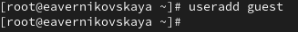{#fig:001 width=70%}

## Создание учётной записи пользовтеля guest

Зададим пароль для пользователя guest: *passwd guest* (рис. 2)

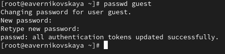{#fig:002 width=70%}

## Создание учётной записи пользовтеля guest

Далее зайдём в систему от имени пользователя guest (рис. 3)

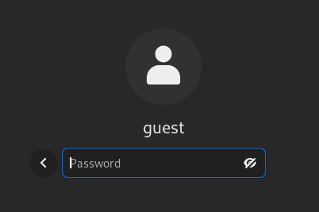{#fig:003 width=50%}

## После входа в систему от имени пользователя guest

Определим директорию, в которой мы находимся, командой *pwd*. Я нахожусь в домашней директории, так как в приглашении командной строки есть *~* (рис. 4)

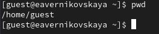{#fig:004 width=70%}

## После входа в систему от имени пользователя guest

Уточним имя нашего пользователя командой *whoami* (рис. 5)

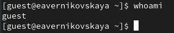{#fig:005 width=70%}

## После входа в систему от имени пользователя guest

Далее уточним имя нашего пользователя, его группу, а также группы, куда входит пользователь, командой *id* (рис. 6)

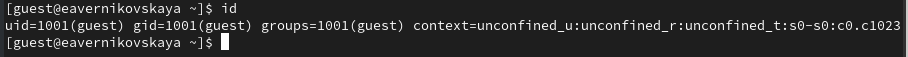{#fig:006 width=70%}  

## После входа в систему от имени пользователя guest

Далее сравним вывод команды *id* с выводом команды *groups*. В выводе команды *groups* информация только о названии группы, к которой относится пользователь. В выводе команды *id* больше
информации: имя пользователя и имя группы, также коды имени пользователя и группы (рис. 7)

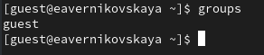{#fig:007 width=70%} 

## После входа в систему от имени пользователя guest

Посмотрим файл /etc/passwd командой *cat /etc/passwd & grep guest*, чтобы найти в нём информацию об учётной записи пользователя guest, определить его uid и gid. Найденные значение совпадают с полученными в предыдущих выводах (рис. 8)

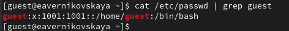{#fig:008 width=70%} 

## После входа в систему от имени пользователя guest

Определим существующие в системе директории командой *ls -l /home/*. Нам удалось получить список поддиректорий директории /home. Права у директорий eavernikovskaya и guest: *drwx------* (рис. 9)

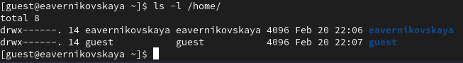{#fig:009 width=70%} 

## После входа в систему от имени пользователя guest

Далее проверим какие расширенные атрибуты установлены на поддиректориях, находящихся в директории /home, командой: *lsattr /home*. Этого увидеть не удалось (рис. 10), (рис. 11)

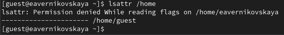{#fig:010 width=70%}  

## После входа в систему от имени пользователя guest

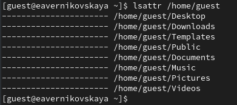{#fig:011 width=70%}

## После входа в систему от имени пользователя guest  

Далее создадим в домашней директории поддиректорию dir1 командой *mkdir dir1* (рис. 12)

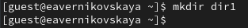{#fig:012 width=70%}  

## После входа в систему от имени пользователя guest

Определим командами *ls -l* и *lsattr*, какие права доступа и расширенные атрибуты были выставлены на директорию dir1 (рис. 13), (рис. 14)

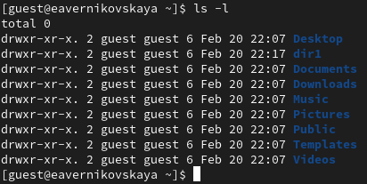{#fig:013 width=70%}  

## После входа в систему от имени пользователя guest

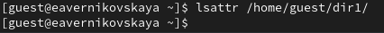{#fig:014 width=70%}  

## После входа в систему от имени пользователя guest

Снимем с директории dir1 все атрибуты командой *chmod 000 dir1* (рис. 15), (рис. 16)

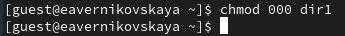{#fig:015 width=70%}  

## После входа в систему от имени пользователя guest

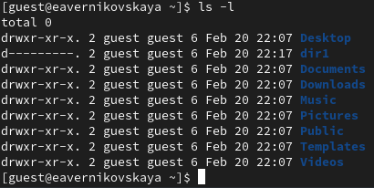{#fig:016 width=70%}  

## После входа в систему от имени пользователя guest

Попытаемся создать в директории dir1 файл file1 командой *echo "test" > /home/guest/dir1/file1*. Мы этго сделать не сможем, так как у директории недостаточно прав для создания файлов (рис. 17)

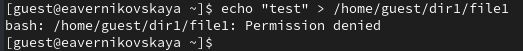{#fig:017 width=70%}

## После входа в систему от имени пользователя guest

Далее проверим командой *ls -l /home/guest/dir1* создался ли файл. Этого мы сделать не сможем, так как у директории всё ещё не достаточно прав даже на просмотр файлов внутри неё. Пэтому изменим атрибуты директории dir1 на 700 и проверим опять, есть ли там файл. Файла там нет!!! (рис. 18), (рис. 19)

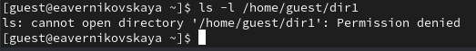{#fig:018 width=70%}

## После входа в систему от имени пользователя guest

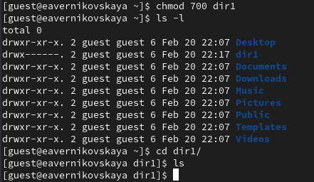{#fig:019 width=70%}

## Заполнение таблиц

Далее я заполнила таблицу 2.1 «Установленные права и разрешённые действия», выполняя действия от имени владельца директории (файлов), определив опытным путём, какие операции разрешены, а какие нет.
Если операция разрешена, я заносила в таблицу знак «+», если не разрешена, знак «-» (рис. 20), (рис. 21), (рис. 22), (рис. 23), (рис. 24), (рис. 25), (рис. 26)

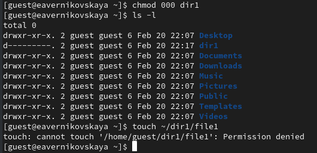{#fig:020 width=50%}

## Заполнение таблиц

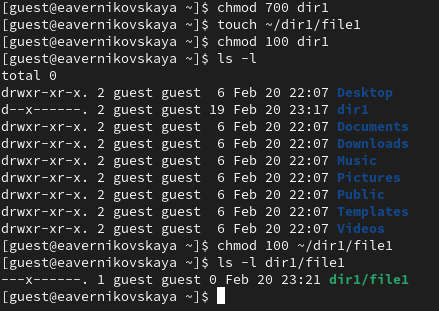{#fig:021 width=70%}

## Заполнение таблиц

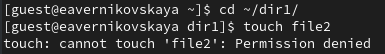{#fig:022 width=70%}

## Заполнение таблиц

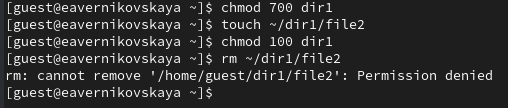{#fig:023 width=70%}

## Заполнение таблиц

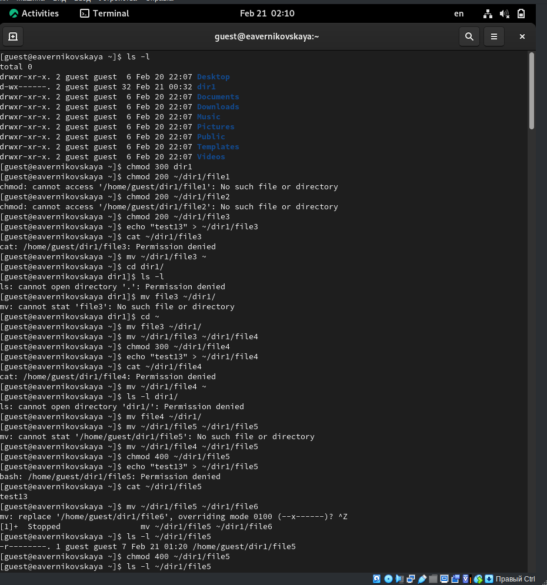{#fig:024 width=40%}

## Заполнение таблиц

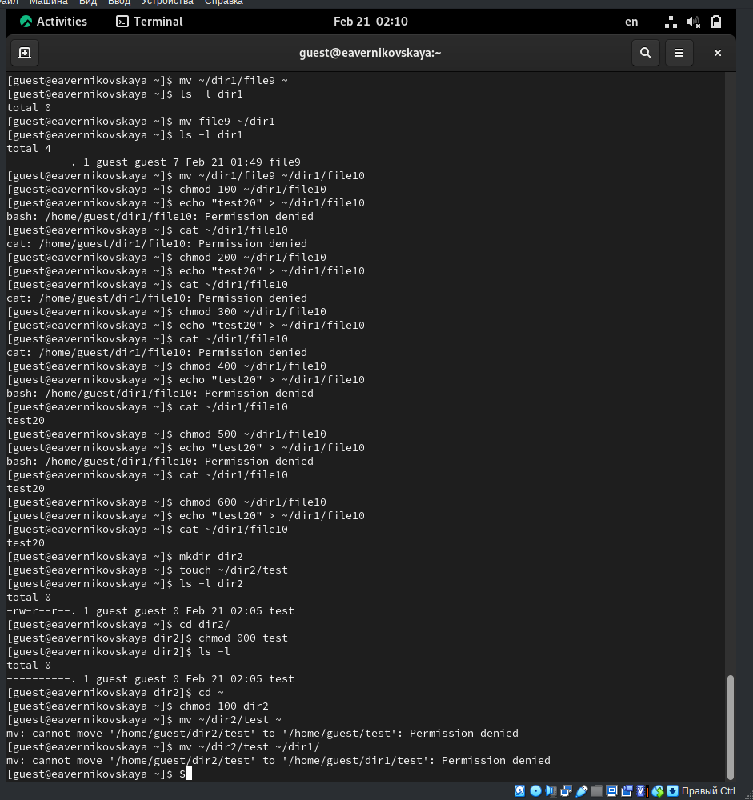{#fig:025 width=40%}

## Заполнение таблиц

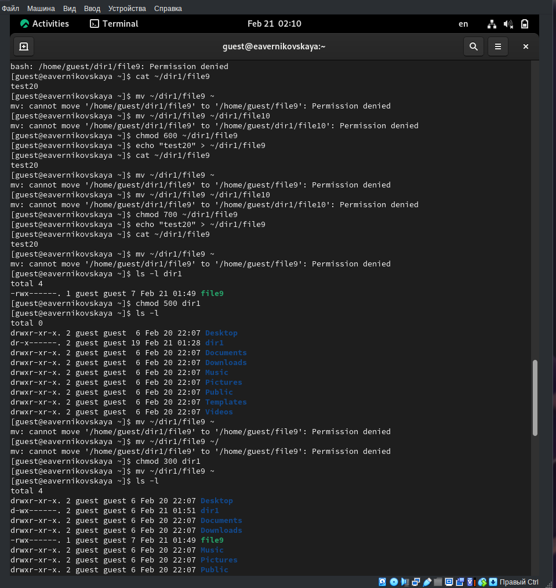{#fig:026 width=40%}

## Заполнение таблиц

Далее на основании заполненной таблицы 2.1 «Установленные права и разрешённые действия» я определила те или иные минимально необходимые права для выполнения операций внутри директории dir1, и заполнила таблицу 2.2 «Минимальные права для совершения операций» (рис. 27), (рис. 28)

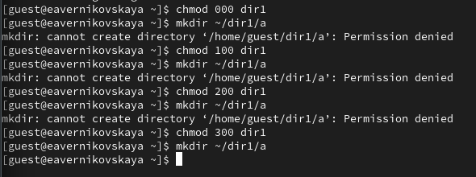{#fig:027 width=70%}

## Заполнение таблиц

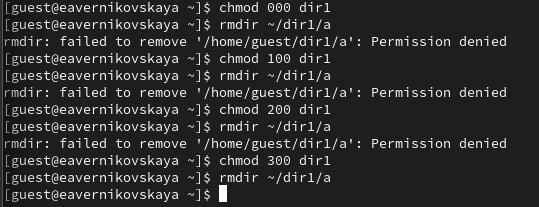{#fig:028 width=70%}

# Подведение итогов

## Выводы

В ходе выполнения лабораторной работы мы получили практические навыки работы в консоли с атрибутами файлов, закрепили теоретические основы дискреционного разграничения доступа в современных системах с открытым кодом на базе ОС Linux

## Список литературы

1. Лаборатораня работа №2 [Электронный ресурс] URL: https://esystem.rudn.ru/pluginfile.php/2580978/mod_resource/content/6/002-lab_discret_attr.pdf
