---
## Front matter
lang: ru-RU
title: Лабораторная работа №3
subtitle: Основы информационной безопасности
author:
  - Верниковская Е. А., НПИбд-01-23
institute:
  - Российский университет дружбы народов, Москва, Россия
date: 12 марта 2025

## i18n babel
babel-lang: russian
babel-otherlangs: english

## Formatting pdf
toc: false
toc-title: Содержание
slide_level: 2
aspectratio: 169
section-titles: true
theme: metropolis
header-includes:
 - \metroset{progressbar=frametitle,sectionpage=progressbar,numbering=fraction}
 - '\makeatletter'
 - '\beamer@ignorenonframefalse'
 - '\makeatother'
 
## Fonts
mainfont: PT Serif
romanfont: PT Serif
sansfont: PT Sans
monofont: PT Mono
mainfontoptions: Ligatures=TeX
romanfontoptions: Ligatures=TeX
sansfontoptions: Ligatures=TeX,Scale=MatchLowercase
monofontoptions: Scale=MatchLowercase,Scale=0.9
---

# Вводная часть

## Цель работы

Целью данной работы является gолучение практических навыков работы в консоли с атрибутами файлов для групп пользователей

## Задания

1. Получить пактические навыки работы в консоли с атрибутами файлов для групп пользователей
2. Заполнить таблицу «Установленные права и разрешённые действия для групп»
3. Заполнить таблицу «Минимальные права для совершения операций от имени пользователей входящих в группу»

# Выполнение лабораторной работы

## Создание учётной записи пользовтеля guest и guest2

В операционной системе создаём учётную запись пользователя guest - это мы сдеали в прошлой рабораторной работе и guest2 (используя учётную запись администратора): *useradd guest2* (рис. 1)

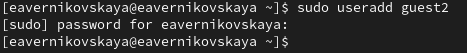{#fig:001 width=70%}

## Создание учётной записи пользовтеля guest и guest2

Зададим пароль для пользователя guest2: *passwd guest2* (рис. 2)

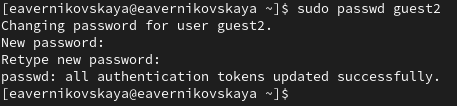{#fig:002 width=70%}

## Создание учётной записи пользовтеля guest и guest2

Далее добавим пользователя guest2 в группу guest: *gpasswd -a guest2 guest* (рис. 3)

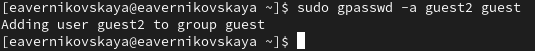{#fig:003 width=70%}

## Создание учётной записи пользовтеля guest и guest2

Далее осуществим вход в систему от двух пользователей на двух разных консолях: guest на первой консоли и guest2 на второй консоли: *su guest* и *su guest2* (рис. 4), (рис. 5), (рис. 6)

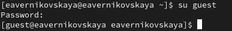{#fig:004 width=70%}

## Создание учётной записи пользовтеля guest и guest2

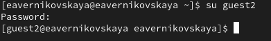{#fig:005 width=70%}

## Создание учётной записи пользовтеля guest и guest2

{#fig:006 width=70%}

## После входа в систему от имени пользователя guest и guest2

Далее для обоих пользователей определим директорию, в которой мы находимся, командой *pwd*. Вход в терминал от имени пользователей был выполнен в домашней директории пользователя eavernikovskaya, которую команда pwd вывела. Домашней директорией пользователей она не является. Текущая директория с
приглашением командной строки совпадает (рис. 7), (рис. 8)

{#fig:007 width=70%}

## После входа в систему от имени пользователя guest и guest2

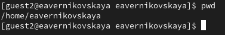{#fig:008 width=70%}

## После входа в систему от имени пользователя guest и guest2

Далее уточним имя вашего пользователя, его группу, кто входит в неё и к каким группам принадлежит он сам командой *whoami*. Также определим командами *groups guest* и *groups guest2*, в какие группы входят пользователи guest и guest2. И сравним вывод команды *groups* с выводом команд *id -Gn* и *id -G* (рис. 9), (рис. 10)

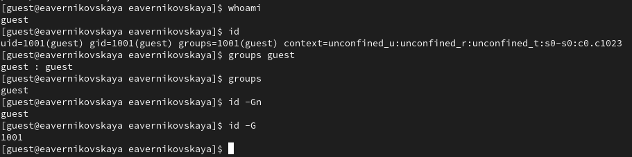{#fig:009 width=70%}

## После входа в систему от имени пользователя guest и guest2

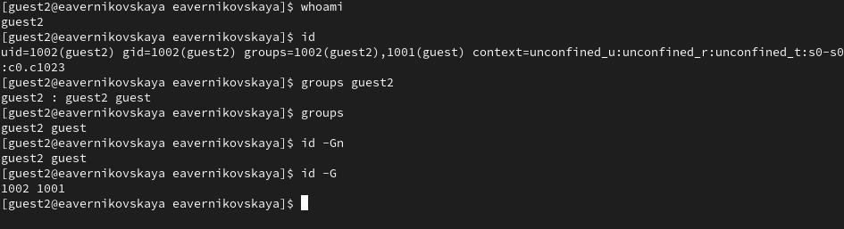{#fig:010 width=70%}

## После входа в систему от имени пользователя guest и guest2

Команда *groups* просто выведет список групп, в которые входит пользователь. *id -Gn* - выведет названия групп, которым принадлежит пользователь, а *id -G* - выведет только код групп, которым принадлежит пользователь

## После входа в систему от имени пользователя guest и guest2

Посмотрим файл /etc/group командой *cat /etc/group | grep 'guest'*, чтобы найти в нём информацию об учётной записи пользователя guest и guest2. Видно, что в группе guest два пользователя, а в группе guest2 один (рис. 11), (рис. 12)

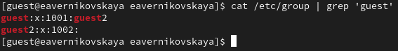{#fig:011 width=70%} 

## После входа в систему от имени пользователя guest и guest2

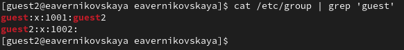{#fig:012 width=70%} 

## После входа в систему от имени пользователя guest и guest2

Далее от имени пользователя guest2 выполним регистрацию пользователя guest2 в группе guest командой *newgrp guest* (рис. 13)

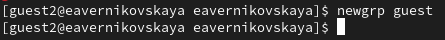{#fig:013 width=70%} 

## После входа в систему от имени пользователя guest и guest2

От имени пользователя guest изменим права директории /home/guest, разрешив все действия для пользователей группы: *chmod g+rwx /home/guest* (рис. 14)

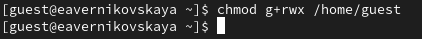{#fig:014 width=70%} 

## После входа в систему от имени пользователя guest и guest2

От имени пользователя guest снимем с директории /home/guest/dir1 все атрибуты командой *chmod 000 dirl* (рис. 15)

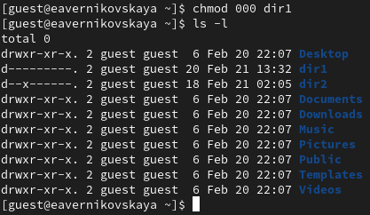{#fig:015 width=60%} 

## Заполнение таблиц

Далее я заполнила таблицу 2.1 «Установленные права и разрешённые действия для групп», меняя атрибуты у директории dir1 и файла file1 от имени пользователя guest и делая проверку от пользователя guest2, определив опытным путём, какие операции разрешены, а какие нет. Если операция разрешена, я заносила в таблицу знак «+», если не разрешена, знак «-» (рис. 16), (рис. 17)

## Заполнение таблиц

{#fig:016 width=50%}

## Заполнение таблиц

{#fig:017 width=50%}

## Заполнение таблиц

Далее на основании заполненной таблицы 2.1 «Установленные права и разрешённые действия для групп» я определила те или иные минимально необходимые права для выполнения операций внутри директории dir1, и заполнила таблицу 2.2 «Минимальные права для совершения операций от имени пользователей входящих в группу» (рис. 18), (рис. 19)

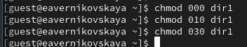{#fig:018 width=70%}

## Заполнение таблиц

{#fig:019 width=70%}

# Подведение итогов

## Выводы

В ходе выполнения лабораторной работы мы получили практические навыки работы в консоли с атрибутами файлов для групп пользователей

## Список литературы

1. Лаборатораня работа №3 [Электронный ресурс] URL: https://esystem.rudn.ru/pluginfile.php/2580980/mod_resource/content/4/003-lab_discret_2users.pdf
