---
## Front matter
lang: ru-RU
title: Лабораторная работа №4
subtitle: Основы информационной безопасности
author:
  - Верниковская Е. А., НПИбд-01-23
institute:
  - Российский университет дружбы народов, Москва, Россия
date: 5 апреля 2025

## i18n babel
babel-lang: russian
babel-otherlangs: english

## Formatting pdf
toc: false
toc-title: Содержание
slide_level: 2
aspectratio: 169
section-titles: true
theme: metropolis
header-includes:
 - \metroset{progressbar=frametitle,sectionpage=progressbar,numbering=fraction}
 - '\makeatletter'
 - '\beamer@ignorenonframefalse'
 - '\makeatother'
 
## Fonts
mainfont: PT Serif
romanfont: PT Serif
sansfont: PT Sans
monofont: PT Mono
mainfontoptions: Ligatures=TeX
romanfontoptions: Ligatures=TeX
sansfontoptions: Ligatures=TeX,Scale=MatchLowercase
monofontoptions: Scale=MatchLowercase,Scale=0.9
---

# Вводная часть

## Цель работы

Целью данной работы является получение практических навыков работы в консоли с расширенными атрибутами файлов

## Задания

1. Получить пактические навыки работы в консоли с расширенными атрибутами файлов

# Выполнение лабораторной работы

## Выполнение лабораторной работы

От имени пользователя guest определим расширенные атрибуты файла /home/guest/dir1/file1 командой
*lsattr /home/guest/dir1/file1* (рис. 1)

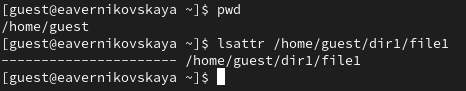{#fig:001 width=70%}

## Выполнение лабораторной работы

Установим командой *chmod 600 file1* на файл file1 права, разрешающие чтение и запись для владельца файла (рис. 2)

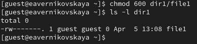{#fig:002 width=70%}

## Выполнение лабораторной работы

Попробуем установить на файл /home/guest/dir1/file1 расширенный атрибут *a* от имени пользователя guest: *chattr +a /home/guest/dir1/file1*. В ответ мы получили отказ на выполнение операции (рис. 3)

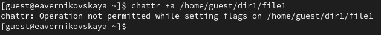{#fig:003 width=70%}

## Выполнение лабораторной работы

Попробуем установить расширенный атрибут a на файл /home/guest/dir1/file1 от имени суперпользователя: *chattr +a /home/guest/dir1/file1* (рис. 4)

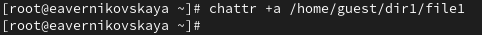{#fig:004 width=70%}

## Выполнение лабораторной работы

От пользователя guest проверим правильность установления атрибута: *lsattr /home/guest/dir1/file1* (рис. 5)

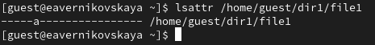{#fig:005 width=70%}

## Выполнение лабораторной работы

Выполним дозапись в файл file1 слова «test» командой *echo "test" >> dir1/file1*. И после этого выполним чтение файла file1 командой *cat dir1/file1* (рис. 6), (рис. 7)

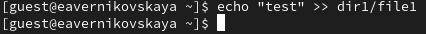{#fig:006 width=70%}

## Выполнение лабораторной работы

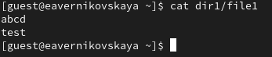{#fig:007 width=70%}

## Выполнение лабораторной работы

Попробуем удалить файл file1, а затем переименовать его. Обе операции не доступны (рис. 8), (рис. 9)

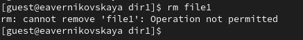{#fig:008 width=70%}

## Выполнение лабораторной работы

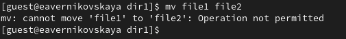{#fig:009 width=70%}

## Выполнение лабораторной работы

Далее попробуем с помощью команды *chmod 000 file1* установить на файл file1 права, например, запрещающие чтение и запись для владельца файла. Этого нам тоже сделать не удалось (рис. 10)

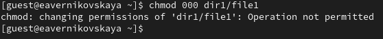{#fig:010 width=70%}

## Выполнение лабораторной работы

Далее снимем расширенный атрибут *a* с файла /home/guest/dirl/file1 от имени суперпользователя командой *chattr -a /home/guest/dir1/file1*. И повторим операции, которые нам ранее не удавалось выполнить (рис. 11), (рис. 12), (рис. 13), (рис. 14), (рис. 15)

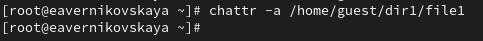{#fig:011 width=70%}

## Выполнение лабораторной работы

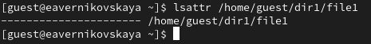{#fig:012 width=70%}

## Выполнение лабораторной работы

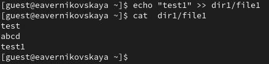{#fig:013 width=70%}

## Выполнение лабораторной работы

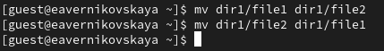{#fig:014 width=70%}

## Выполнение лабораторной работы

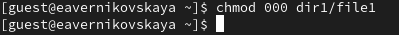{#fig:015 width=70%}

## Выполнение лабораторной работы

Далее повторим наши действия по шагам, заменив атрибут «a» атрибутом «i» (рис. 16), (рис. 17), (рис. 18), (рис. 19), (рис. 20), (рис. 21), (рис. 22)

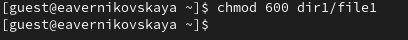{#fig:016 width=70%}

## Выполнение лабораторной работы

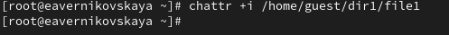{#fig:017 width=70%}

## Выполнение лабораторной работы

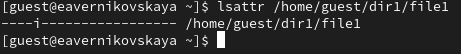{#fig:018 width=70%}

## Выполнение лабораторной работы

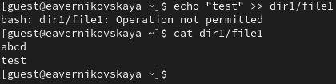{#fig:019 width=70%}

## Выполнение лабораторной работы

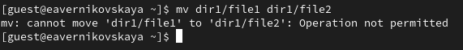{#fig:020 width=70%}

## Выполнение лабораторной работы

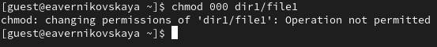{#fig:021 width=70%}

## Выполнение лабораторной работы

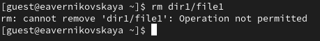{#fig:022 width=70%}

# Подведение итогов

## Выводы

В результате выполнения работы мы повысили свои навыки использования интерфейса командой строки (CLI), познакомились на примерах с тем, как используются основные и расширенные атрибуты при разграничении доступа. Имели возможность связать теорию дискреционного разделения доступа (дискреционная политика безопасности) с её реализацией на практике в ОС Linux. Опробовали действие на практике расширенных атрибутов «а» и «i»

## Список литературы

1. Лаборатораня работа №4 [Электронный ресурс] URL: https://esystem.rudn.ru/pluginfile.php/2580982/mod_resource/content/3/004-lab_discret_extattr.pdf
