---
## Front matter
lang: ru-RU
title: Лабораторная работа №5
subtitle: Основы информационной безопасности
author:
  - Верниковская Е. А., НПИбд-01-23
institute:
  - Российский университет дружбы народов, Москва, Россия
date: 17 апреля 2025

## i18n babel
babel-lang: russian
babel-otherlangs: english

## Formatting pdf
toc: false
toc-title: Содержание
slide_level: 2
aspectratio: 169
section-titles: true
theme: metropolis
header-includes:
 - \metroset{progressbar=frametitle,sectionpage=progressbar,numbering=fraction}
 - '\makeatletter'
 - '\beamer@ignorenonframefalse'
 - '\makeatother'
 
## Fonts
mainfont: PT Serif
romanfont: PT Serif
sansfont: PT Sans
monofont: PT Mono
mainfontoptions: Ligatures=TeX
romanfontoptions: Ligatures=TeX
sansfontoptions: Ligatures=TeX,Scale=MatchLowercase
monofontoptions: Scale=MatchLowercase,Scale=0.9
---

# Вводная часть

## Цель работы

Целью данной работы является изучение механизмов изменения идентификаторов, применения SetUID- и Sticky-битов. Получение практических навыков работы в консоли с дополнительными атрибутами. Рассмотрение работы механизма смены идентификатора процессов пользователей, а также влияние бита
Sticky на запись и удаление файлов.

# Выполнение лабораторной работы

## Подготовка лабораторного стенда

Для лабораторной работы необходимо проверить, установлен ли компилятор gcc. Проверим это с помощью команды *gcc -v*. Также осуществим отключение системы запретов с помощью *sudo setenforce 0* и проверим командой *getenforce*, что выводится Permissive (рис. 1)

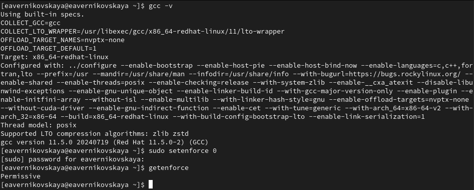{#fig:001 width=70%}

## Создание программы

Войдём в систему от имени пользователя guest. И создадим программу simpleid.c (рис. 2), (рис. 3)

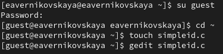{#fig:002 width=70%}

## Создание программы

{#fig:003 width=70%}

## Создание программы

Скомплилируем программу и убедимся, что файл программы создан: *gcc simpleid.c -o simpleid* (рис. 4)

{#fig:004 width=70%}

## Создание программы

Выполним программу simpleid: *./simpleid*. В выводе файла выписыны номера пользоватея и групп, от вывода при вводе id, они отличаются только тем, что информации меньше (рис. 5)

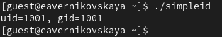{#fig:005 width=70%}

## Создание программы

Выполните системную программу id: *id* (рис. 6)

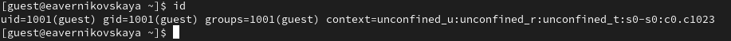{#fig:006 width=70%}

## Создание программы

Далее усложним программу, добавив вывод действительных идентификаторов. Создадим программу под названием simpleid2.c (рис. 7), (рис. 8)

{#fig:007 width=70%}

## Создание программы

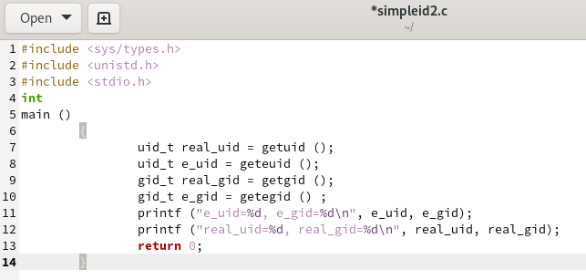{#fig:008 width=70%}

## Создание программы

Скомпилируем и запустим simpleid2.c: *gcc simpleid2.c -o simpleid2* и *./simpleid2* (рис. 9), (рис. 10)

{#fig:009 width=70%}

## Создание программы

{#fig:010 width=70%}

## Создание программы

От имени суперпользователя выполним команды: *chown root:guest /home/guest/simpleid2* и *chmod u+s /home/guest/simpleid2*. Также выполним проверку правильности установки новых атрибутов и смены
владельца файла simpleid2: *ls -l simpleid2*. С помощью chown мы меняем владельца файла на суперпользователя, а с помощью chmod  меняем права доступа (рис. 11)

{#fig:011 width=70%}

## Создание программы

Запустим simpleid2 и id: *./simpleid2* и *id*. Наша команда снова вывела только ограниченное количество информации (рис. 12)

{#fig:012 width=70%}

## Создание программы

Создадим программу readfile.c (рис. 13), (рис. 14)

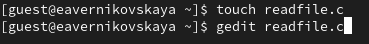{#fig:013 width=70%}

## Создание программы

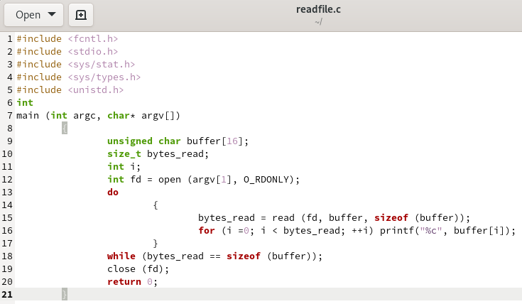{#fig:014 width=70%}

## Создание программы

Откомпилируем её: *gcc readfile.c -o readfile* (рис. 15)

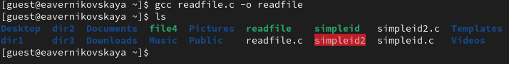{#fig:015 width=70%}

## Создание программы

Далее сменим владельца у файла readfile.c и изменим права так, чтобы только суперпользователь
(root) мог прочитать его, a guest не мог (рис. 16)

{#fig:016 width=70%}

## Создание программы

Проверим, что пользователь guest не может прочитать файл readfile.c (рис. 17)

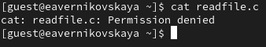{#fig:017 width=70%}

## Создание программы

Проверим, может ли программа readfile прочитать файл readfile.c (рис. 18)

{#fig:018 width=70%}

## Создание программы

Проверим, может ли программа readfile прочитать файл /etc/shadow (рис. 19)

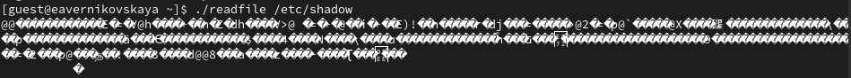{#fig:019 width=70%}

## Создание программы

Теперь попробуем прочесть эти же файлы от имени суперпользователя (рис. 20)

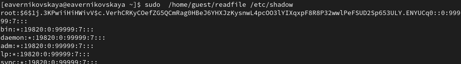{#fig:020 width=70%}

## Исследование Sticky-бита

Выясним, установлен ли атрибут Sticky на директории /tmp, для чего выполним команду *ls -l / | grep tmp*. Так как ввыводе есть буква t, это значит что атрибут установлен (рис. 21)

{#fig:021 width=70%}

## Исследование Sticky-бита

От имени пользователя guest создадим файл file01.txt в директории /tmp со словом test: *echo "test" > /tmp/file01.txt* (рис. 22)

{#fig:022 width=70%}

## Исследование Sticky-бита

Просмотрим атрибуты у только что созданного файла *ls -l /tmp/file01.txt* и разрешим чтение и запись для категории пользователей «все остальные»: *chmod o+rw /tmp/file01.txt* (рис. 23)

{#fig:023 width=70%}

## Исследование Sticky-бита

От пользователя guest2 (не являющегося владельцем) попробуем прочитать файл /tmp/file01.txt: *cat /tmp/file01.txt* (рис. 24)

{#fig:024 width=70%}

## Исследование Sticky-бита

От пользователя guest2 попробуем дозаписать в файл /tmp/file01.txt слово test2 командой *echo "test2" > /tmp/file01.txt* (рис. 25)

{#fig:025 width=70%}

## Исследование Sticky-бита

От пользователя guest2 попробуем записать в файл /tmp/file01.txt слово test3, стерев при этом всю имеющуюся в файле информацию командой *echo "test3" > /tmp/file01.txt* (рис. 26)

{#fig:026 width=70%}

## Исследование Sticky-бита

От пользователя guest2 попробуем удалить файл /tmp/file01.txt командой *rm /tmp/file01.txt* (рис. 27)

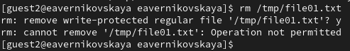{#fig:027 width=70%}

## Исследование Sticky-бита

Далее от имени суперпользователя снимем с директории tmp атрибут Sticky командой *chmod -t /tmp* (рис. 28), (рис. 29)

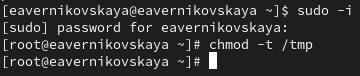{#fig:028 width=70%}

## Исследование Sticky-бита

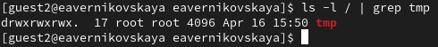{#fig:029 width=70%}

## Исследование Sticky-бита

Далее снова проделаем предыдущие шаги. Всё то же самое только теперь можно удалить файл  (рис. 30)

{#fig:030 width=70%}

## Исследование Sticky-бита

Вернём директории tmp атрибут t от имени суперпользователя (рис. 31)

{#fig:031 width=70%}

# Подведение итогов

## Выводы

В результате выполнения работы мы изучили механизмы изменения идентификаторов, применения SetUID- и Sticky-битов. Получили практические навыки работы в консоли с дополнительными атрибутами. Рассмотрели работы механизма смены идентификатора процессов пользователей, а также влияние бита
Sticky на запись и удаление файлов

## Список литературы

1. Лаборатораня работа №5 [Электронный ресурс] URL: https://esystem.rudn.ru/pluginfile.php/2580984/mod_resource/content/2/005-lab_discret_sticky.pdf

2. Инструментарий программиста в Linux: Компилятор GCC [Электронный ресурс] URL: http://parallel.imm.uran.ru/freesoft/make/instrum.html
