---
## Front matter
lang: ru-RU
title: Лабораторная работа №6
subtitle: Основы информационной безопасности
author:
  - Верниковская Е. А., НПИбд-01-23
institute:
  - Российский университет дружбы народов, Москва, Россия
date: 30 апреля 2025

## i18n babel
babel-lang: russian
babel-otherlangs: english

## Formatting pdf
toc: false
toc-title: Содержание
slide_level: 2
aspectratio: 169
section-titles: true
theme: metropolis
header-includes:
 - \metroset{progressbar=frametitle,sectionpage=progressbar,numbering=fraction}
 - '\makeatletter'
 - '\beamer@ignorenonframefalse'
 - '\makeatother'
 
## Fonts
mainfont: PT Serif
romanfont: PT Serif
sansfont: PT Sans
monofont: PT Mono
mainfontoptions: Ligatures=TeX
romanfontoptions: Ligatures=TeX
sansfontoptions: Ligatures=TeX,Scale=MatchLowercase
monofontoptions: Scale=MatchLowercase,Scale=0.9
---

# Вводная часть

## Цель работы

Целью данной работы является развитие навыков администрирования ОС Linux. Плучение первого практического знакомства с технологией SELinux. Проверка работы SELinx на практике совместно с веб-сервером Apache.

# Выполнение лабораторной работы

## Выполнение лабораторной работы

Зайдём в систему с полученными учётными данными и убедимся, что SELinux работает в режиме enforcing политики targeted с помощью команд *getenforce* и *sestatus* (рис. 1)

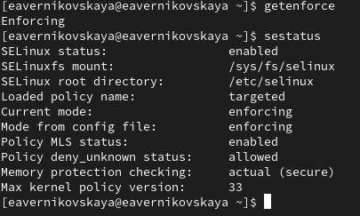{#fig:001 width=50%}

## Выполнение лабораторной работы

Установим httpd.service с помощью *sudo yum install httpd* (рис. 2)

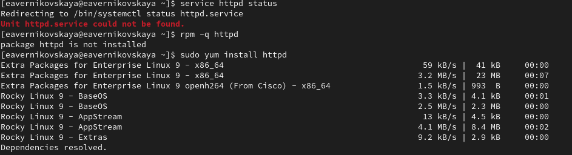{#fig:002 width=70%}

## Выполнение лабораторной работы

Далее запустим веб-сервер и посмотрим его статус, чтобы убетиться что он работает. Сделаем это с помощью команд *sudo systemctl start httpd* и *service httpd status* (рис. 3)

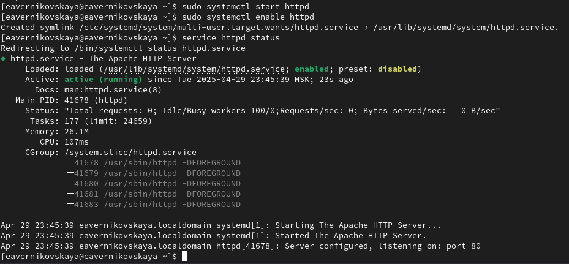{#fig:003 width=70%}

## Выполнение лабораторной работы

Найдём веб-сервер Apache в списке процессов командой *ps auxZ | grep httpd* и определим его контекст безопасности. Его контекст безопасности httpd_d (рис. 4)

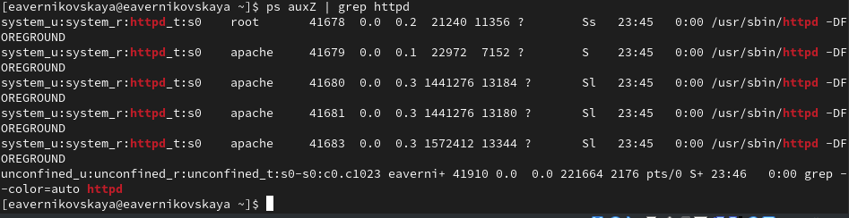{#fig:004 width=70%}

## Выполнение лабораторной работы

Посмотрим текущее состояние переключателей SELinux для Apache с помощью команды *sestatus -b httpd* (рис. 5)

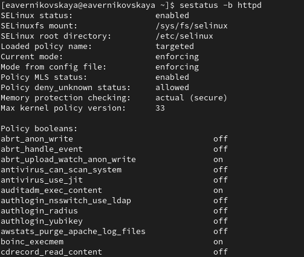{#fig:005 width=40%}

## Выполнение лабораторной работы

Посмотрим статистику по политике с помощью команды *seinfo*. Множество пользователей - 8, ролей - 40, типов - 5169 (рис. 6)

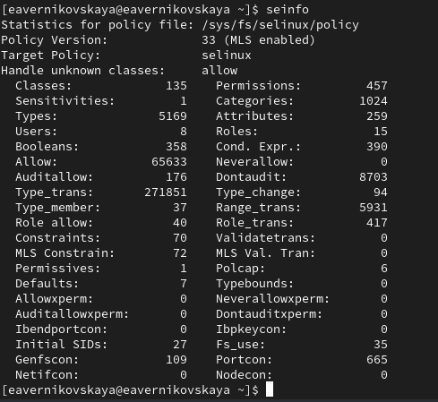{#fig:006 width=40%}

## Выполнение лабораторной работы

Определим тип файлов и поддиректорий, находящихся в директории /var/www, с помощью команды *ls -lZ /var/www*. Владелец - root, права на изменения только у владельца. Файлов в директории нет, есть только поддиректории (рис. 7)

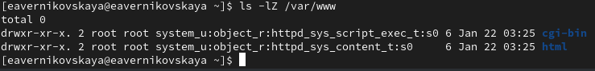{#fig:007 width=70%}

## Выполнение лабораторной работы

Определим тип файлов, находящихся в директории /var/www/html: *ls -lZ /var/www/html*. Там нет файлов. Создать из может только суперпользователь (рис. 8)

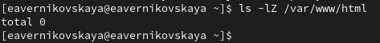{#fig:008 width=70%}

## Выполнение лабораторной работы

Создадим от от имени суперпользователя html-файл /var/www/html/test.html (рис. 9), (рис. 10), (рис. 11)

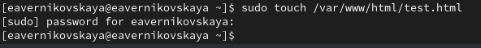{#fig:009 width=70%}

## Выполнение лабораторной работы

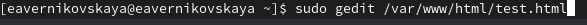{#fig:010 width=70%}

## Выполнение лабораторной работы

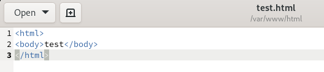{#fig:011 width=70%}

## Выполнение лабораторной работы

Проверим содержание файла с помощью команды cat (рис. 12)

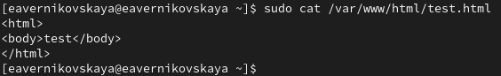{#fig:012 width=70%}

## Выполнение лабораторной работы

Проверим контекст созданного нами файла командой *ls -lZ*. По умолчанию это httpd_sys_content_t (рис. 13)

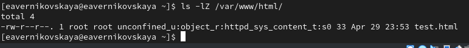{#fig:013 width=70%}

## Выполнение лабораторной работы

Обратимся к файлу через веб-сервер, введя в браузере адрес http://127.0.0.1/test.html. Файл успешно отображён (рис. 14)

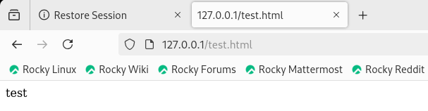{#fig:014 width=70%}

## Выполнение лабораторной работы

Изучим справку *man httpd*. Для httpd определён контекст файла httpd_sys_content_t(рис. 15)

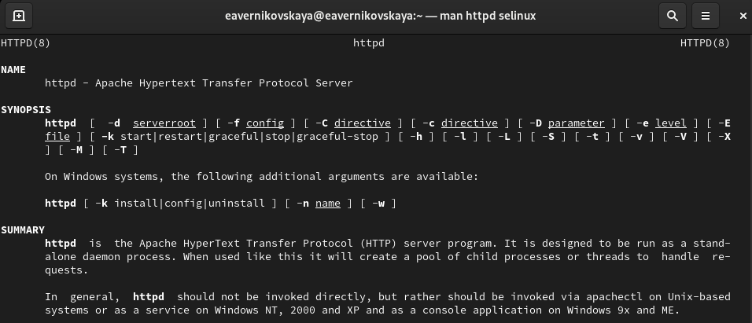{#fig:015 width=70%}

## Выполнение лабораторной работы

Опять проверим контекст файла (рис. 16)

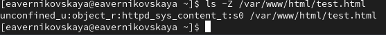{#fig:016 width=70%}

## Выполнение лабораторной работы

Изменим контекст файла /var/www/html/test.html с httpd_sys_content_t на любой другой, к которому процесс httpd не должен иметь доступа, например, на samba_share_t: *chcon -t samba_share_t /var/www/html/test.html*. И проверим командй *ls -Z /var/www/html/test.html* что контекст был изменён (рис. 17)

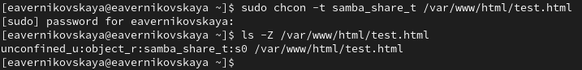{#fig:017 width=70%}

## Выполнение лабораторной работы

Попробуем ещё раз получить доступ к файлу через веб-сервер, введя в браузере адрес http://127.0.0.1/test.html. Мы получили сообщение об ошибке. Это произошло потому что установлен контекст, к которому процесс httpd не имеет доступа (рис. 18)

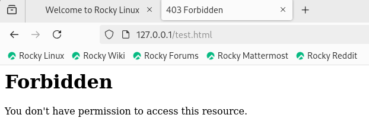{#fig:018 width=70%}

## Выполнение лабораторной работы

Просмотрим системный лог-файл: *tail /var/log/messages*. Те же ошибки мы можем увидеть в файле /var/log/audit/audit.log (рис. 19), (рис. 20)

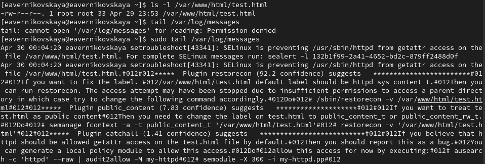{#fig:019 width=70%}

## Выполнение лабораторной работы

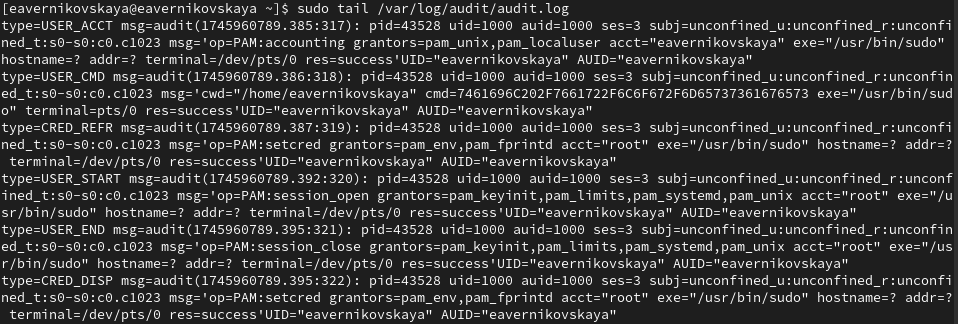{#fig:020 width=70%}

## Выполнение лабораторной работы

Далее попробуем запустить веб-сервер Apache на прослушивание ТСР-порта 81 (а не 80, как рекомендует IANA и прописано в /etc/services). Для этого в файле /etc/httpd/conf/httpd.conf найдём строчку Listen 80 и заменим её на Listen 81 (рис. 21), (рис. 22)

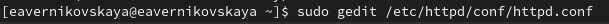{#fig:021 width=70%}

## Выполнение лабораторной работы

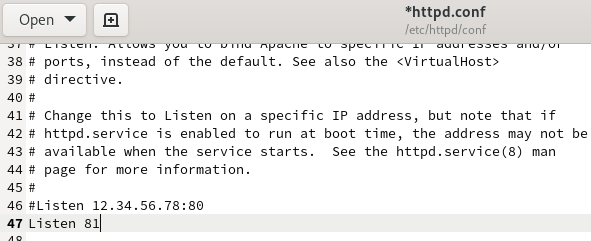{#fig:022 width=70%}

## Выполнение лабораторной работы

Выполним перезапуск веб-сервера Apache. Произошёл сбой, так как порт 80 для локальной сети, а 81 нет (рис. 23)

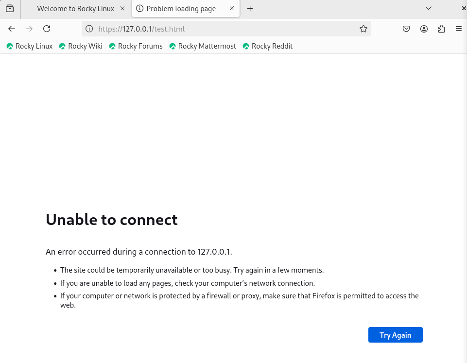{#fig:023 width=40%}

## Выполнение лабораторной работы

Далее проанализируем лог-файлы *tail -nl /var/log/messages* (рис. 24)

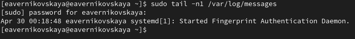{#fig:024 width=70%}

## Выполнение лабораторной работы

Посмотрим файлы /var/log/httpd/error_log, /var/log/httpd/access_log и /var/log/audit/audit.log (рис. 25), (рис. 26), (рис. 27)

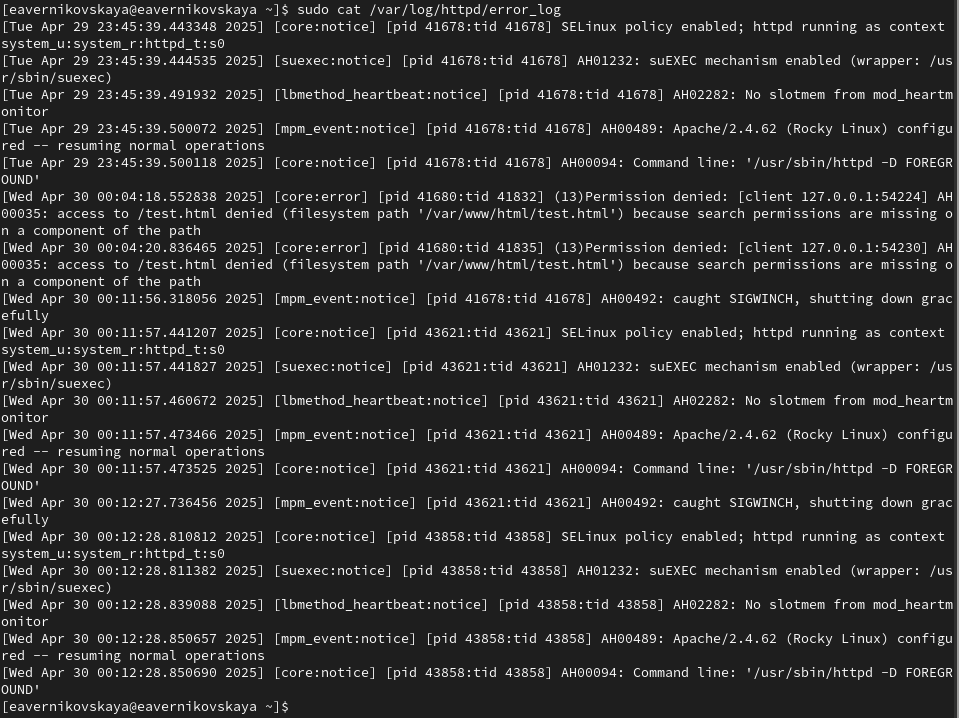{#fig:025 width=40%}

## Выполнение лабораторной работы

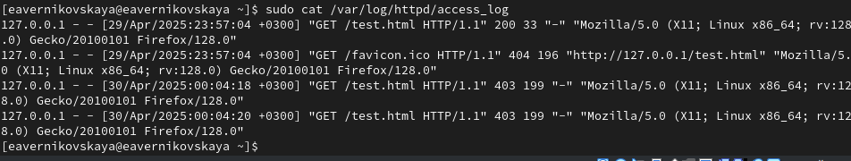{#fig:026 width=70%}

## Выполнение лабораторной работы

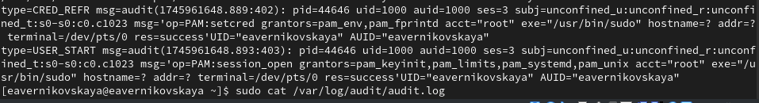{#fig:027 width=70%}

## Выполнение лабораторной работы

Выполним команду *semanage port -a -t http_port_t -p tcp 81*. И после этого проверим список портов командой *semanage port -l | grep http_port_t*. Порт 81 появился в списке (рис. 28), (рис. 29)

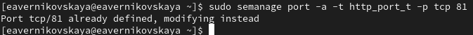{#fig:028 width=70%}

## Выполнение лабораторной работы

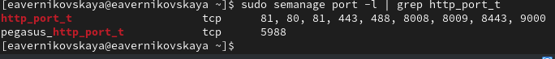{#fig:029 width=70%}

## Выполнение лабораторной работы

Перезапустим сервер Apache. Теперь он работает, так как мы внесли порт 81 в список портов httpd_port_t (рис. 30)

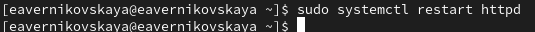{#fig:030 width=70%}

## Выполнение лабораторной работы

Вернём контекст httpd_sys_cоntent__t к файлу /var/www/html/test.html: *chcon -t httpd_sys_content_t /var/www/html/test.html*. После этого попробуем получить доступ к файлу через веб-сервер, введя в браузере адрес http://127.0.0.1:81/test.html (рис. 31)

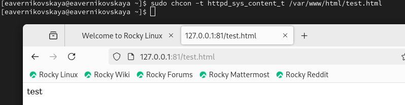{#fig:031 width=70%}

## Выполнение лабораторной работы

Исправим обратно конфигурационный файл apache, вернув Listen 80 (рис. 32), (рис. 33)

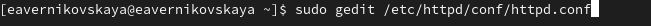{#fig:032 width=70%}

## Выполнение лабораторной работы

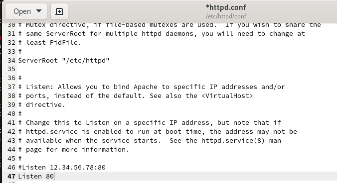{#fig:033 width=70%}

## Выполнение лабораторной работы

Удалим привязку http_port_t к 81 порту: *semanage port -d -t http_port_t -p tcp 81* и проверим, что порт 81 удалён  (рис. 34), (рис. 35)

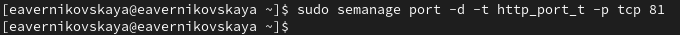{#fig:034 width=70%}

## Выполнение лабораторной работы

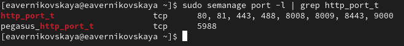{#fig:035 width=70%}

## Выполнение лабораторной работы

Удалим файл /var/www/html/test.html: *rm /var/www/html/test.html* (рис. 35)

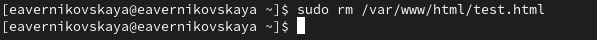{#fig:036 width=70%}

# Подведение итогов

## Выводы

В результате выполнения работы мы развили навыки администрирования ОС Linux. Плучили первое практическое знакомство с технологией SELinux. Проверили работу SELinx на практике совместно с веб-сервером Apache.

## Список литературы

1. Лаборатораня работа №6 [Электронный ресурс] URL: https://esystem.rudn.ru/pluginfile.php/2580986/mod_resource/content/2/006-lab_selinux.pdf

2. SELinux – описание и особенности работы с системой. Часть 1 [Электронный ресурс] URL: https://habr.com/ru/companies/kingservers/articles/209644/
