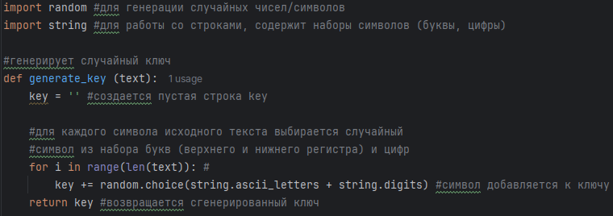
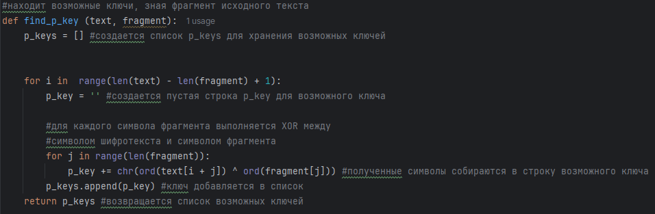
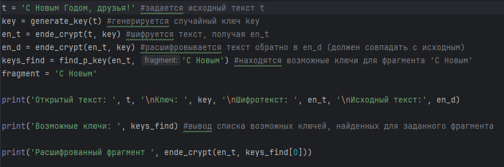
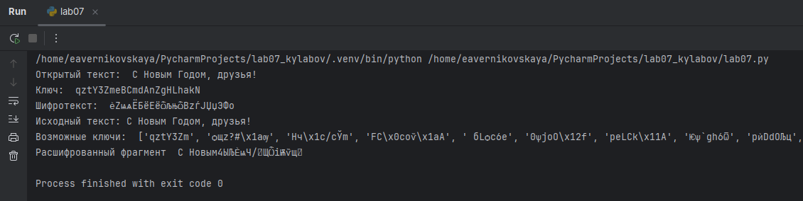

---
## Front matter
lang: ru-RU
title: Лабораторная работа №7
subtitle: Основы информационной безопасности
author:
  - Верниковская Е. А., НПИбд-01-23
institute:
  - Российский университет дружбы народов, Москва, Россия
date: 15 мая 2025

## i18n babel
babel-lang: russian
babel-otherlangs: english

## Formatting pdf
toc: false
toc-title: Содержание
slide_level: 2
aspectratio: 169
section-titles: true
theme: metropolis
header-includes:
 - \metroset{progressbar=frametitle,sectionpage=progressbar,numbering=fraction}
 - '\makeatletter'
 - '\beamer@ignorenonframefalse'
 - '\makeatother'
 
## Fonts
mainfont: PT Serif
romanfont: PT Serif
sansfont: PT Sans
monofont: PT Mono
mainfontoptions: Ligatures=TeX
romanfontoptions: Ligatures=TeX
sansfontoptions: Ligatures=TeX,Scale=MatchLowercase
monofontoptions: Scale=MatchLowercase,Scale=0.9
---

# Вводная часть

## Цель работы

Целью данной работы освоение на практике применения режима однократного гаммирования.

## Задание

Нужно подобрать ключ, чтобы получить сообщение «С Новым Годом, друзья!». Требуется разработать приложение, позволяющее шифровать и дешифровать данные в режиме однократного гаммирования. Приложение должно:

1. Определить вид шифротекста при известном ключе и известном открытом тексте.
2. Определить ключ, с помощью которого шифротекст может быть преобразован в некоторый фрагмент текста, представляющий собой один из возможных вариантов прочтения открытого текста.

# Выполнение лабораторной работы

## Выполнение лабораторной работы

Выполним лабораторную работу на языке программирования Python. Требуется разработать программу, позволяющую шифровать и дешифровать данные в режиме однократного гаммирования. Начнём с функции для генерации случайного ключа (рис. 1)

{#fig:001 width=70%}

## Выполнение лабораторной работы

Необходимо определить вид шифротекста при известном ключе и известном открытом тексте. Напишем одну функцию, которая будет и шифровать и дешифровать текст (рис. 2)

{#fig:002 width=70%}

## Выполнение лабораторной работы

Далее нужно определить ключ, с помощью которого шифротекст может быть преобразован в некоторый фрагмент текста, представляющий собой один из возможных вариантов прочтения открытого текста. Для этого создадим функцию, которая будет искать все возможные ключи для фрагмента текста (рис. 3)

{#fig:003 width=70%}

## Выполнение лабораторной работы

Далее проверим работу всех функций. Шифрование и дешифрование происходит верно, также как и нахождение ключей, с помощью которых можно расшифровать верно кусок текста (рис. 4), (рис. 5)

{#fig:004 width=70%}

## Выполнение лабораторной работы

{#fig:005 width=70%}

# Подведение итогов

## Выводы

В результате выполнения работы мы освоили на практике применение режима однократного гаммирования

## Список литературы

1. Лаборатораня работа №7 [Электронный ресурс] URL: https://esystem.rudn.ru/pluginfile.php/2580988/mod_resource/content/2/007-lab_crypto-gamma.pdf
