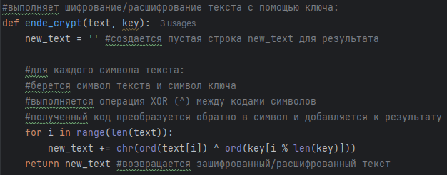

---
## Front matter
title: "Отчёт по лабораторной работе №7"
subtitle: "Дисциплина: Основы информационной безопасности"
author: "Верниковская Екатерина Андреевна"

## Generic otions
lang: ru-RU
toc-title: "Содержание"

## Bibliography
bibliography: bib/cite.bib
csl: pandoc/csl/gost-r-7-0-5-2008-numeric.csl

## Pdf output format
toc: true # Table of contents
toc-depth: 2
lof: true # List of figures
lot: true # List of tables
fontsize: 12pt
linestretch: 1.5
papersize: a4
documentclass: scrreprt
## I18n polyglossia
polyglossia-lang:
  name: russian
  options:
	- spelling=modern
	- babelshorthands=true
polyglossia-otherlangs:
  name: english
## I18n babel
babel-lang: russian
babel-otherlangs: english
## Fonts
mainfont: PT Serif
romanfont: PT Serif
sansfont: PT Sans
monofont: PT Mono
mainfontoptions: Ligatures=TeX
romanfontoptions: Ligatures=TeX
sansfontoptions: Ligatures=TeX,Scale=MatchLowercase
monofontoptions: Scale=MatchLowercase,Scale=0.9
## Biblatex
biblatex: true
biblio-style: "gost-numeric"
biblatexoptions:
  - parentracker=true
  - backend=biber
  - hyperref=auto
  - language=auto
  - autolang=other*
  - citestyle=gost-numeric
## Pandoc-crossref LaTeX customization
figureTitle: "Рис."
tableTitle: "Таблица"
listingTitle: "Листинг"
lofTitle: "Список иллюстраций"
lotTitle: "Список таблиц"
lolTitle: "Листинги"
## Misc options
indent: true
header-includes:
  - \usepackage{indentfirst}
  - \usepackage{float} # keep figures where there are in the text
  - \floatplacement{figure}{H} # keep figures where there are in the text
---

# Цель работы

Целью данной работы освоение на практике применения режима однократного гаммирования.

# Задание

Нужно подобрать ключ, чтобы получить сообщение «С Новым Годом, друзья!». Требуется разработать приложение, позволяющее шифровать и дешифровать данные в режиме однократного гаммирования. Приложение должно:

1. Определить вид шифротекста при известном ключе и известном открытом тексте.
2. Определить ключ, с помощью которого шифротекст может быть преобразован в некоторый фрагмент текста, представляющий собой один из возможных вариантов прочтения открытого текста.

# Выполнение лабораторной работы

Выполним лабораторную работу на языке программирования Python. Требуется разработать программу, позволяющую шифровать и дешифровать данные в режиме однократного гаммирования. Начнём с функции для генерации случайного ключа (рис. [-@fig:001])

{#fig:001 width=70%}

Необходимо определить вид шифротекста при известном ключе и известном открытом тексте. Напишем одну функцию, которая будет и шифровать и дешифровать текст (рис. [-@fig:002])

{#fig:002 width=70%}

Далее нужно определить ключ, с помощью которого шифротекст может быть преобразован в некоторый фрагмент текста, представляющий собой один из возможных вариантов прочтения открытого текста. Для этого создадим функцию, которая будет искать все возможные ключи для фрагмента текста (рис. [-@fig:003])

{#fig:003 width=70%}

Далее проверим работу всех функций. Шифрование и дешифрование происходит верно, также как и нахождение ключей, с помощью которых можно расшифровать верно кусок текста (рис. [-@fig:004])

{#fig:004 width=70%}

{#fig:005 width=70%}

Листинг программы:

```
import random #для генерации случайных чисел/символов
import string #для работы со строками, содержит наборы символов (буквы, цифры)

#генерирует случайный ключ
def generate_key (text):
    key = '' #создается пустая строка key

    #для каждого символа исходного текста выбирается случайный
    #символ из набора букв (верхнего и нижнего регистра) и цифр
    for i in range(len(text)): #
        key += random.choice(string.ascii_letters + string.digits) #символ добавляется к ключу
    return key #возвращается сгенерированный ключ

#выполняет шифрование/расшифрование текста с помощью ключа:
def ende_crypt(text, key):
    new_text = '' #создается пустая строка new_text для результата

    #для каждого символа текста:
    #берется символ текста и символ ключа
    #выполняется операция XOR (^) между кодами символов
    #полученный код преобразуется обратно в символ и добавляется к результату
    for i in range(len(text)):
        new_text += chr(ord(text[i]) ^ ord(key[i % len(key)]))
    return new_text #возвращается зашифрованный/расшифрованный текст

#находит возможные ключи, зная фрагмент исходного текста
def find_p_key (text, fragment):
    p_keys = [] #создается список p_keys для хранения возможных ключей


    for i in  range(len(text) - len(fragment) + 1):
        p_key = '' #создается пустая строка p_key для возможного ключа

        #для каждого символа фрагмента выполняется XOR между
        #символом шифротекста и символом фрагмента
        for j in range(len(fragment)):
            p_key += chr(ord(text[i + j]) ^ ord(fragment[j])) #полученные символы собираются в строку возможного ключа
        p_keys.append(p_key) #ключ добавляется в список
    return p_keys #возвращается список возможных ключей


t = 'С Новым Годом, друзья!' #задается исходный текст t
key = generate_key(t) #генерируется случайный ключ key
en_t = ende_crypt(t, key) #шифруется текст, получая en_t
en_d = ende_crypt(en_t, key) #расшифровывается текст обратно в en_d (должен совпадать с исходным)
keys_find = find_p_key(en_t, 'С Новым') #находятся возможные ключи для фрагмента 'С Новым'
fragment = 'С Новым'

print('Открытый текст: ', t, '\nКлюч: ', key, '\nШифротекст: ', en_t, '\nИсходный текст:', en_d)

print('Возможные ключи: ', keys_find) #вывод списка возможных ключей, найденных для заданного фрагмента

print('Расшифрованный фрагмент ', ende_crypt(en_t, keys_find[0]))
```

# Контрольные вопросы + ответы

1. Поясните смысл однократного гаммирования.

Однократное гаммирование - это метод шифрования, при котором каждый символ открытого текста гаммируется с соответствующим символом ключа только один раз.

2. Перечислите недостатки однократного гаммирования.

Недостатки однократного гаммирования:

- Уязвимость к частотному анализу из-за сохранения частоты символов открытого текста в шифротексте.
- Необходимость использования одноразового ключа, который должен быть длиннее самого открытого текста.
- Нет возможности использовать один ключ для шифрования разных сообщений.

3. Перечислите преимущества однократного гаммирования.

Преимущества однократного гаммирования:

- Высокая стойкость при правильном использовании случайного ключа.
- Простота реализации алгоритма.
- Возможность использования случайного ключа.

4. Почему длина открытого текста должна совпадать с длиной ключа?

Длина открытого текста должна совпадать с длиной ключа, чтобы каждый символ открытого текста гаммировался с соответствующим символом ключа.

5. Какая операция используется в режиме однократного гаммирования, назовите её особенности?

В режиме однократного гаммирования используется операция XOR (исключающее ИЛИ), которая объединяет двоичные значения символов открытого текста и ключа для получения шифротекста. Особенность XOR - если один из битов равен 1, то результат будет 1, иначе 0.

6. Как по открытому тексту и ключу получить шифротекст?

Для получения шифротекста по открытому тексту и ключу каждый символ открытого текста гаммируется с соответствующим символом ключа с помощью операции XOR.

7. Как по открытому тексту и шифротексту получить ключ?

По открытому тексту и шифротексту невозможно восстановить действительный ключ, так как для этого нужна информация о каждом символе ключа.

8. В чем заключаются необходимые и достаточные условия абсолютной стойкости шифра?

Необходимые и достаточные условия абсолютной стойкости шифра:

- Ключи должны быть случайными и использоваться только один раз.
- Длина ключа должна быть не менее длины самого открытого текста.
- Ключи должны быть храниться и передаваться безопасным способом.

# Выводы

В результате выполнения работы мы освоили на практике применение режима однократного гаммирования

# Список литературы

1. Лаборатораня работа №7 [Электронный ресурс] URL: https://esystem.rudn.ru/pluginfile.php/2580988/mod_resource/content/2/007-lab_crypto-gamma.pdf

2. SELinux – описание и особенности работы с системой. Часть 1 [Электронный ресурс] URL: https://habr.com/ru/companies/kingservers/articles/209644/
