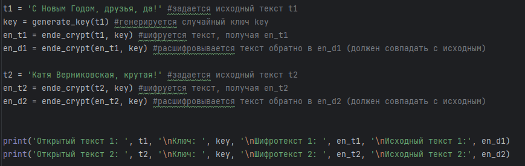

---
## Front matter
lang: ru-RU
title: Лабораторная работа №8
subtitle: Основы информационной безопасности
author:
  - Верниковская Е. А., НПИбд-01-23
institute:
  - Российский университет дружбы народов, Москва, Россия
date: 29 мая 2025

## i18n babel
babel-lang: russian
babel-otherlangs: english

## Formatting pdf
toc: false
toc-title: Содержание
slide_level: 2
aspectratio: 169
section-titles: true
theme: metropolis
header-includes:
 - \metroset{progressbar=frametitle,sectionpage=progressbar,numbering=fraction}
 - '\makeatletter'
 - '\beamer@ignorenonframefalse'
 - '\makeatother'
 
## Fonts
mainfont: PT Serif
romanfont: PT Serif
sansfont: PT Sans
monofont: PT Mono
mainfontoptions: Ligatures=TeX
romanfontoptions: Ligatures=TeX
sansfontoptions: Ligatures=TeX,Scale=MatchLowercase
monofontoptions: Scale=MatchLowercase,Scale=0.9
---

# Вводная часть

## Цель работы

Целью данной работы является освоение на практике применения режима однократного гаммирования напримере кодирования различных исходных текстов одним ключом.

## Задание

Два текста кодируются одним ключом (однократное гаммирование). Требуется не зная ключа и не стремясь его определить, прочитать оба текста. Необходимо разработать приложение, позволяющее шифровать и дешифровать тексты P1 и P2 в режиме однократного гаммирования. Приложение должно определить вид шифротекстов C1 и C2 обоих текстов P1 и P2 при известном ключе; Необходимо определить и выразить аналитически способ, при котором злоумышленник может прочитать оба текста, не зная ключа и не стремясь его определить.

# Выполнение лабораторной работы

## Выполнение лабораторной работы

Выполним лабораторную работу на языке программирования Python, используя ранее написанные функции при выполнении лабораторной работы №7 (рис. 1)

{#fig:001 width=50%}

## Выполнение лабораторной работы

Далее, используя функцию для генерации числа, сгенирируем ключ, затем зашифруем 2 разных текста одним и тем же ключом (рис. 2)

{#fig:002 width=70%}

## Выполнение лабораторной работы

Расшифруем оба текста сначала с помощью одного ключа, а затем предположим, что нам не известен ключ, но известен один из текстов. И расшифруем второй текст, зная только шифротексты и первый текст (рис. 3), (рис. 4)

{#fig:003 width=70%}

## Выполнение лабораторной работы

{#fig:004 width=70%}

# Подведение итогов

## Выводы

В результате выполнения работы мы освоили на практике применение режима однократного гаммирования на примере кодирования различных исходных текстов одним ключом

## Список литературы

1. Лаборатораня работа №8 [Электронный ресурс] URL: https://esystem.rudn.ru/pluginfile.php/2580990/mod_resource/content/2/008-lab_crypto-key.pdf
