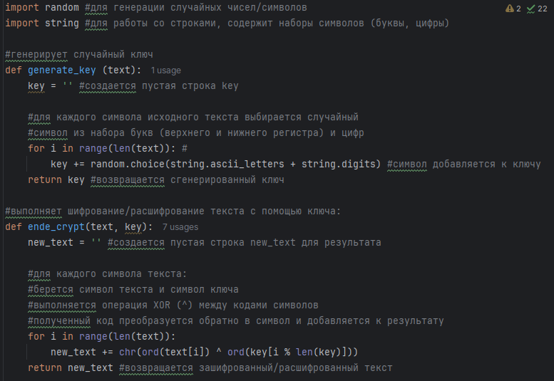
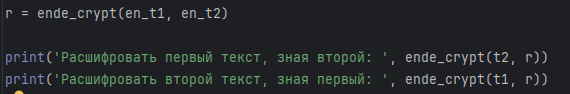
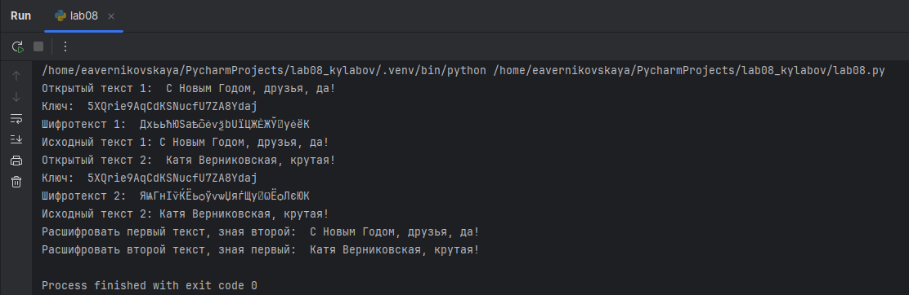

---
## Front matter
title: "Отчёт по лабораторной работе №8"
subtitle: "Дисциплина: Основы информационной безопасности"
author: "Верниковская Екатерина Андреевна"

## Generic otions
lang: ru-RU
toc-title: "Содержание"

## Bibliography
bibliography: bib/cite.bib
csl: pandoc/csl/gost-r-7-0-5-2008-numeric.csl

## Pdf output format
toc: true # Table of contents
toc-depth: 2
lof: true # List of figures
lot: true # List of tables
fontsize: 12pt
linestretch: 1.5
papersize: a4
documentclass: scrreprt
## I18n polyglossia
polyglossia-lang:
  name: russian
  options:
	- spelling=modern
	- babelshorthands=true
polyglossia-otherlangs:
  name: english
## I18n babel
babel-lang: russian
babel-otherlangs: english
## Fonts
mainfont: PT Serif
romanfont: PT Serif
sansfont: PT Sans
monofont: PT Mono
mainfontoptions: Ligatures=TeX
romanfontoptions: Ligatures=TeX
sansfontoptions: Ligatures=TeX,Scale=MatchLowercase
monofontoptions: Scale=MatchLowercase,Scale=0.9
## Biblatex
biblatex: true
biblio-style: "gost-numeric"
biblatexoptions:
  - parentracker=true
  - backend=biber
  - hyperref=auto
  - language=auto
  - autolang=other*
  - citestyle=gost-numeric
## Pandoc-crossref LaTeX customization
figureTitle: "Рис."
tableTitle: "Таблица"
listingTitle: "Листинг"
lofTitle: "Список иллюстраций"
lotTitle: "Список таблиц"
lolTitle: "Листинги"
## Misc options
indent: true
header-includes:
  - \usepackage{indentfirst}
  - \usepackage{float} # keep figures where there are in the text
  - \floatplacement{figure}{H} # keep figures where there are in the text
---

# Цель работы

Целью данной работы является освоение на практике применения режима однократного гаммирования напримере кодирования различных исходных текстов одним ключом.

# Задание

Два текста кодируются одним ключом (однократное гаммирование). Требуется не зная ключа и не стремясь его определить, прочитать оба текста. Необходимо разработать приложение, позволяющее шифровать и дешифровать тексты P1 и P2 в режиме однократного гаммирования. Приложение должно определить вид шифротекстов C1 и C2 обоих текстов P1 и P2 при известном ключе; Необходимо определить и выразить аналитически способ, при котором злоумышленник может прочитать оба текста, не зная ключа и не стремясь его определить.

# Выполнение лабораторной работы

Выполним лабораторную работу на языке программирования Python, используя ранее написанные функции при выполнении лабораторной работы №7.  (рис. [-@fig:001])

{#fig:001 width=70%}

Далее, используя функцию для генерации числа, сгенирируем ключ, затем зашифруем 2 разных текста одним и тем же ключом (рис. [-@fig:002])

{#fig:002 width=70%}

Расшифруем оба текста сначала с помощью одного ключа, а затем предположим, что нам не известен ключ, но известен один из текстов. И расшифруем второй текст, зная только шифротексты и первый текст (рис. [-@fig:003]), (рис. [-@fig:004])

{#fig:003 width=70%}

{#fig:004 width=70%}


Листинг программы:

```
import random #для генерации случайных чисел/символов
import string #для работы со строками, содержит наборы символов (буквы, цифры)

#генерирует случайный ключ
def generate_key (text):
    key = '' #создается пустая строка key

    #для каждого символа исходного текста выбирается случайный
    #символ из набора букв (верхнего и нижнего регистра) и цифр
    for i in range(len(text)): #
        key += random.choice(string.ascii_letters + string.digits) #символ добавляется к ключу
    return key #возвращается сгенерированный ключ

#выполняет шифрование/расшифрование текста с помощью ключа:
def ende_crypt(text, key):
    new_text = '' #создается пустая строка new_text для результата

    #для каждого символа текста:
    #берется символ текста и символ ключа
    #выполняется операция XOR (^) между кодами символов
    #полученный код преобразуется обратно в символ и добавляется к результату
    for i in range(len(text)):
        new_text += chr(ord(text[i]) ^ ord(key[i % len(key)]))
    return new_text #возвращается зашифрованный/расшифрованный текст

t1 = 'С Новым Годом, друзья, да!' #задается исходный текст t1
key = generate_key(t1) #генерируется случайный ключ key
en_t1 = ende_crypt(t1, key) #шифруется текст, получая en_t1
en_d1 = ende_crypt(en_t1, key) #расшифровывается текст обратно в en_d1 (должен совпадать с исходным)

t2 = 'Катя Верниковская, крутая!' #задается исходный текст t2
en_t2 = ende_crypt(t2, key) #шифруется текст, получая en_t2
en_d2 = ende_crypt(en_t2, key) #расшифровывается текст обратно в en_d2 (должен совпадать с исходным)


print('Открытый текст 1: ', t1, '\nКлюч: ', key, '\nШифротекст 1: ', en_t1, '\nИсходный текст 1:', en_d1)
print('Открытый текст 2: ', t2, '\nКлюч: ', key, '\nШифротекст 2: ', en_t2, '\nИсходный текст 2:', en_d2)

r = ende_crypt(en_t1, en_t2)

print('Расшифровать первый текст, зная второй: ', ende_crypt(t2, r))
print('Расшифровать второй текст, зная первый: ', ende_crypt(t1, r))
```

# Контрольные вопросы + ответы

1. Как, зная один из текстов (P1 или P2), определить другой, не зная при этом ключа?

Для определения другого текста (P2 ) можно просто взять зашифрованные тексты C1 ⊕ C2, далее применить XOR к ним и к известному тексту: C1 ⊕ C2 ⊕ P1 = P2 .

2. Что будет при повторном использовании ключа при шифровании текста?

При повторном использовании ключа мы получим дешифрованный текст.

3. Как реализуется режим шифрования однократного гаммирования одним ключом двух открытых текстов?

Режим шифрования однократного гаммирования одним ключом двух открытых текстов осуществляется путем XOR-ирования каждого бита первого текста с соответствующим битом ключа или второго текста.

4. Перечислите недостатки шифрования одним ключом двух открытых текстов.

Недостатки шифрования одним ключом двух открытых текстов включают возможность раскрытия ключа или текстов при известном открытом тексте.

5. Перечислите преимущества шифрования одним ключом двух открытых текстов.

Преимущества шифрования одним ключом двух открытых текстов включают использование одного ключа для зашифрования нескольких сообщений без необходимости создания нового ключа и выделения на него памяти.

# Выводы

В результате выполнения работы мы освоили на практике применение режима однократного гаммирования на примере кодирования различных исходных текстов одним ключом

# Список литературы

1. Лаборатораня работа №8 [Электронный ресурс] URL: https://esystem.rudn.ru/pluginfile.php/2580990/mod_resource/content/2/008-lab_crypto-key.pdf
