---
## Front matter
lang: ru-RU
title: 1-ый этап индивидуального проекта
subtitle: Основы информационной безопасности
author:
  - Верниковская Е. А., НПИбд-01-23
institute:
  - Российский университет дружбы народов, Москва, Россия
date: 20 февраля 2025

## i18n babel
babel-lang: russian
babel-otherlangs: english

## Formatting pdf
toc: false
toc-title: Содержание
slide_level: 2
aspectratio: 169
section-titles: true
theme: metropolis
header-includes:
 - \metroset{progressbar=frametitle,sectionpage=progressbar,numbering=fraction}
 - '\makeatletter'
 - '\beamer@ignorenonframefalse'
 - '\makeatother'
 
## Fonts
mainfont: PT Serif
romanfont: PT Serif
sansfont: PT Sans
monofont: PT Mono
mainfontoptions: Ligatures=TeX
romanfontoptions: Ligatures=TeX
sansfontoptions: Ligatures=TeX,Scale=MatchLowercase
monofontoptions: Scale=MatchLowercase,Scale=0.9
---

# Вводная часть

## Цель работы

Научиться основным способам тестирования веб приложений. Установка Kali Linux

## Задание

1. Установить дистрибутив Kali Linux в виртуальную машину.

# Выполнение 1-ого этапа индивидуального проекта

## Создание виртуальной машины

Скачиваем Kali Linux (рис. 1)

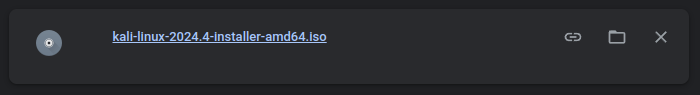{#fig:001 width=70%}

## Создание виртуальной машины

Указываем имя виртуальной машины, определяем тип операционной системы и указываем путь к iso-образу (рис. 2)

{#fig:002 width=40%}

## Создание виртуальной машины

Далее указываем размер оперативной памяти виртуальной машины - 4096 МБ и число процессоров - 3 (рис. 3)

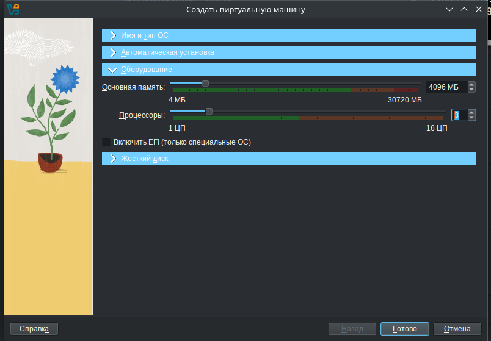{#fig:003 width=40%}

## Создание виртуальной машины

Задаём размер виртуального жёсткого диска - 40 ГБ (рис. 4)

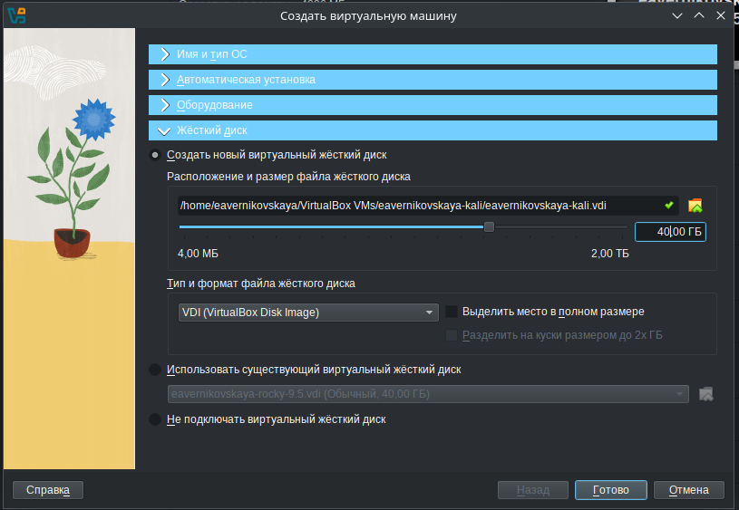{#fig:004 width=40%}

## Создание виртуальной машины

Далее запускаем установку систему (рис. 5)

{#fig:005 width=40%}

## Установка операционной системы

После запуска устанавливаем русский язык интерфейса (рис. 6)

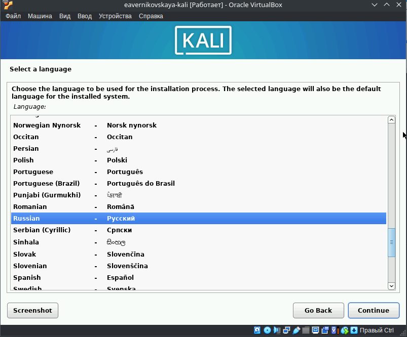{#fig:006 width=40%}

## Установка операционной системы

Выбираем местонахождение -  Российская Федерация (рис. 7)

{#fig:007 width=40%}

## Установка операционной системы

Добавляем русскую раскладку клавиатуры (рис. 8)

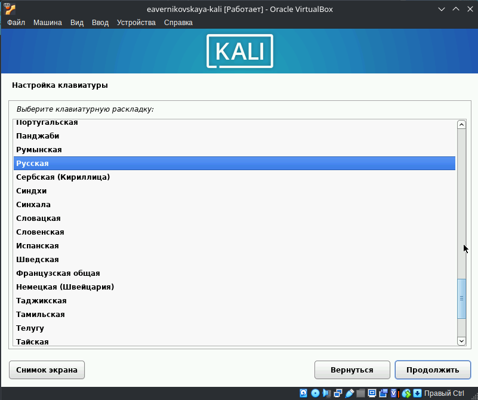{#fig:008 width=40%}

## Установка операционной системы

После настраиваем клавиатуру. Указываем способ переключения клавиатуры между национальносй раскладкой и стандартной латинской раскладкой - Alt+Shift (рис. 9)

{#fig:009 width=40%}

## Установка операционной системы

Далее настраиваем сеть. Вводим имя компьютера и имя домена (рис. 10), (рис. 11)

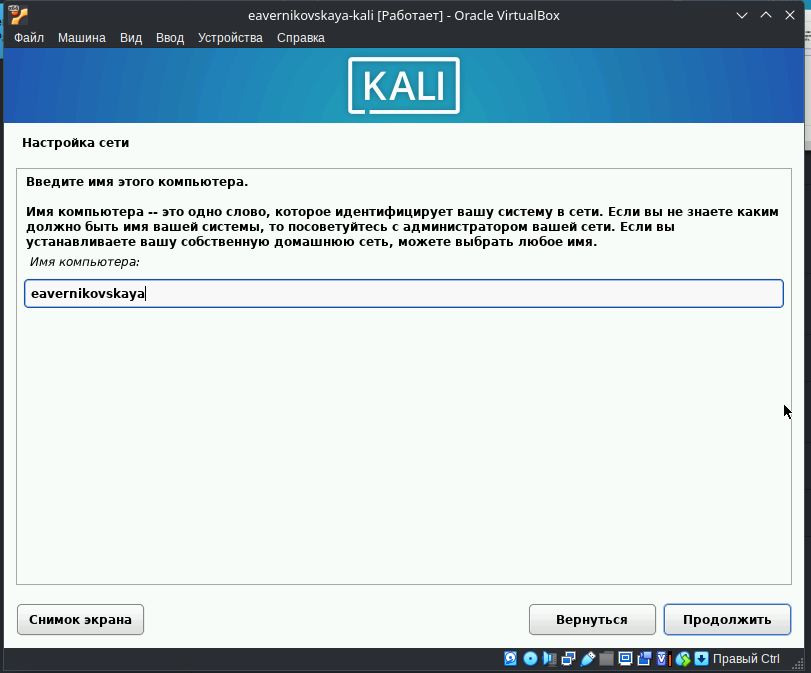{#fig:010 width=40%}

## Установка операционной системы

{#fig:011 width=40%}

## Установка операционной системы

После настраиваем учётную запись пользователя. Вводим полное имя пользователя и имя нашей учётной записи. Также задаём пароль для нашего пользователя (рис. 12), (рис. 13), (рис. 14)

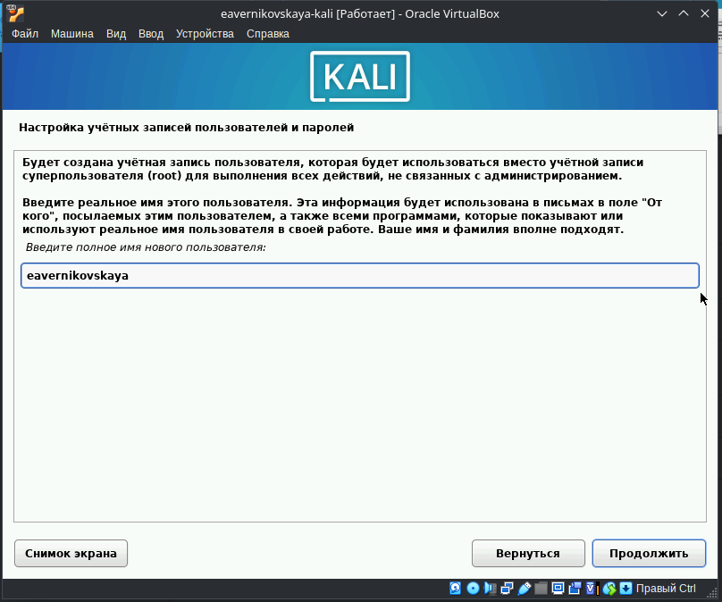{#fig:012 width=40%}

## Установка операционной системы

{#fig:013 width=40%}

## Установка операционной системы

{#fig:014 width=40%}

## Установка операционной системы

Далее настраиваем время. Выбираем нужный нам часовой пояс (рис. 15)

{#fig:015 width=40%}

## Установка операционной системы

Далее установщик предлагает разметку дисков. Так как созданный виртуальный диск пустой, выбираем "использовать весь диск". После, выбираем нужный диск для разметки. Далее предлагается выбрать одну из схем разметки. Оставляем рекомендуемую схему разметки, т.е. первую, "все файлы в одном разделе". После этого заканчиваем разметку и подтверждаем что мы хотим записать изменения на диск (рис. 16), (рис. 17), (рис. 18), (рис. 19), (рис. 20)

## Установка операционной системы

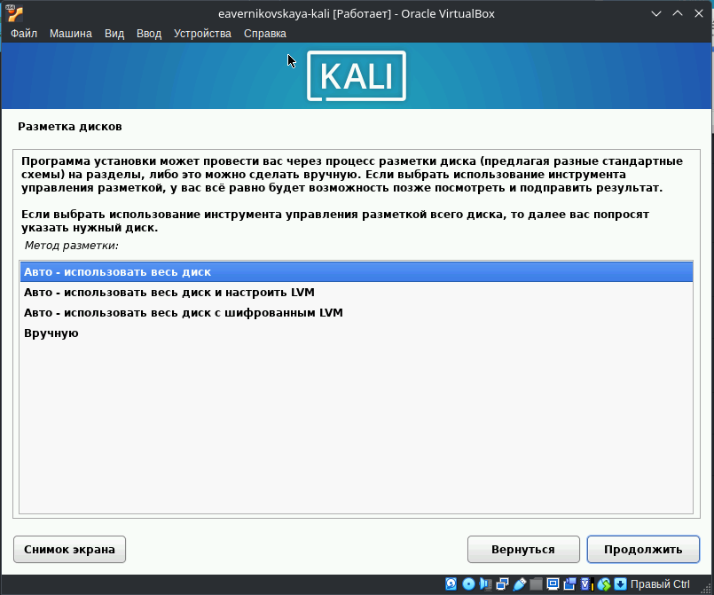{#fig:016 width=40%}

## Установка операционной системы

{#fig:017 width=40%}

## Установка операционной системы

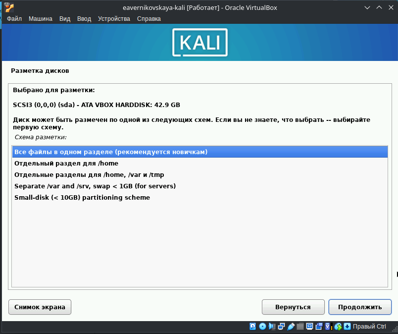{#fig:018 width=40%}

## Установка операционной системы

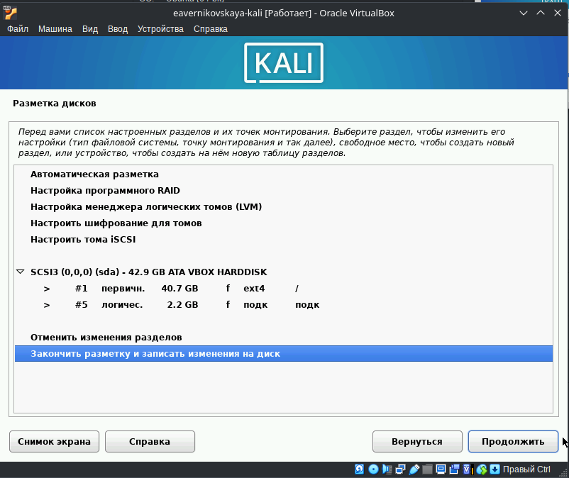{#fig:019 width=40%}

## Установка операционной системы

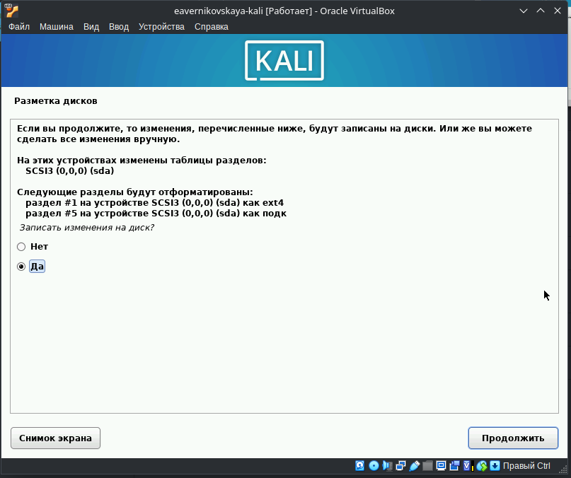{#fig:020 width=40%}

## Установка операционной системы

Далее предлагается выбор метапакетов, которые могут быть установлены. Выбор по умолчанию установит стандартную систему Kali Linux, поэтому оставляем выбор по умолчанию (рис. 21)

{#fig:021 width=40%}

## Установка операционной системы

Далее подтверждаем установку системного загрузчика GRUB (загрузчик операционной системы от проекта GNU программа для управления процессом загрузки), также выбираем виртуальный диск, на который устанавливать GRUB (рис. 22), (рис. 23)

{#fig:022 width=40%}

## Установка операционной системы

{#fig:023 width=40%}

## Установка операционной системы

После этго ждём завершение установки перезагружаем систему (рис. 24)

{#fig:024 width=40%}

## После установки

После установки ОС и перезапуска ВМ входим в ОС под заданной нами при установке учётной записью (рис. 25), (рис. 26)

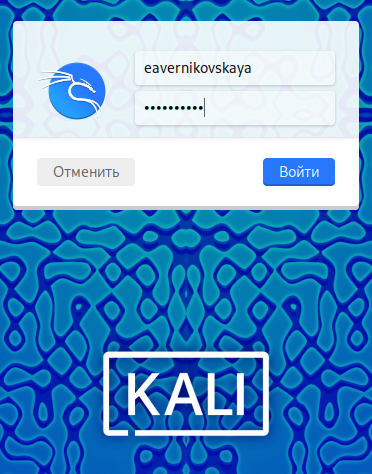{#fig:025 width=30%}

## После установки

{#fig:026 width=60%}

# Подведение итогов

## Выводы

В ходе выполнения 1-ого этапа индивидуального проекта мы установили дистрибутив Kali Linux в виртуальную машину

## Список литературы

1. Этапы реализации проекта [Электронный ресурс] URL: https://esystem.rudn.ru/mod/page/view.php?id=1220336
2. VirtualBox [Электронный ресурс] URL: https://www.virtualbox.org/wiki/Linux_Downloads
3. Kali Linux [Электронный ресурс] URL: https://www.kali.org/get-kali/#kali-platforms
