---
## Front matter
title: "Отчёт по выполнению 1-ого этапа индивидуального проекта"
subtitle: "Дисциплина: Основы информационной безопасности"
author: "Верниковская Екатерина Андреевна"

## Generic otions
lang: ru-RU
toc-title: "Содержание"

## Bibliography
bibliography: bib/cite.bib
csl: pandoc/csl/gost-r-7-0-5-2008-numeric.csl

## Pdf output format
toc: true # Table of contents
toc-depth: 2
lof: true # List of figures
lot: true # List of tables
fontsize: 12pt
linestretch: 1.5
papersize: a4
documentclass: scrreprt
## I18n polyglossia
polyglossia-lang:
  name: russian
  options:
	- spelling=modern
	- babelshorthands=true
polyglossia-otherlangs:
  name: english
## I18n babel
babel-lang: russian
babel-otherlangs: english
## Fonts
mainfont: PT Serif
romanfont: PT Serif
sansfont: PT Sans
monofont: PT Mono
mainfontoptions: Ligatures=TeX
romanfontoptions: Ligatures=TeX
sansfontoptions: Ligatures=TeX,Scale=MatchLowercase
monofontoptions: Scale=MatchLowercase,Scale=0.9
## Biblatex
biblatex: true
biblio-style: "gost-numeric"
biblatexoptions:
  - parentracker=true
  - backend=biber
  - hyperref=auto
  - language=auto
  - autolang=other*
  - citestyle=gost-numeric
## Pandoc-crossref LaTeX customization
figureTitle: "Рис."
tableTitle: "Таблица"
listingTitle: "Листинг"
lofTitle: "Список иллюстраций"
lotTitle: "Список таблиц"
lolTitle: "Листинги"
## Misc options
indent: true
header-includes:
  - \usepackage{indentfirst}
  - \usepackage{float} # keep figures where there are in the text
  - \floatplacement{figure}{H} # keep figures where there are in the text
---

# Цель работы

Научиться основным способам тестирования веб приложений. Установка Kali Linux

# Задание

1. Установите дистрибутив Kali Linux в виртуальную машину.

# Выполнение 1-ого этапа индивидуального проекта

## Создание виртуальной машины

Скачиваем Kali Linux (рис. [-@fig:001])

{#fig:001 width=70%}

Указываем имя виртуальной машины, определяем тип операционной системы и указываем путь к iso-образу (рис. [-@fig:002])

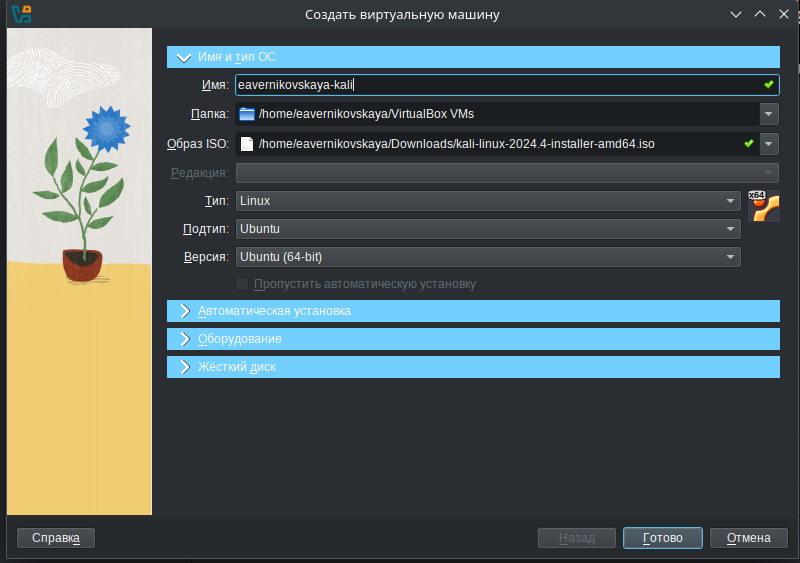{#fig:002 width=70%}

Далее указываем размер оперативной памяти виртуальной машины - 4096 МБ и число процессоров - 3 (рис. [-@fig:003])

{#fig:003 width=70%}

Задаём размер виртуального жёсткого диска - 40 ГБ (рис. [-@fig:004])

{#fig:004 width=70%}

Далее запускаем установку систему (рис. [-@fig:005])

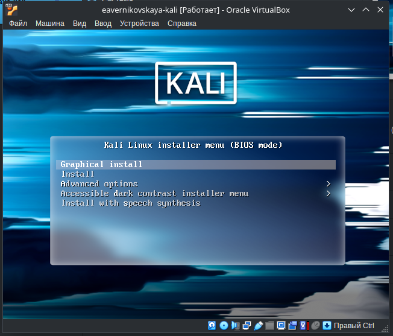{#fig:005 width=70%}

## Установка операционной системы

После запуска устанавливаем русский язык интерфейса (рис. [-@fig:006])

{#fig:006 width=70%}

Выбираем местонахождение -  Российская Федерация (рис. [-@fig:007])

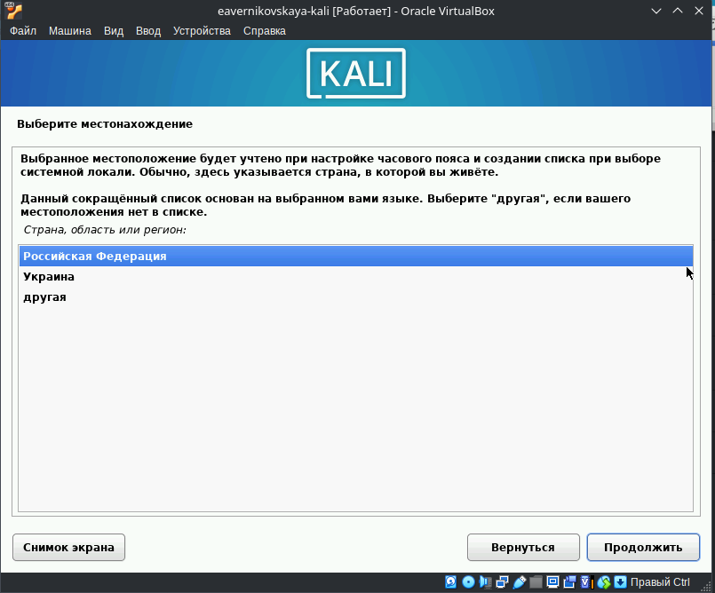{#fig:007 width=70%}

Добавляем русскую раскладку клавиатуры (рис. [-@fig:008])

{#fig:008 width=70%}

После настраиваем клавиатуру. Указываем способ переключения клавиатуры между национальносй раскладкой и стандартной латинской раскладкой - Alt+Shift (рис. [-@fig:009])

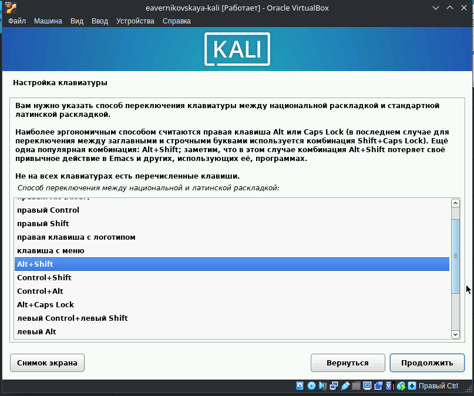{#fig:009 width=70%}

Далее настраиваем сеть. Вводим имя компьютера и имя домена (рис. [-@fig:010]), (рис. [-@fig:011])

{#fig:010 width=70%}

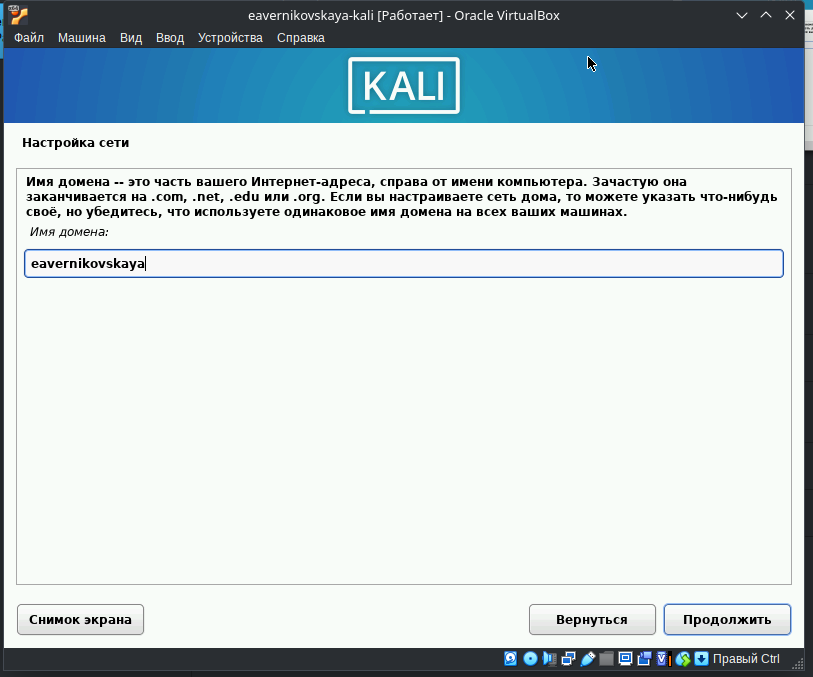{#fig:011 width=70%}

После настраиваем учётную запись пользователя. Вводим полное имя пользователя и имя нашей учётной записи. Также задаём пароль для нашего пользователя (рис. [-@fig:012]), (рис. [-@fig:013]), (рис. [-@fig:014])

{#fig:012 width=70%}

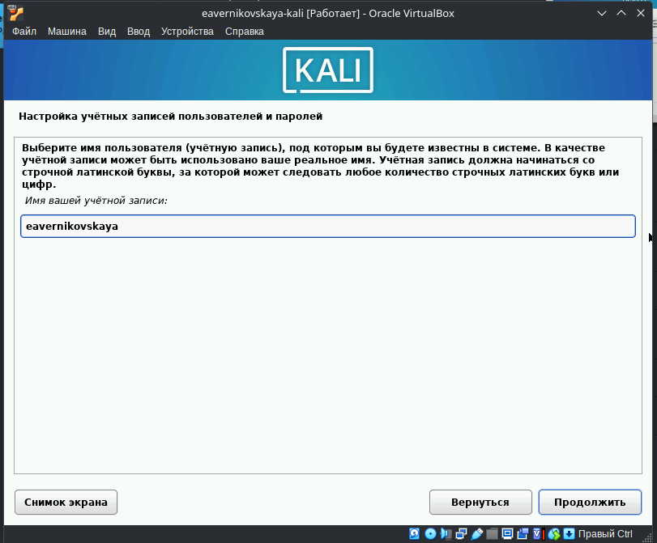{#fig:013 width=70%}

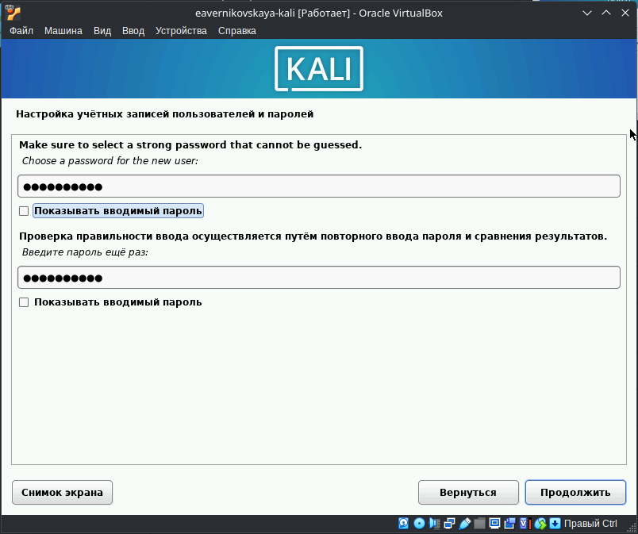{#fig:014 width=70%}

Далее настраиваем время. Выбираем нужный нам часовой пояс (рис. [-@fig:015])

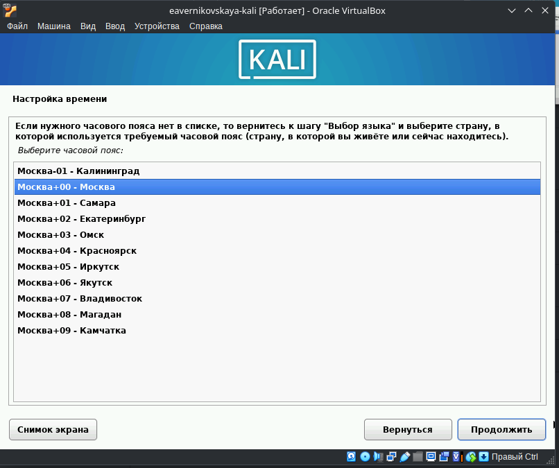{#fig:015 width=70%}

Далее установщик предлагает разметку дисков. Так как созданный виртуальный диск пустой, выбираем "использовать весь диск". После, выбираем нужный диск для разметки. Далее предлагается выбрать одну из схем разметки. Оставляем рекомендуемую схему разметки, т.е. первую, "все файлы в одном разделе". После этого заканчиваем разметку и подтверждаем что мы хотим записать изменения на диск (рис. [-@fig:016]), (рис. [-@fig:017]), (рис. [-@fig:018]), (рис. [-@fig:019]), (рис. [-@fig:020])

{#fig:016 width=70%}

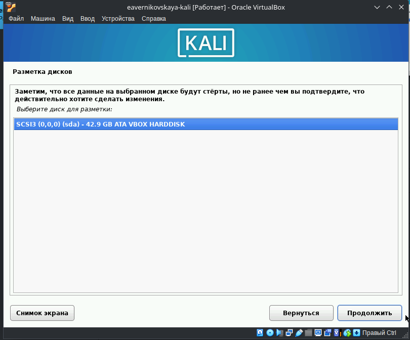{#fig:017 width=70%}

{#fig:018 width=70%}

{#fig:019 width=70%}

{#fig:020 width=70%}

Далее предлагается выбор метапакетов, которые могут быть установлены. Выбор по умолчанию установит стандартную систему Kali Linux, поэтому оставляем выбор по умолчанию (рис. [-@fig:021])

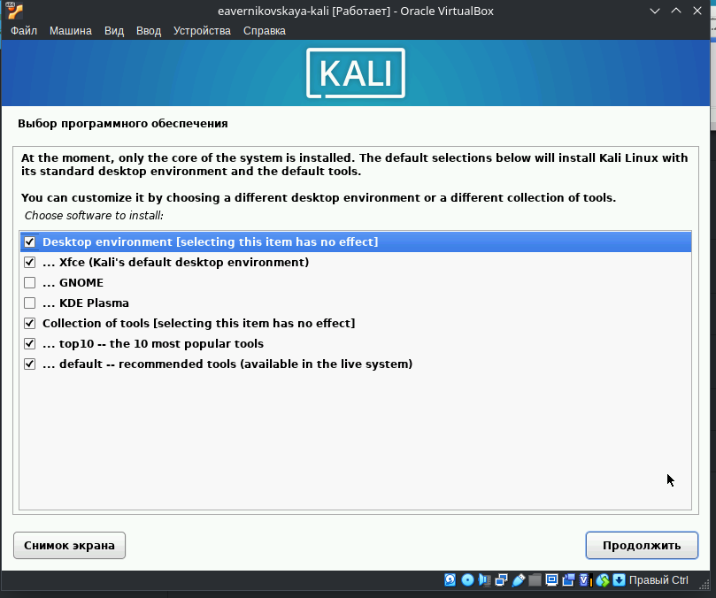{#fig:021 width=70%}

Далее подтверждаем установку системного загрузчика GRUB (загрузчик операционной системы от проекта GNU программа для управления процессом загрузки), также выбираем виртуальный диск, на который устанавливать GRUB (рис. [-@fig:022]), (рис. [-@fig:023])

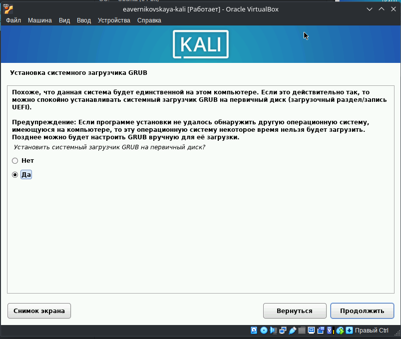{#fig:022 width=70%}

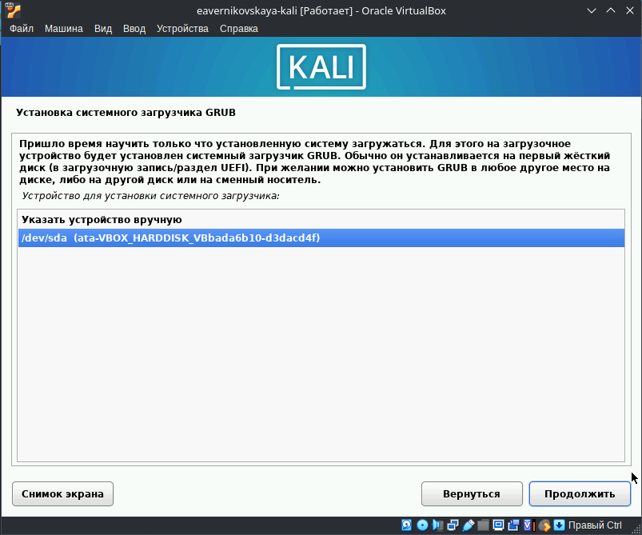{#fig:023 width=70%}

После этго ждём завершение установки перезагружаем систему (рис. [-@fig:024])

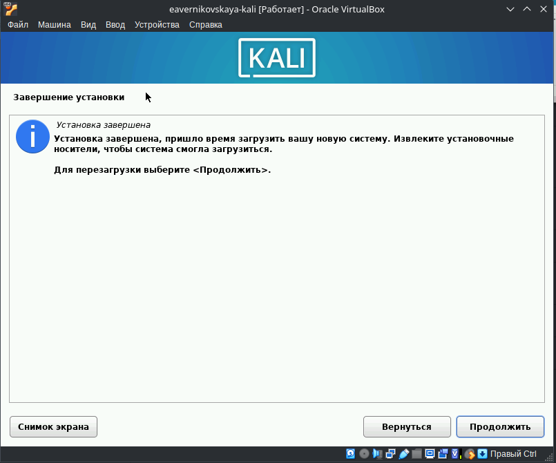{#fig:024 width=70%}

## После установки

После установки ОС и перезапуска ВМ входим в ОС под заданной нами при установке учётной записью (рис. [-@fig:025]), (рис. [-@fig:026])

{#fig:025 width=70%}

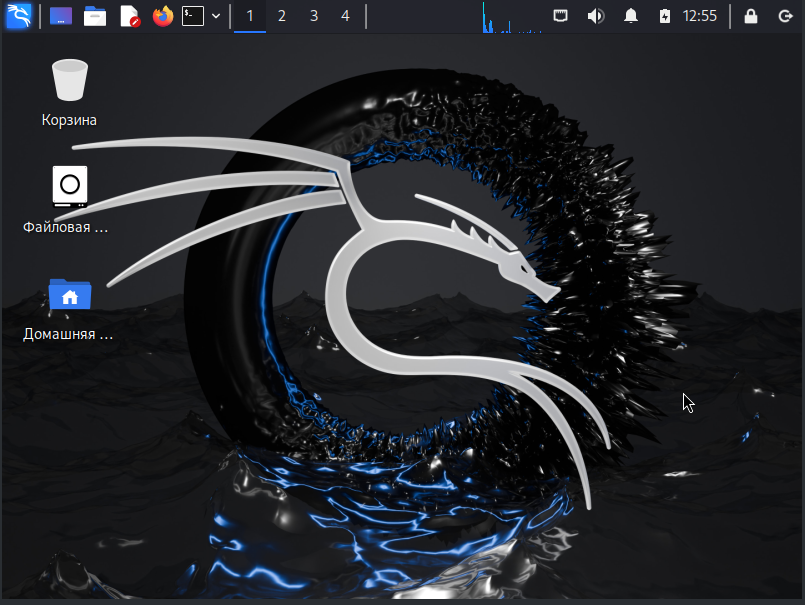{#fig:026 width=70%}

# Выводы
 
В ходе выполнения 1-ого этапа индивидуального проекта мы установили дистрибутив Kali Linux в виртуальную машину

# Список литературы

1. Этапы реализации проекта [Электронный ресурс] URL: https://esystem.rudn.ru/mod/page/view.php?id=1220336
2. VirtualBox [Электронный ресурс] URL: https://www.virtualbox.org/wiki/Linux_Downloads
3. Kali Linux [Электронный ресурс] URL: https://www.kali.org/get-kali/#kali-platforms
