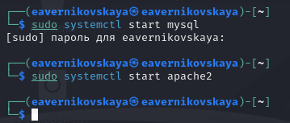
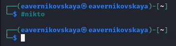
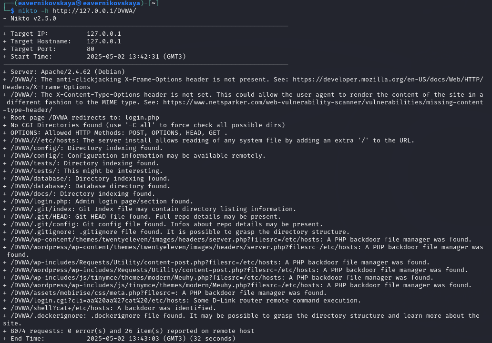

---
## Front matter
lang: ru-RU
title: 4-ый этап индивидуального проекта
subtitle: Основы информационной безопасности
author:
  - Верниковская Е. А., НПИбд-01-23
institute:
  - Российский университет дружбы народов, Москва, Россия
date: 2 мая 2025

## i18n babel
babel-lang: russian
babel-otherlangs: english

## Formatting pdf
toc: false
toc-title: Содержание
slide_level: 2
aspectratio: 169
section-titles: true
theme: metropolis
header-includes:
 - \metroset{progressbar=frametitle,sectionpage=progressbar,numbering=fraction}
 - '\makeatletter'
 - '\beamer@ignorenonframefalse'
 - '\makeatother'
 
## Fonts
mainfont: PT Serif
romanfont: PT Serif
sansfont: PT Sans
monofont: PT Mono
mainfontoptions: Ligatures=TeX
romanfontoptions: Ligatures=TeX
sansfontoptions: Ligatures=TeX,Scale=MatchLowercase
monofontoptions: Scale=MatchLowercase,Scale=0.9
---

# Вводная часть

## Цель работы

Научиться тестированию веб-приложений с помощью сканера nikto.

## Задание

1. Использовать сканер nikto

# Выполнение 4-ого этапа индивидуального проекта

## Выполнение основных действий

Чтобы работать с nikto, надо сначала подготовить веб-приложение, которое мы будем сканировать. Это будет DVWA. Запустим mysql и apache2: *sudo systemctl start mysql* и *sudo systemctl start apache2* (рис. 1)

{#fig:001 width=70%}

## Выполнение основных действий

Далее введём в адресной строке браузера адрес DVWA и перейдём в режим уровня безопасности. Поставим минимальный уровень безопасности "Low" (рис. 2)

{#fig:002 width=30%}

## Выполнение основных действий

Далее запустим nikto (рис. 3)

{#fig:003 width=70%}

## Выполнение основных действий

Проверить веб-приожение можно введя его полный URL. Просканируем веб-приложение таким образом введя команду *nikto -h http://127.0.0.1/DVWA/* (рис. 4)

{#fig:004 width=50%}

## Выполнение основных действий

Проверить веб-приожение можно также введя адрес хоста и адрес порта. Просканируем веб-приложение таким образом введя команду *nikto -h 127.0.0.1 -p 80* (рис. 5)

{#fig:005 width=50%}

# Подведение итогов

## Выводы

В ходе выполнения 4-ого этапа индивидуального проекта мы научились использовать сканер nikto для тестирования веб-приложений.

## Список литературы

1. Этапы реализации проекта [Электронный ресурс] URL: https://esystem.rudn.ru/mod/page/view.php?id=1220336
2. Обзор сканера Nikto для поиска уязвимостей в веб-серверах [Электронный ресурс] URL: https://habr.com/ru/companies/first/articles/731696/
