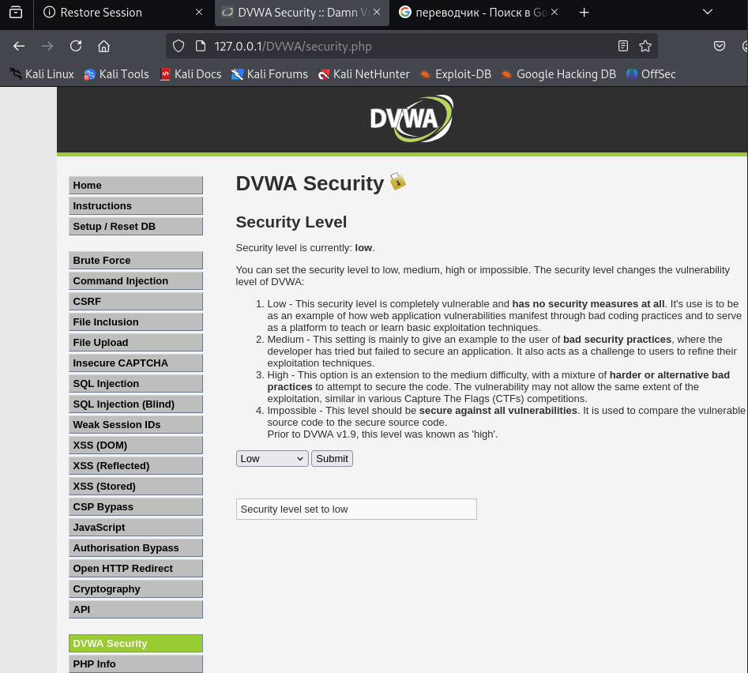
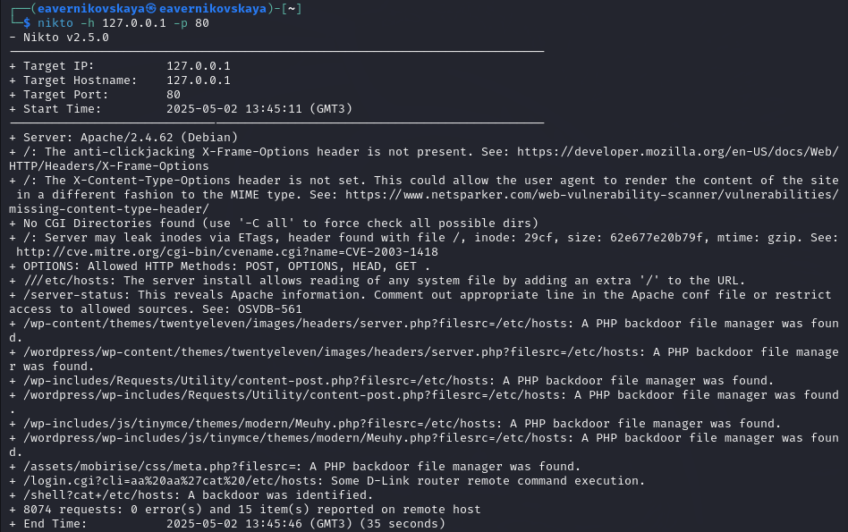

---
## Front matter
title: "Отчёт по выполнению 4-ого этапа индивидуального проекта"
subtitle: "Дисциплина: Основы информационной безопасности"
author: "Верниковская Екатерина Андреевна"

## Generic otions
lang: ru-RU
toc-title: "Содержание"

## Bibliography
bibliography: bib/cite.bib
csl: pandoc/csl/gost-r-7-0-5-2008-numeric.csl

## Pdf output format
toc: true # Table of contents
toc-depth: 2
lof: true # List of figures
lot: true # List of tables
fontsize: 12pt
linestretch: 1.5
papersize: a4
documentclass: scrreprt
## I18n polyglossia
polyglossia-lang:
  name: russian
  options:
	- spelling=modern
	- babelshorthands=true
polyglossia-otherlangs:
  name: english
## I18n babel
babel-lang: russian
babel-otherlangs: english
## Fonts
mainfont: PT Serif
romanfont: PT Serif
sansfont: PT Sans
monofont: PT Mono
mainfontoptions: Ligatures=TeX
romanfontoptions: Ligatures=TeX
sansfontoptions: Ligatures=TeX,Scale=MatchLowercase
monofontoptions: Scale=MatchLowercase,Scale=0.9
## Biblatex
biblatex: true
biblio-style: "gost-numeric"
biblatexoptions:
  - parentracker=true
  - backend=biber
  - hyperref=auto
  - language=auto
  - autolang=other*
  - citestyle=gost-numeric
## Pandoc-crossref LaTeX customization
figureTitle: "Рис."
tableTitle: "Таблица"
listingTitle: "Листинг"
lofTitle: "Список иллюстраций"
lotTitle: "Список таблиц"
lolTitle: "Листинги"
## Misc options
indent: true
header-includes:
  - \usepackage{indentfirst}
  - \usepackage{float} # keep figures where there are in the text
  - \floatplacement{figure}{H} # keep figures where there are in the text
---

# Цель работы

Научиться тестированию веб-приложений с помощью сканера nikto.

# Задание

1. Использовать сканер nikto

# Выполнение 4-ого этапа индивидуального проекта

## Выполнение основных действий

Чтобы работать с nikto, надо сначала подготовить веб-приложение, которое мы будем сканировать. Это будет DVWA. Запустим mysql и apache2: *sudo systemctl start mysql* и *sudo systemctl start apache2* (рис. [-@fig:001])

{#fig:001 width=70%}

Далее введём в адресной строке браузера адрес DVWA и перейдём в режим уровня безопасности. Поставим минимальный уровень безопасности "Low" (рис. [-@fig:002])

{#fig:002 width=70%}

Далее запустим nikto (рис. [-@fig:003])

{#fig:003 width=70%}

Проверить веб-приожение можно введя его полный URL. Просканируем веб-приложение таким образом введя команду *nikto -h http://127.0.0.1/DVWA/* (рис. [-@fig:004])

{#fig:004 width=70%}

Проверить веб-приожение можно также введя адрес хоста и адрес порта. Просканируем веб-приложение таким образом введя команду *nikto -h 127.0.0.1 -p 80* (рис. [-@fig:005])

{#fig:005 width=70%}

## Анализ результатов сканирования

1. Отсутствие критических HTTP-заголовков:

- X-Frame-Options: Отсутствует защита от кликджекинга (clickjacking), что позволяет злоумышленнику встраивать страницу в iframe и выполнять действия от имени пользователя.
- X-Content-Type-Options: Не установлен заголовок, что может привести к MIME-sniffing атакам, когда браузер неправильно интерпретирует тип контента.

2. Раскрытие системных файлов:

- Доступ к /etc/hosts: Добавление лишнего / в URL (например, //etc/hosts) позволяет читать системные файлы. Это критическая уязвимость, так как злоумышленник может получить доступ к конфиденциальной информации.
- Раскрытие Apache-информации: Доступ к /server-status может предоставить злоумышленнику детали о сервере и его активности.

3. PHP-бэкдоры и файловые менеджеры:

- Обнаружены подозрительные PHP-файлы (например, server.php, meta.php), которые могут быть бэкдорами или файловыми менеджерами. Примеры:
    + /wp-content/themes/twentyeleven/images/headers/server.php?filesrc=/etc/hosts
    + /assets/mobirise/css/meta.php?filesrc=
    + /shell?cat=/etc/hosts

- Эти файлы позволяют злоумышленнику читать и, возможно, изменять файлы на сервере.

Backdoor — вредоносная программа, а иногда намеренно оставленная лазейка в коде легальной программы, которая предоставляет доступ к устройству для несанкционированных действий. Бэкдор в точности соответствует своему названию (от англ. back door — «черный ход»): скрытно впускает злоумышленника в систему, наделяя правами администратора.

4. Уязвимости в директориях:

- Индексация директорий: Найдены открытые директории (/DVWA/config/, /DVWA/database/, /DVWA/docs/), что позволяет злоумышленнику просматривать их содержимое без аутентификации.
- Git-репозиторий: Обнаружены файлы .git/index, .git/HEAD, .git/config, что может привести к утечке исходного кода, если репозиторий не защищен.

5. Уязвимости в CMS (WordPress):

- Найдены пути, связанные с WordPress (например, /wordpress/wp-includes/...), что указывает на возможное использование устаревших или уязвимых версий плагинов/тем.

6. Уязвимости в маршрутизаторах:

- /login.cgi?cli=aa%20aa%22cat%20/etc/hosts: Уязвимость, связанная с D-Link router, позволяющая выполнять удаленные команды

# Выводы
 
В ходе выполнения 4-ого этапа индивидуального проекта мы научились использовать сканер nikto для тестирования веб-приложений.

# Список литературы

1. Этапы реализации проекта [Электронный ресурс] URL: https://esystem.rudn.ru/mod/page/view.php?id=1220336
2. Обзор сканера Nikto для поиска уязвимостей в веб-серверах [Электронный ресурс] URL: https://habr.com/ru/companies/first/articles/731696/
