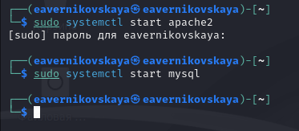
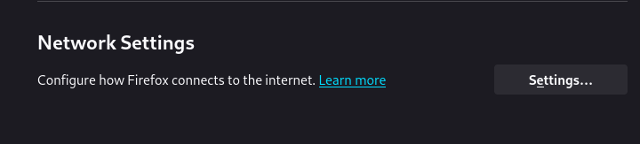
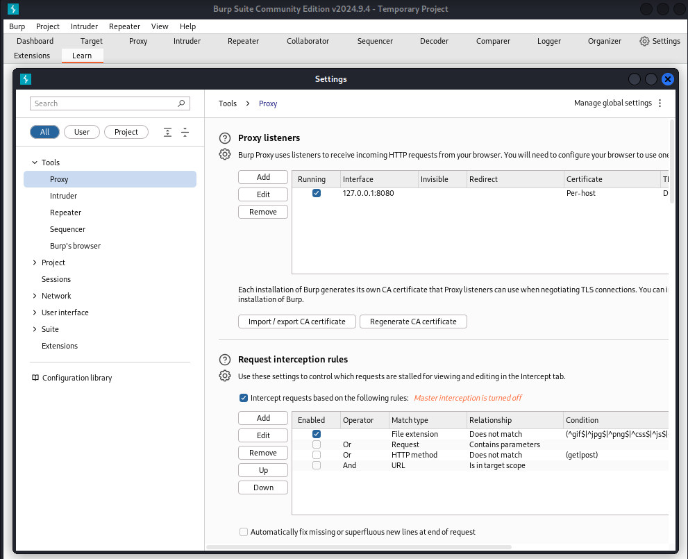
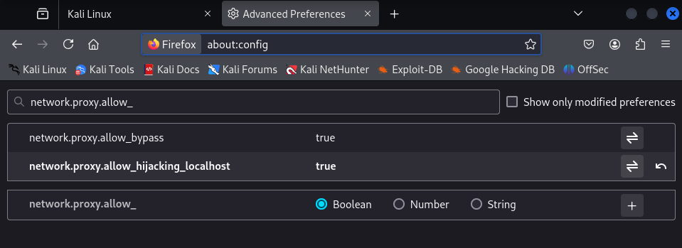
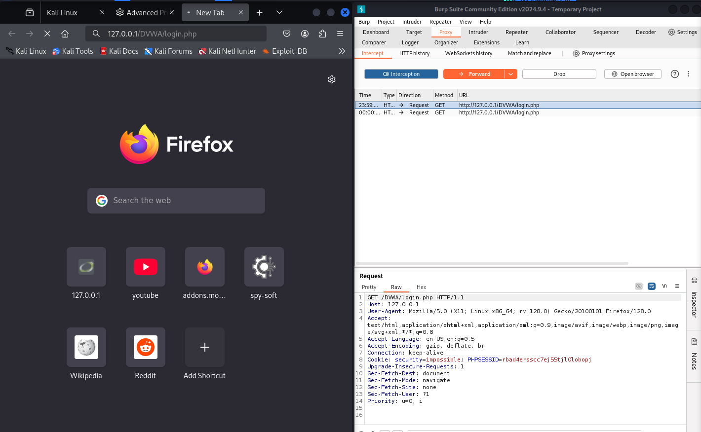
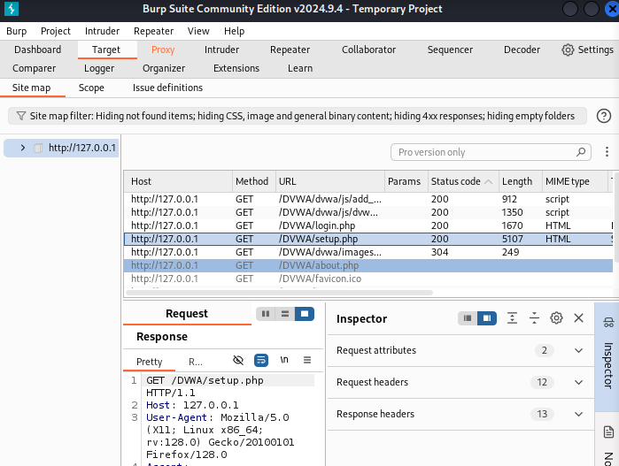
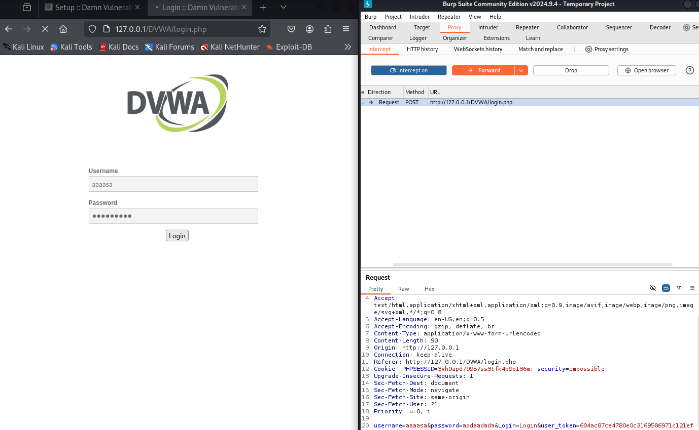
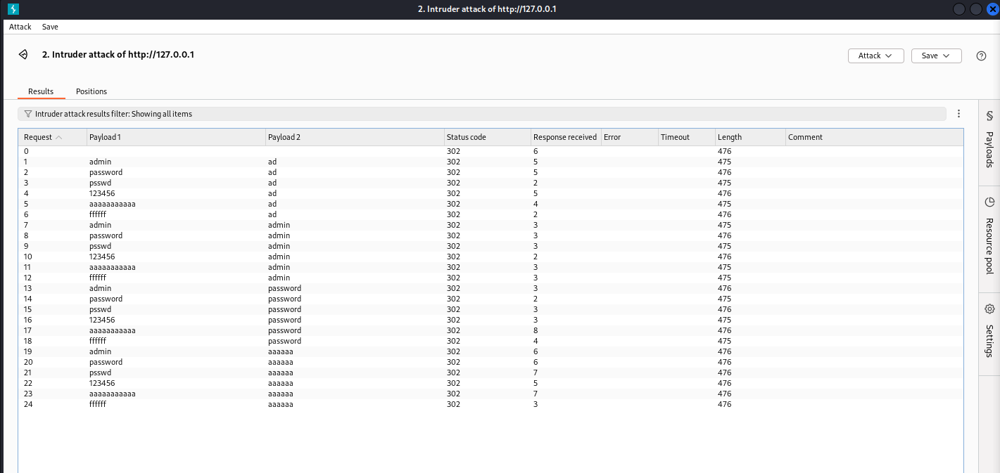
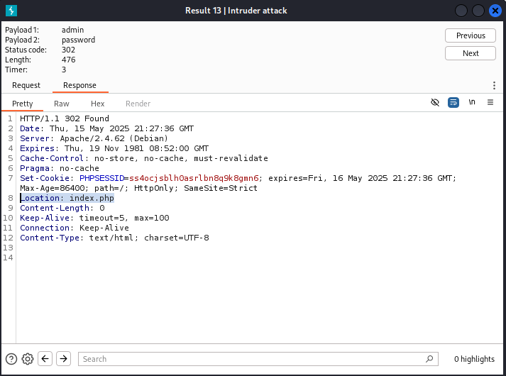
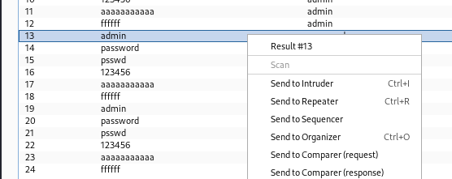

---
## Front matter
lang: ru-RU
title: 5-ый этап индивидуального проекта
subtitle: Основы информационной безопасности
author:
  - Верниковская Е. А., НПИбд-01-23
institute:
  - Российский университет дружбы народов, Москва, Россия
date: 17 мая 2025

## i18n babel
babel-lang: russian
babel-otherlangs: english

## Formatting pdf
toc: false
toc-title: Содержание
slide_level: 2
aspectratio: 169
section-titles: true
theme: metropolis
header-includes:
 - \metroset{progressbar=frametitle,sectionpage=progressbar,numbering=fraction}
 - '\makeatletter'
 - '\beamer@ignorenonframefalse'
 - '\makeatother'
 
## Fonts
mainfont: PT Serif
romanfont: PT Serif
sansfont: PT Sans
monofont: PT Mono
mainfontoptions: Ligatures=TeX
romanfontoptions: Ligatures=TeX
sansfontoptions: Ligatures=TeX,Scale=MatchLowercase
monofontoptions: Scale=MatchLowercase,Scale=0.9
---

# Вводная часть

## Цель работы

Научиться пользоваться Burp Suite.

## Задание

1. Научиться пользоваться Burp Suite. Burp Suite представляет собой набор мощных инструментов безопасности веб-приложений, которые демонстрируют реальные возможности злоумышленника, проникающего в веб-приложения

# Выполнение 5-ого этапа индивидуального проекта

## Выполнение основных действий

Запустим mysql и apache2: *sudo systemctl start mysql* и *sudo systemctl start apache2* (рис. 1)

{#fig:001 width=70%}

## Выполнение основных действий

Далее запустим Burp Suite (рис. 2)

{#fig:002 width=70%}

## Выполнение основных действий

Откроем сетевые настройки браузера (рис. 3)

{#fig:003 width=70%}

## Выполнение основных действий

Далее изменим настройки сервера для работы с proxy и захватом данных с помощью Burp Suite (рис. 4)

{#fig:004 width=30%}

## Выполнение основных действий

Изменим настройки proxy инструмента Burp Suite (рис. 5)

{#fig:005 width=40%}

## Выполнение основных действий

Во вкладке Proxy установим "Interxept is on" (рис. 6)

{#fig:006 width=70%}

## Выполнение основных действий

Для того чтобы Burp Suite работал исправно с локальным сервером установим параметр network_allow_hijacking_localhost на true (рис. 7)

{#fig:007 width=70%}

## Выполнение основных действий

Далее попытаемся зайти в браузере на сайт DVWA. Во вкладке Proxy появится захваченный запрос. Нажмём Forward чтобы загрузить страницу (рис. 8)

{#fig:008 width=50%}

## Выполнение основных действий

После этго загрузится страница авторизации. Текст запроса поменяется (рис. 9)

{#fig:009 width=60%}

## Выполнение основных действий

История запросов хранится во вкладке Target (рис. 10)

{#fig:010 width=50%}

## Выполнение основных действий

Введём неправильные данные в веб-приложение и нажмём на Login. В запросе мы увидим строчку, в которой отображаются введённые нами данные (в поле для ввода) (рис. 11)

{#fig:011 width=50%}

## Выполнение основных действий

Этот запос можно найти во вкладке Target. Нажмём правой кнопкой мыши на хост нужного запроса и нажмём Send to Intruder (рис. 12)

{#fig:012 width=40%}

## Выполнение основных действий

Далее переходим на вкладку Intruder. Мы увидим значения по умолчанию у типа атаки и наш введённый запрос (рис. 13)

{#fig:013 width=40%}

## Выполнение основных действий

Изменим значение типа атаки на Cluster bomb attack и проставим специальные символы у техданных, которые мы будем пробивать (то есть у имени пользователяи пароля) (рис. 14)

{#fig:014 width=30%}

## Выполнение основных действий

Так как было отмечено 2 параметра для подбора, то нам нужно 2 списка со значениями для подбора. Далее заполняем 2 списка в Payload settings. В строке request count мы будем видеть нужное количество запросов, чтобы проверить все возможные пары пользователь-пароль (рис. 15), (рис. 16)

{#fig:015 width=70%}

## Выполнение основных действий

{#fig:016 width=70%}

## Выполнение основных действий

Далее запустим атаку (рис. 17)

{#fig:017 width=70%}

## Выполнение основных действий

При открытии каждого post-запроса можно увидеть полученный get-запрос. В нём видно куда нас перенаправляют после выполнения ввода пары пользователь пароль. На (рис. 18) с подбором пары admin-ad видно, что нас перенаправляют на страницу login.php. Это значит что пара не подходит

{#fig:018 width=40%}

## Выполнение основных действий

Далее проверим результат пары sdmin-password. В этом случае нас перенаправляют на страницу index.php. Это значит что пара верная (рис. 19) 

{#fig:019 width=50%}

## Выполнение основных действий

Также есть дополнительная проверка. Для этого нужно нажать на Send to Repeater (рис. 20) 

{#fig:020 width=70%}

## Выполнение основных действий

Переходим во вкладку Repeater (рис. 21) 

{#fig:021 width=50%}

## Выполнение основных действий

Нажмём на send. И получим в Response перенаправление на index.php (рис. 22) 

{#fig:022 width=70%}

## Выполнение основных действий

Далее нажмём Follow redirection. После этого мы получим html код в окне Response (подокно Pretty) (рис. 23) 

{#fig:023 width=70%}

## Выполнение основных действий

Далее в подокне Render получим то как выглядит полученная страница (рис. 24) 

{#fig:024 width=70%}

# Подведение итогов

## Выводы

В ходе выполнения 5-ого этапа индивидуального проекта мы научились использовать инструмент Burp Suite

## Список литературы

1. Этапы реализации проекта [Электронный ресурс] URL: https://esystem.rudn.ru/mod/page/view.php?id=1220336
