---
## Front matter
title: "Отчёт по выполнению 5-ого этапа индивидуального проекта"
subtitle: "Дисциплина: Основы информационной безопасности"
author: "Верниковская Екатерина Андреевна"

## Generic otions
lang: ru-RU
toc-title: "Содержание"

## Bibliography
bibliography: bib/cite.bib
csl: pandoc/csl/gost-r-7-0-5-2008-numeric.csl

## Pdf output format
toc: true # Table of contents
toc-depth: 2
lof: true # List of figures
lot: true # List of tables
fontsize: 12pt
linestretch: 1.5
papersize: a4
documentclass: scrreprt
## I18n polyglossia
polyglossia-lang:
  name: russian
  options:
	- spelling=modern
	- babelshorthands=true
polyglossia-otherlangs:
  name: english
## I18n babel
babel-lang: russian
babel-otherlangs: english
## Fonts
mainfont: PT Serif
romanfont: PT Serif
sansfont: PT Sans
monofont: PT Mono
mainfontoptions: Ligatures=TeX
romanfontoptions: Ligatures=TeX
sansfontoptions: Ligatures=TeX,Scale=MatchLowercase
monofontoptions: Scale=MatchLowercase,Scale=0.9
## Biblatex
biblatex: true
biblio-style: "gost-numeric"
biblatexoptions:
  - parentracker=true
  - backend=biber
  - hyperref=auto
  - language=auto
  - autolang=other*
  - citestyle=gost-numeric
## Pandoc-crossref LaTeX customization
figureTitle: "Рис."
tableTitle: "Таблица"
listingTitle: "Листинг"
lofTitle: "Список иллюстраций"
lotTitle: "Список таблиц"
lolTitle: "Листинги"
## Misc options
indent: true
header-includes:
  - \usepackage{indentfirst}
  - \usepackage{float} # keep figures where there are in the text
  - \floatplacement{figure}{H} # keep figures where there are in the text
---

# Цель работы

Научиться пользоваться Burp Suite.

# Задание

1. Научиться пользоваться Burp Suite. Burp Suite представляет собой набор мощных инструментов безопасности веб-приложений, которые демонстрируют реальные возможности злоумышленника, проникающего в веб-приложения

# Выполнение 5-ого этапа индивидуального проекта

## Выполнение основных действий

Запустим mysql и apache2: *sudo systemctl start mysql* и *sudo systemctl start apache2* (рис. [-@fig:001])

{#fig:001 width=70%}

Далее запустим Burp Suite (рис. [-@fig:002])

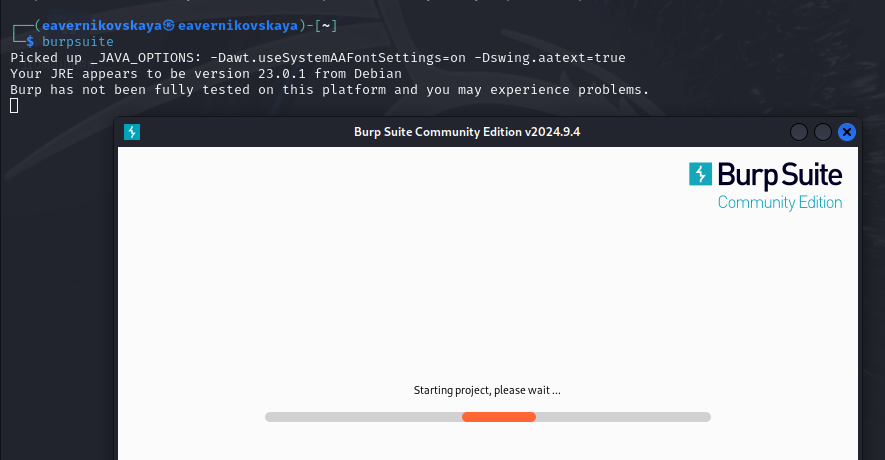{#fig:002 width=70%}

Откроем сетевые настройки браузера (рис. [-@fig:003])

{#fig:003 width=70%}

Далее изменим настройки сервера для работы с proxy и захватом данных с помощью Burp Suite (рис. [-@fig:004])

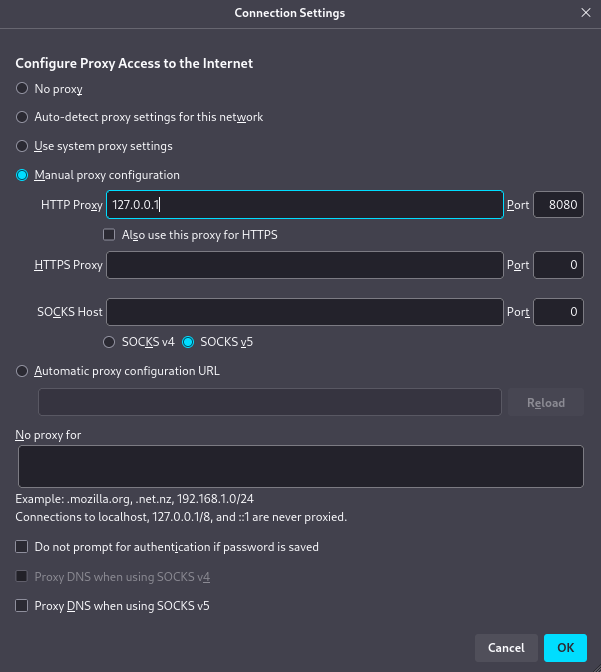{#fig:004 width=70%}

Изменим настройки proxy инструмента Burp Suite (рис. [-@fig:005])

{#fig:005 width=70%}

Во вкладке Proxy установим "Interxept is on" (рис. [-@fig:006])

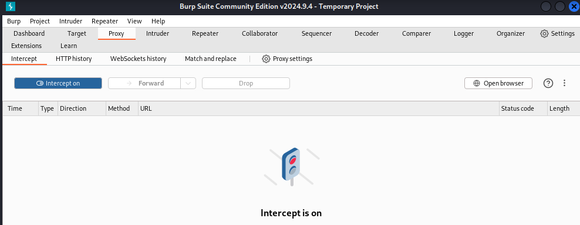{#fig:006 width=70%}

Для того чтобы Burp Suite работал исправно с локальным сервером установим параметр network_allow_hijacking_localhost на true (рис. [-@fig:007])

{#fig:007 width=70%}

Далее попытаемся зайти в браузере на сайт DVWA. Во вкладке Proxy появится захваченный запрос. Нажмём Forward чтобы загрузить страницу (рис. [-@fig:008])

{#fig:008 width=70%}

После этго загрузится страница авторизации. Текст запроса поменяется (рис. [-@fig:009])

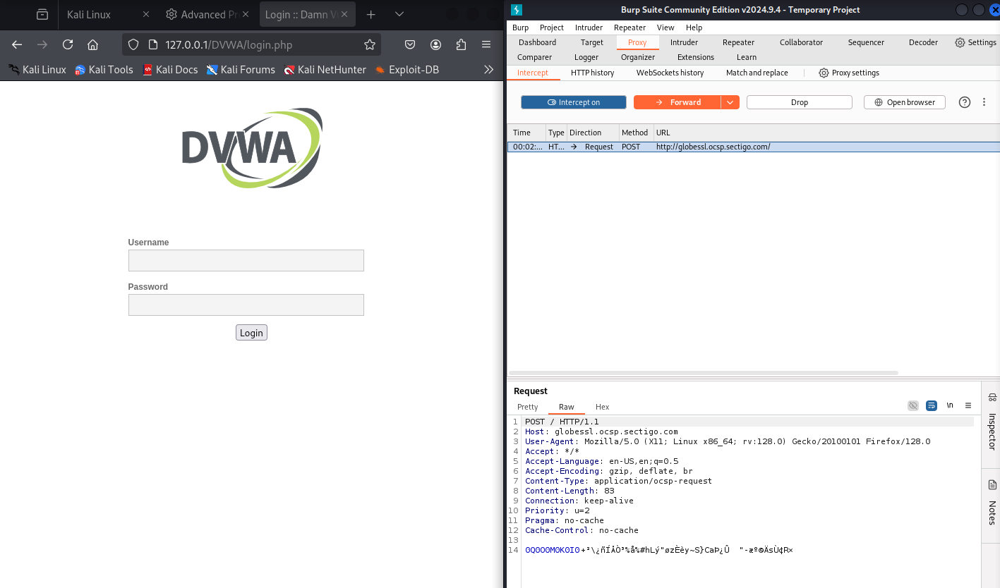{#fig:009 width=70%}

История запросов хранится во вкладке Target (рис. [-@fig:010])

{#fig:010 width=70%}

Введём неправильные данные в веб-приложение и нажмём на Login. В запросе мы увидим строчку, в которой отображаются введённые нами данные (в поле для ввода) (рис. [-@fig:011])

{#fig:011 width=70%}

Этот запос можно найти во вкладке Target. Нажмём правой кнопкой мыши на хост нужного запроса и нажмём Send to Intruder (рис. [-@fig:012])

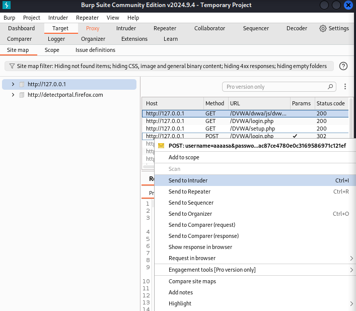{#fig:012 width=70%}

Далее переходим на вкладку Intruder. Мы увидим значения по умолчанию у типа атаки и наш введённый запрос (рис. [-@fig:013])

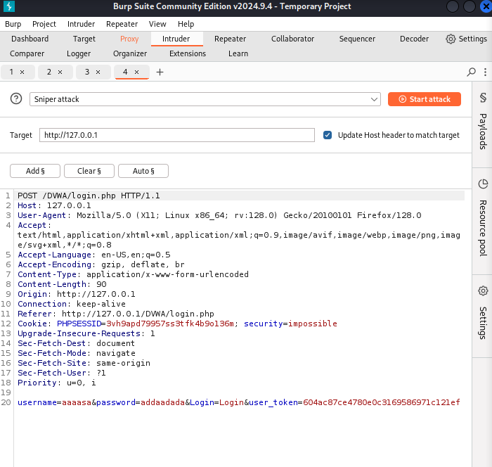{#fig:013 width=70%}

Изменим значение типа атаки на Cluster bomb attack и проставим специальные символы у техданных, которые мы будем пробивать (то есть у имени пользователяи пароля) (рис. [-@fig:014])

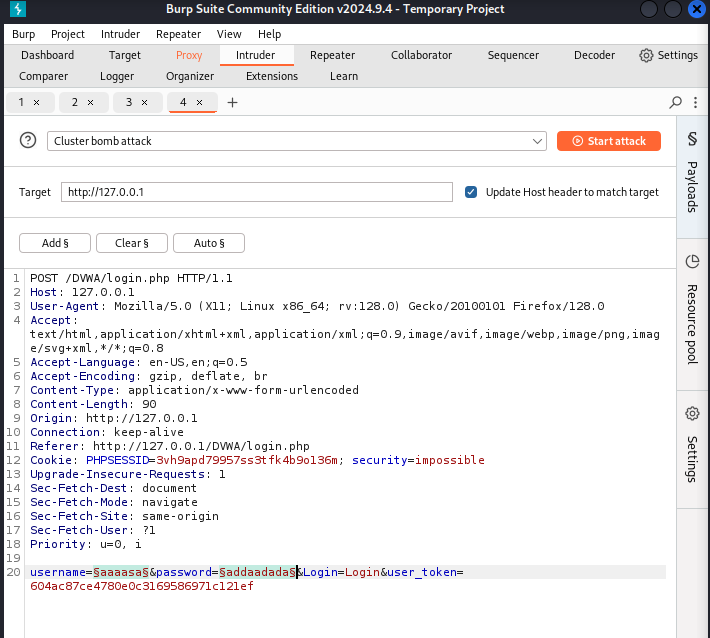{#fig:014 width=70%}

Так как было отмечено 2 параметра для подбора, то нам нужно 2 списка со значениями для подбора. Далее заполняем 2 списка в Payload settings. В строке request count мы будем видеть нужное количество запросов, чтобы проверить все возможные пары пользователь-пароль (рис. [-@fig:015]), (рис. [-@fig:016])

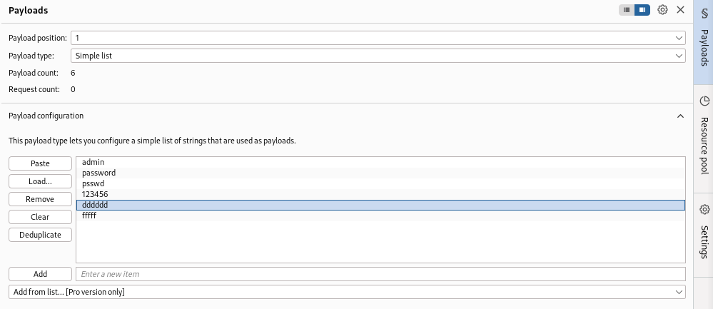{#fig:015 width=70%}

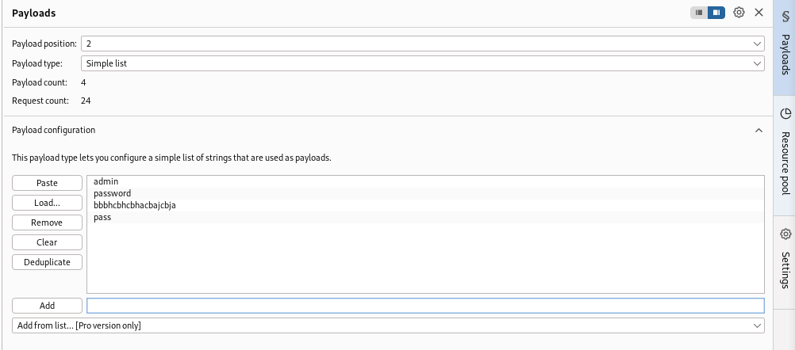{#fig:016 width=70%}

Далее запустим атаку (рис. [-@fig:017])

{#fig:017 width=70%}

При открытии каждого post-запроса можно увидеть полученный get-запрос. В нём видно куда нас перенаправляют после выполнения ввода пары пользователь пароль. На (рис. [-@fig:018]) с подбором пары admin-ad видно, что нас перенаправляют на страницу login.php. Это значит что пара не подходит

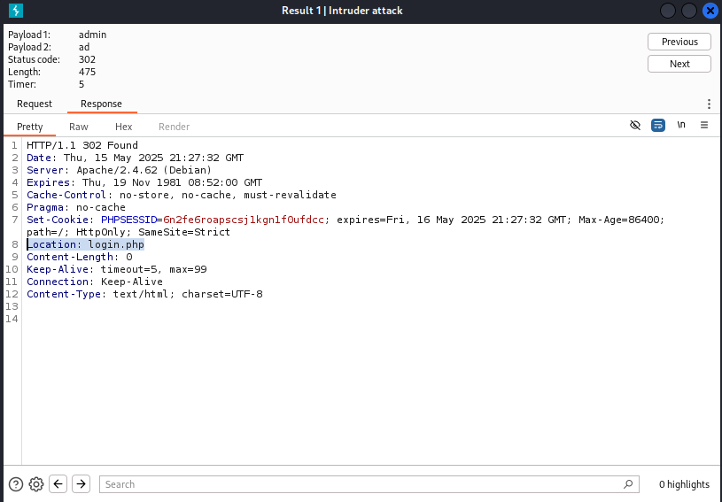{#fig:018 width=70%}

Далее проверим результат пары sdmin-password. В этом случае нас перенаправляют на страницу index.php. Это значит что пара верная (рис. [-@fig:019]) 

{#fig:019 width=70%}

Также есть дополнительная проверка. Для этого нужно нажать на Send to Repeater (рис. [-@fig:020]) 

{#fig:020 width=70%}

Переходим во вкладку Repeater (рис. [-@fig:021]) 

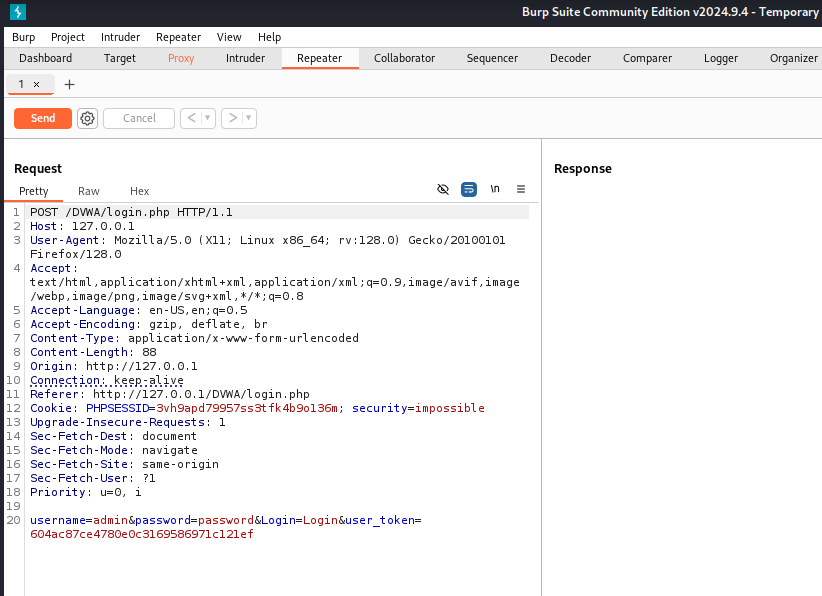{#fig:021 width=70%}

Нажмём на send. И получим в Response перенаправление на index.php (рис. [-@fig:022]) 

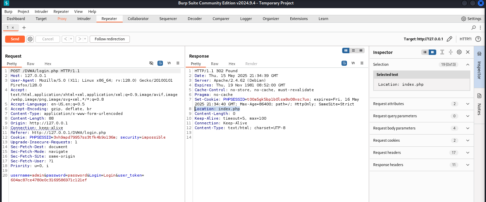{#fig:022 width=70%}

Далее нажмём Follow redirection. После этого мы получим html код в окне Response (подокно Pretty) (рис. [-@fig:023]) 

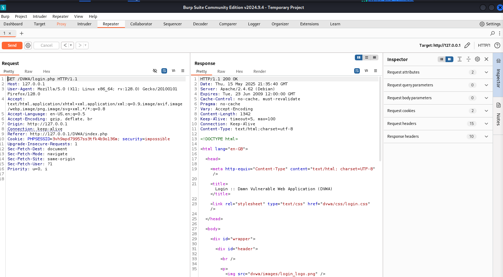{#fig:023 width=70%}

Далее в подокне Render получим то как выглядит полученная страница (рис. [-@fig:024]) 

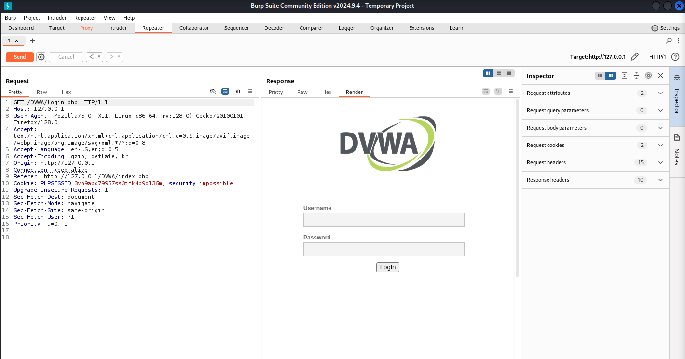{#fig:024 width=70%}

# Выводы
 
В ходе выполнения 5-ого этапа индивидуального проекта мы научились использовать инструмент  Burp Suite

# Список литературы

1. Этапы реализации проекта [Электронный ресурс] URL: https://esystem.rudn.ru/mod/page/view.php?id=1220336
