---
## Front matter
lang: ru-RU
title: Доклад
subtitle: Пакетный фильтр на базе ОС Linux 
author:
  - Верниковская Е. А., НПИбд-01-23
institute:
  - Российский университет дружбы народов, Москва, Россия
date: 28 марта 2025

## i18n babel
babel-lang: russian
babel-otherlangs: english

## Formatting pdf
fontsize: 1pt
toc: false
toc-title: Содержание
slide_level: 2
aspectratio: 169
section-titles: true
theme: metropolis
header-includes:
 - \metroset{progressbar=frametitle,sectionpage=progressbar,numbering=fraction}
 - '\makeatletter'
 - '\beamer@ignorenonframefalse'
 - '\makeatother'

## Fonts
mainfont: PT Serif
romanfont: PT Serif
sansfont: PT Sans
monofont: PT Mono
mainfontoptions: Ligatures=TeX
romanfontoptions: Ligatures=TeX
sansfontoptions: Ligatures=TeX,Scale=MatchLowercase
monofontoptions: Scale=MatchLowercase,Scale=0.9
---

## Докладчик

:::::::::::::: {.columns align=center}
::: {.column width="70%"}

  * Верниковская Екатерина Андреевна
  * Студентка
  * Российский университет дружбы народов
  * [1132236136@pfur.ru](mailto:1132236136@pfur.ru)

:::
::: {.column width="30%"}

:::
::::::::::::::

## Вводная часть 

:::::::::::::: {.columns align=top}
::: {.column width="60%"}
**Актуальность темы и проблема:**
  
  
  сетевые атаки и угрозы постоянно эволюционируют, поэтому надежная фильтрация трафика необходима для защиты серверов и сетей. Пакетные фильтры в Linux обеспечивают эффективную защиту и контроль доступа. Без настройки фильтрации система уязвима для несанкционированного доступа, DDoS-атак и вредоносного трафика. Поэтому важно правильно настроить и оптимизировать фильтры для повышения безопасности без ущерба для производительности
  
:::
::: {.column width="30%"}
**Объект и предмет исследования:**
  
  
  пакетный фильтр на базе ОС Linux 
  
:::
::::::::::::::

## Вводная часть 

:::::::::::::: {.columns align=top}
::: {.column width="30%"}
**Цель:**
  
  
  цель данного доклада - рассмотреть принципы работы пакетных фильтров в Linux, их роль в обеспечении сетевой безопасности, а также сравнить основные инструменты (iptables, nftables, eBPF) и продемонстрировать примеры их настройки
  
:::
::: {.column width="30%"}
**Задачи исследования:**
  
  
  изучить пакетные фильтры на базе операционной системы Linux
  
:::
::: {.column width="20%"}
**Материалы и методы и инструменты исследования:**
  
  
  интернет-ресурсы, аналитика и практические навыки работы на своей операционной системе Linux (Ubuntu)
:::
::::::::::::::

## Введение

:::::::::::::: {.columns align=top}
::: {.column width="60%"}

Атаки и киберугрозы представляют собой серьезную проблему для информационных технологий и безопасности данных в современном мире. С каждым годом количество кибератак возрастает, становясь все более изощренными и разнообразными. Киберугрозы могут варьироваться от вирусов и троянов до сложных атак, таких как DDoS (Distributed Denial of Service) и phishing (фишинг). В ответ на эти угрозы, многие организации и пользователи обращаются к эффективным методам защиты, одним из которых является пакетный фильтр.

:::
::: {.column width="40%"}

:::
::::::::::::::

## Что такое пакетный фильтр и зачем он нужен?

:::::::::::::: {.columns align=top}
::: {.column width="50%"}

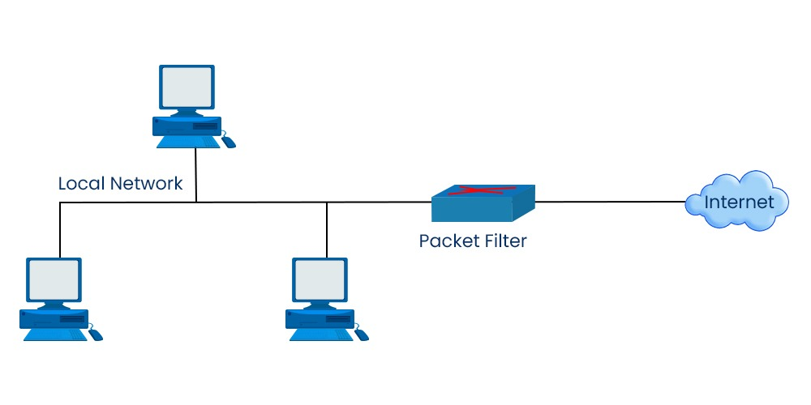

:::
::: {.column width="50%"}

**Пакетный фильтр (Packet Filter - PF)** — это элемент брандмауэра, позволяющий управлять прохождением трафика по указанным протоколам, разрешая или запрещая передачу пакетов, удовлетворяющих заданным условиям. Простыми словами это программа которая просматривает заголовки пакетов по мере их прихода, и решает дальнейшую судьбу всего пакета.

:::
::::::::::::::

## Основные компоненты пакетного фильтра

:::::::::::::: {.columns align=center}
::: {.column width="50%"}

1. Сетевые пакеты и их заголовки

Каждый сетевой пакет содержит заголовок, который несет важную информацию о передаваемых данных.

Типы заголовков:

- Заголовок Ethernet (Канальный уровень, L2)
- Заголовок IP (Сетевой уровень, L3)
- Заголовки TCP и UDP (Транспортный уровень, L4)

:::
::: {.column width="50%"}

2. Сетевые интерфейсы

**Сетевые интерфейсы** — это точки подключения к сети, через которые происходит обмен данными. Пакетные фильтры работают непосредственно с сетевыми интерфейсами, перехватывая входящие и исходящие пакеты, которые проходят через них. В Linux это может быть интерфейс Ethernet, Wi-Fi и другие.
  
:::
::::::::::::::

## Основные компоненты пакетного фильтра

:::::::::::::: {.columns align=center}
::: {.column width="50%"}

3. Правила фильтрации

Правила фильтрации представляют собой набор условий, которые определяют, как обрабатываются пакеты. Типы правил:

- Разрешающие (ALLOW) — пакеты разрешаются к передаче
- Блокирующие (DENY) — пакеты отклоняются
- Журналирующие (LOG) — информация о пакетах записывается в журнал

:::
::: {.column width="50%"}

4. Таблицы

Правила, используемые пакетным фильтром, группируются в таблицы, каждая из которых предназначена для определённой задачи. Основные таблицы:

- filter
- nat
- mangle
- raw
  
:::
::::::::::::::

## Основные компоненты пакетного фильтра

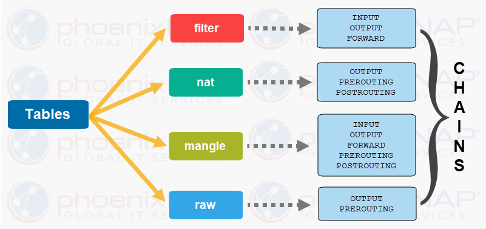
  
## Основные компоненты пакетного фильтра

:::::::::::::: {.columns align=center}
::: {.column width="50%"}

5. Цепочки (chains)

**Цепочки** — это последовательности правил внутри таблицы фильтрации. Основные цепочки:

- INPUT
- OUTPUT
- FORWARD
- PREROUTING
- POSTROUTING

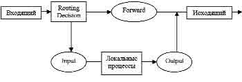

:::
::: {.column width="50%"}

6. Программное обеспечение для фильтрации

В Linux для реализации пакетной фильтрации используется специализированное программное обеспечение. Примеры:

- iptables - классический инструмент для настройки фильтрации на уровне IP
- nftables -  новая, более современная система фильтрации
- eBPF - код на уровне ядра
  
:::
::::::::::::::

## Основные компоненты пакетного фильтра

7. Журналирование и мониторинг

Процесс записи событий и действий пакетного фильтра в журнал. Журналирование позволяет администраторам отслеживать подозрительную активность и анализировать успешные и неуспешные попытки доступа. Это важно для дальнейшего реагирования на инциденты и улучшения мер безопасности.

## Принцип работы пакетного фильтра

:::::::::::::: {.columns align=center}
::: {.column width="50%"}

1. Перехват пакетов
2. Анализ заголовков пакетов
3. Применение правил фильтрации
4. Принятие решения и передача пакета

:::
::: {.column width="50%"}

  
:::
::::::::::::::

## Встроенные механизмы фильтрации в Linux

:::::::::::::: {.columns align=center}
::: {.column width="40%"}

Linux использует мощную подсистему Netfilter, встроенную в ядро, которая отвечает за обработку сетевых пакетов.

:::
::: {.column width="60%"}

Для взаимодействия с Netfilter в Linux используются несколько инструментов:

- iptables – традиционный инструмент управления фильтрацией пакетов.
- nftables – современная альтернатива, более мощная и гибкая.
- eBPF – новый механизм, обеспечивающий высокоэффективную обработку пакетов на уровне ядра.
  
:::
::::::::::::::

## Обзор iptables, nftables и eBPF 

:::::::::::::: {.columns align=top}
::: {.column width="30%"}

**iptables:**

Это один из самых популярных инструментов для создания правил фильтрации на основе пакетов. Он существует с 1998 года и является основным средством для настройки брандмауэров в Linux.

  
:::
::: {.column width="30%"}

**nftables:**

Это современная замена iptables, представленная в ядре Linux 3.13

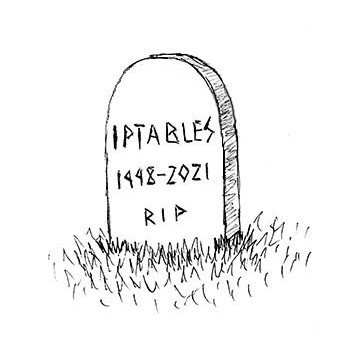
  
:::
::: {.column width="30%"}

**eBPF (extended Berkeley Packet Filter):**

Это мощный механизм, позволяющий запуска кода непосредственно в ядре Linux для фильтрации пакетов и мониторинга

:::
::::::::::::::

## Работа iptables

:::::::::::::: {.columns align=center}
::: {.column width="60%"}

Операционные системы Linux, на которых чаще всего и функционируют серверы (виртуальные машины), имеют встроенный инструмент защиты – программный фильтр **iptables**.Он работает путем проверки пакетов данных на соответствие определенным критериям и выполнения заданных действий, если пакеты соответствуют этим критериям. Эти критерии и действия определяются в таблицах, которые состоят из набора правил.

:::
::: {.column width="40%"}

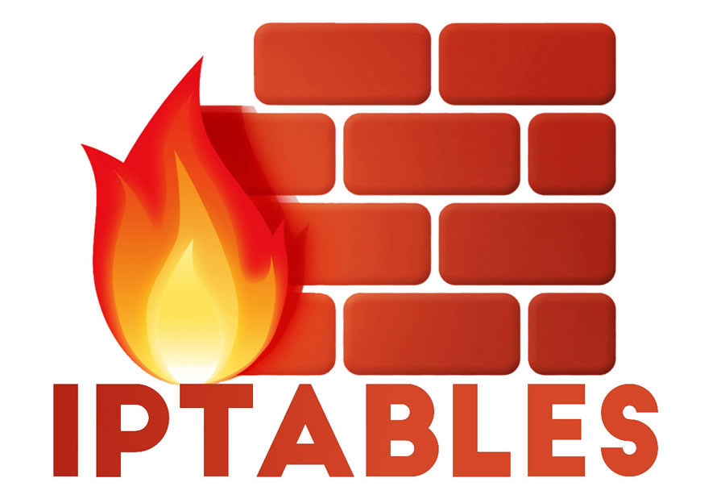
  
:::
::::::::::::::

## Основные таблицы и цепочки iptables

:::::::::::::: {.columns align=center}
::: {.column width="50%"}

Четыре основные таблицы iptables:

1. Filter - это основная таблица, используемая для фильтрации пакетов
2. NAT - эта таблица используется для настройки NAT
3. Mangle - эта таблица используется для специальной обработки пакетов
4. Raw - эта таблица используется для обхода системы отслеживания состояний

:::
::: {.column width="50%"}

Каждая таблица состоит из набора цепочек:

1. INPUT - эта цепочка применяется к пакетам, которые предназначены для самой системы
2. FORWARD - эта цепочка применяется к пакетам, которые проходят через систему
3. OUTPUT - эта цепочка применяется к пакетам, которые исходят из системы
  
:::
::::::::::::::

## Правила фильтрации и их синтаксис в iptables

Общий синтаксис запуска программы выглядит следующим образом: *iptables -t таблица действие цепочка дополнительные_параметры*

:::::::::::::: {.columns align=center}
::: {.column width="50%"}

Перечень основных действий:

1. -D – удалить текущее правило
2. -L – вывести правила текущей цепочки
3. -S – вывести все активные правила
4. -F – очистить все правила
5. -N – создать цепочку
6. -X – удалить цепочку
7. -P – установить действие «по умолчанию»

:::
::: {.column width="50%"}

В качестве дополнительных параметров используются опции: 

1. -p – вручную установить протокол
2. -s – указать статичный IP-адрес оборудования, откуда отправляется пакет данных
3. -d – установить IP получателя
4. -i – настроить входной сетевой интерфейс
5. -j – выбрать действие при подтверждении правила
  
:::
::::::::::::::

## Работа nftables

:::::::::::::: {.columns align=center}
::: {.column width="40%"}

 

:::
::: {.column width="60%"}

**nftables** — это современный механизм фильтрации пакетов в Linux, который заменяет устаревший iptables. Он обеспечивает более простую и удобную работу с правилами, а также улучшенную производительность. 
  
:::
::::::::::::::

## Основные таблицы и цепочки nftables

В отличие от iptables в nftables вместо разделения на отдельные таблицы (filter, nat, mangle, raw), nftables предлагает более общую структуру, где вы сами определяете таблицы и цепочки, адаптированные к вашим конкретным потребностям.

Таблицы определяются с указанием семейства адресов. Таблицы могут относиться к одному из пяти семейств:

- ip: (т.е. IPv4) — семейство по умолчанию; используется, если семейство не было указано
- ip6: IPv6
- inet: IPv4 и IPv6 (используется чаще всего, делает правила более универсальными)
- arp: ARP
- bridge: Мосты

## Основные таблицы и цепочки nftables

:::::::::::::: {.columns align=center}
::: {.column width="50%"}

В отличие от iptables, в nftables отсутствуют также и встроенные цепочки.

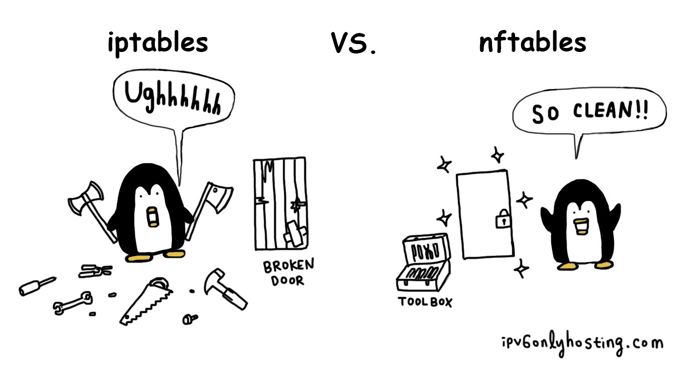 

:::
::: {.column width="50%"}

Есть два типа цепочек:

- **Base chains (базовые цепочки)** – напрямую обрабатывают пакеты из сетевого стека (input, output, forward и т. д.)
- **Regular chains (обычные цепочки)** – служат вспомогательными и вызываются из других цепочек
  
:::
::::::::::::::

## Правила фильтрации и их синтаксис в nftables

Синтаксис nftables разработан для большей ясности и удобства по сравнению с iptables: *nft "команда" "объект" "путь к объекту" "параметры"*

- Команда — add, insert, delete, replace, rename, list, flush…
- Объект — table, chain, rule, set, ruleset…
- Путь к объекту зависит от типа. Например, у таблицы это "семейство" "название". У правила — гораздо длиннее: "семейство таблицы" "название таблицы" "название цепочки"
- Параметры зависят от типа объекта. Для правила это условие отбора пакетов и действие, применяемое к отобранным пакетам

## Работа eBPF

:::::::::::::: {.columns align=center}
::: {.column width="30%"}

:::
::: {.column width="70%"}

**eBPF (англ. extended Berkley Packet Filter — расширенный фильтр пакетов Беркли)** — это мощный механизм в ядре Linux, который позволяет безопасно выполнять пользовательский код на уровне ядра без необходимости его модификации. Благодаря eBPF можно анализировать и фильтровать сетевой трафик с высокой производительностью и низкими затратами на системные ресурсы. В отличие от классических инструментов (iptables, nftables), eBPF обладает высокой производительностью и гибкостью, что делает его особенно полезным для современных задач сетевой безопасности.
  
:::
::::::::::::::

## Работа eBPF

:::::::::::::: {.columns align=center}
::: {.column width="60%"}

eBPF работает следующим образом:

1. Пользователь загружает eBPF-программу в ядро
2. Ядро проверяет программу на безопасность
3. Программа подключается к одной из точек (hook points) ядра
4. При прохождении сетевого пакета eBPF-программа анализирует его заголовки и принимает решение 
5. Результат обработки применяется к пакету в реальном времени

:::
::: {.column width="40%"}

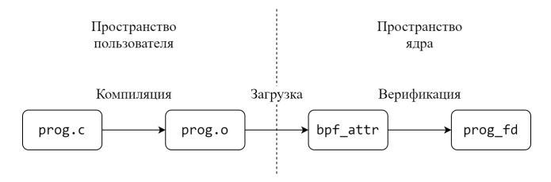
  
:::
::::::::::::::

## Основные точки внедрения eBPF для фильтрации

:::::::::::::: {.columns align=top}
::: {.column width="30%"}

**1. XDP (eXpress Data Path)**

XDP обрабатывает пакеты на уровне сетевого драйвера, еще до попадания в стек ядра.
  
:::
::: {.column width="30%"}

**2. TC (Traffic Control) BPF**

TC eBPF работает на уровне сетевого стека ядра и позволяет фильтровать и изменять пакеты после их принятия системой.
  
:::
::: {.column width="30%"}

**3. Socket Filtering (SOCK_FILTER)**

Фильтрует трафик на уровне сокетов, прежде чем он попадет в пользовательские приложения.

:::
::::::::::::::

## Практическое применение. Пример работы с iptables

:::::::::::::: {.columns align=center}
::: {.column width="30%"}

Перед активацией приложение требуется установить из стандартного репозитория Linux. Так, для инсталляции в Ubuntu подойдет команда: *sudo apt install iptables*

:::
::: {.column width="70%"}

  
:::
::::::::::::::

## Практическое применение. Пример работы с iptables

:::::::::::::: {.columns align=center}
::: {.column width="70%"}

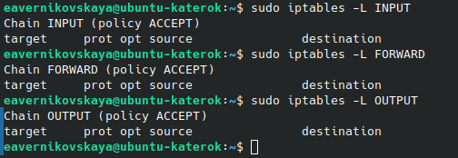

:::
::: {.column width="30%"}

Посмотрим конкретные цепочки правил. Команда чтобы вывести на экран конкретную цепочку правил выглядит следующим образом: *sudo iptables -L [имя цепочки]*
  
:::
::::::::::::::

## Практическое применение. Пример работы с iptables

:::::::::::::: {.columns align=center}
::: {.column width="50%"}

Зададим правила «по умолчанию» вручную: *sudo iptables -p INPUT ACCEPT*, *sudo iptables -p OUTPUT ACCEPT* и *sudo iptables -p FORWARD DROP*. Здесь мы разрешаем все цепочки INPUT и OUTPUT, запрещаем FORWARD. А после проверим командой *iptables -L -n -v* правильность заданных правил 

:::
::: {.column width="50%"}

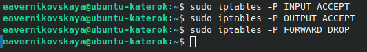

  
:::
::::::::::::::

## Практическое применение. Пример работы с iptables

:::::::::::::: {.columns align=center}
::: {.column width="60%"}

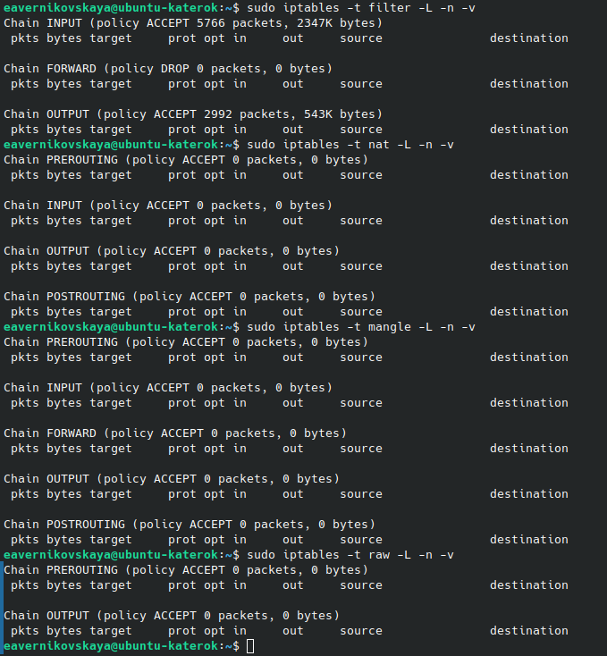{width=60%}

:::
::: {.column width="40%"}

По умолчанию iptables работает с таблицей filter. Для просмотра правил в этой таблице используем: *sudo iptables -t filter -L -n -v*. Аналогично посмотрим правила в таблицах nat, mangle и raw: *sudo iptables -t nat -L -n -v*, *sudo iptables -t mangle -L -n -v* и *sudo iptables -t raw -L -n -v*
  
:::
::::::::::::::

## Практическое применение. Пример работы с iptables

:::::::::::::: {.columns align=center}
::: {.column width="30%"}

Создадим пользовательскую цепочку в таблице фильтрации: *sudo iptables -N MYCHAIN*

:::
::: {.column width="70%"}

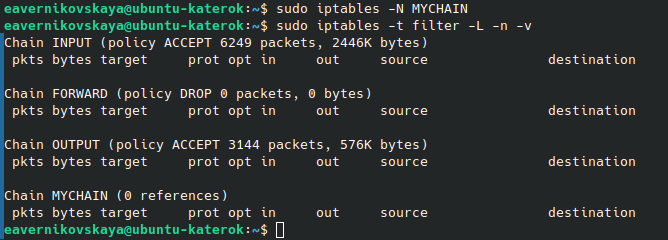
  
:::
::::::::::::::

## Практическое применение. Пример работы с iptables

:::::::::::::: {.columns align=center}
::: {.column width="60%"}

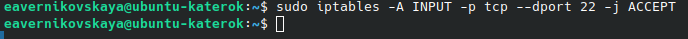

:::
::: {.column width="40%"}

Добавим правила в стандартную цепочку (например, разрешение ssh): *sudo iptables -A INPUT -p tcp --dport 22 -j ACCEPT* 

Также добавим правила в созданную цепочку (например, заблокируем IP адрес 192.168.1.0/24): *sudo iptables -A MYCHAIN -s 192.168.1.0/24 -j DROP*
  
:::
::::::::::::::

## Практическое применение. Пример работы с iptables

:::::::::::::: {.columns align=center}
::: {.column width="30%"}

И проверим правильность выполнения

:::
::: {.column width="70%"}

  
:::
::::::::::::::

## Практическое применение. Пример работы с iptables

:::::::::::::: {.columns align=center}
::: {.column width="70%"}

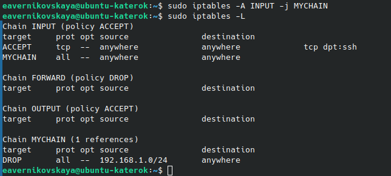

:::
::: {.column width="30%"}

Теперь можно использовать созданную цепочку. Например, разрешить доступ по цепочке MYCHAIN: *sudo iptables -A INPUT -j MYCHAIN*
  
:::
::::::::::::::

## Практическое применение. Пример работы с iptables

:::::::::::::: {.columns align=center}
::: {.column width="40%"}

Далее для сохранения текущих правил iptables используем: *sudo iptables-save | sudo tee /etc/iptables/rules.v4*

Чтобы настройки применялись после перезагрузки используем команду *sudo iptables-restore < /etc/iptables/rules.v4* 

:::
::: {.column width="60%"}

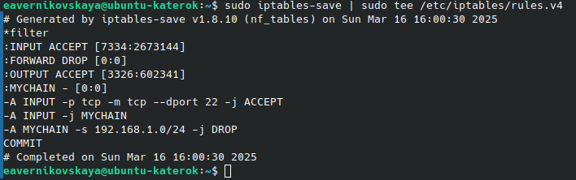

  
:::
::::::::::::::

## Практическое применение. Пример работы с iptables

:::::::::::::: {.columns align=center}
::: {.column width="60%"}

:::
::: {.column width="40%"}

Далее перезапустим систему и проверим остались ли наши ранее заданные правила 
  
:::
::::::::::::::

## Практическое применение. Пример работы с iptables

:::::::::::::: {.columns align=center}
::: {.column width="50%"}

Если требуется полное удаление правил, применяется команда: *sudo iptables –F*

:::
::: {.column width="50%"}

Далее удалим созданную нами ранее цепочку с помощью утилиты *sudo iptables –X*

  
:::
::::::::::::::

## Практическое применение. Пример работы с iptables

Снова сохраним текущие правила и применим iptables-restore

:::::::::::::: {.columns align=center}
::: {.column width="50%"}

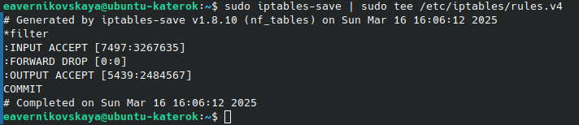

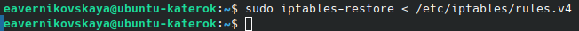

:::
::: {.column width="50%"}

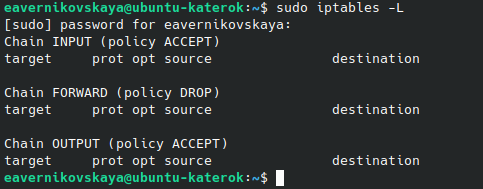
  
:::
::::::::::::::

## Практическое применение. Пример работы с iptables

:::::::::::::: {.columns align=center}
::: {.column width="60%"}

Выполним команду *ping*. Ответы от сервера показывают, что он доступен. Далее изменим политику по умолчанию для цепочки OUTPUT, устанавливая ее в DROP. Это означает, что все исходящие пакеты будут сбрасываться. После выполнения команды, запросы не смогут покидать систему. При попытке отправить ping на google.com возникает ошибка. Это связано с тем, что все исходящие пакеты, включая DNS-запросы, блокируются установленными правилами iptables.

:::
::: {.column width="40%"}

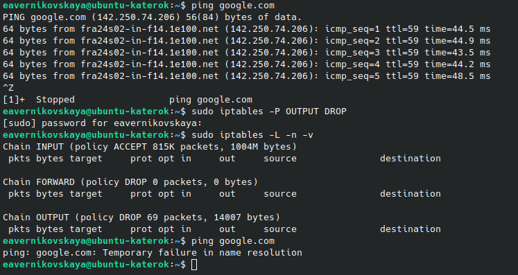
  
:::
::::::::::::::

## Практическое применение. Пример работы с nftables

:::::::::::::: {.columns align=center}
::: {.column width="70%"}

:::
::: {.column width="30%"}

В некоторых дистрибутивах nftables уже установлен. Установить его можно командой *sudo apt-get install nftables* 
  
:::
::::::::::::::

## Практическое применение. Пример работы с nftables

:::::::::::::: {.columns align=center}
::: {.column width="30%"}

Текущий набор правил можно узнать командой: *sudo nft list ruleset*

:::
::: {.column width="70%"}

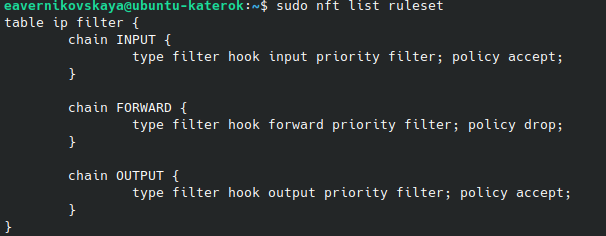
  
:::
::::::::::::::

## Практическое применение. Пример работы с nftables

:::::::::::::: {.columns align=center}
::: {.column width="70%"}

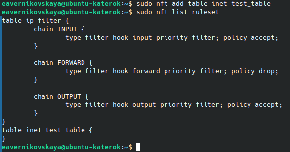

:::
::: {.column width="30%"}

При создании таблицы (table) должно быть определено семейство (family) адресов. 

Например, создадим таблицу с именем, test_table, которая отрабатывает одновременно пакеты IPv4 и IPv6: *sudo nft add table inet test_table*
  
:::
::::::::::::::

## Практическое применение. Пример работы с nftables

:::::::::::::: {.columns align=center}
::: {.column width="40%"}

Для добавления цепочки использется команда с таким синтаксисом: *sudo nft add chain inet [таблица] [цепочка] {set}*  

Например создадим такую цепочку: *sudo nft add chain inet test_table test_chain {type filter hook input priority 0 \; policy accept \; }*. Эта цепочка фильтрует входящие пакеты.

:::
::: {.column width="60%"}

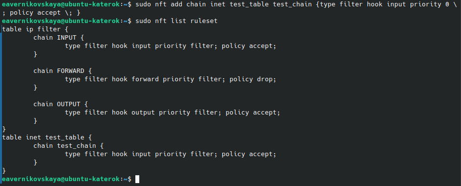  

:::
::::::::::::::

## Практическое применение. Пример работы с nftables

:::::::::::::: {.columns align=center}
::: {.column width="60%"}

:::
::: {.column width="40%"}

Правила добавляются командой с таким синтаксисом: *sudo nft add rule [family] [table] [chain] [expression] [action]* 

Теперь добавим правило: *sudo nft add rule inet test_table test_chain ip saddr 8.8.8.8 drop*. Данное правило отбрасывает пакеты с ip-адресом источника отправления 8.8.8.8.

:::
::::::::::::::

## Практическое применение. Пример работы с nftables

:::::::::::::: {.columns align=center}
::: {.column width="40%"}

Для удаления правила nftables используется команда со следующим синтаксисом: *sudo nft delete rule [family] [table] [chain] handle [number]*

Например *sudo nft delete rule inet test_table test_chain handle 2* удалит правило созданное нами на предыдущем шаге 

:::
::: {.column width="60%"}

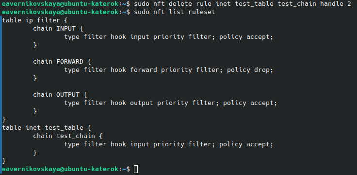

:::
::::::::::::::

## Практическое применение. Пример работы с nftables

:::::::::::::: {.columns align=center}
::: {.column width="50%"}

Далее для сохранения текущих правил iptables используем: *sudo nft list ruleset | sudo tee /etc/nftables.conf*

:::
::: {.column width="50%"}

Далее после перезарузки системы загрузим наши сохранённые правила: *sudo nft -f /etc/nftables.conf*

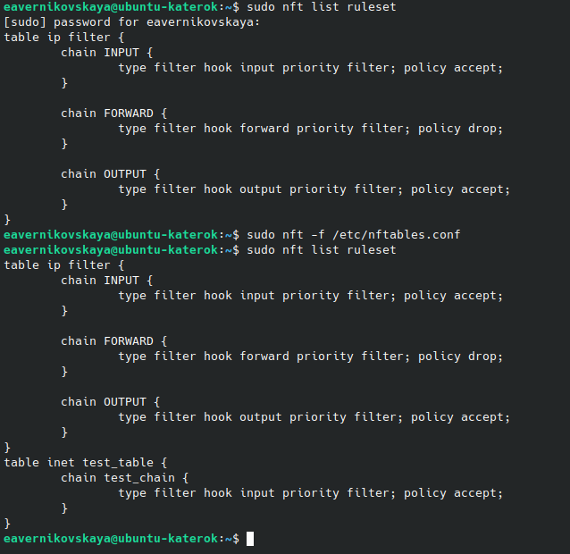{width=60%}

:::
::::::::::::::

## Практическое применение. Пример работы с nftables

:::::::::::::: {.columns align=center}
::: {.column width="50%"}

Цепочка удаляется с помощью команды: *sudo nft delete chain [family] [table] [chain]*

Удалим цепочку test_chain: *sudo nft delete chain inet test_table test_chain* 

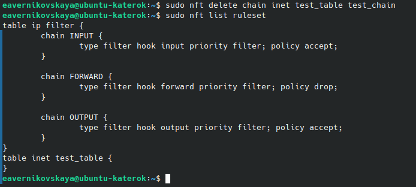{width=90%}

:::
::: {.column width="50%"}

Таблицу можно удалить конструкцией с синтаксисом: *sudo nft delete table [family] [table]*

Удалим таблицу test_table: *sudo nft delete table inet test_table* 

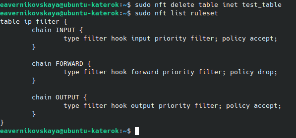{width=90%}

:::
::::::::::::::

## Сравнение iptables, nftables и eBPF

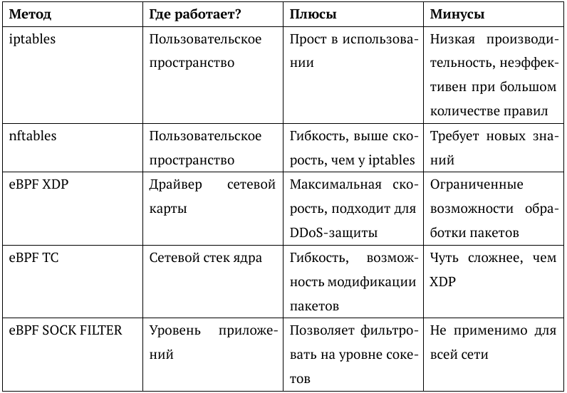{width=70%}

## Вывод

:::::::::::::: {.columns align=center}
::: {.column width="70%"}

Пакетный фильтр на базе Linux является мощным и гибким инструментом, который позволяет эффективно управлять сетевым трафиком и обеспечивать защиту от киберугроз. Современные технологии, такие как nftables и eBPF, делают фильтрацию более эффективной, а мониторинг трафика с помощью инструментов логирования позволяет оперативно реагировать на потенциальные угрозы. Использование современных средств фильтрации в Linux позволяет создать надежную систему защиты и поддерживать высокий уровень безопасности в сетевых инфраструктурах!

:::
::: {.column width="30%"}

  
:::
:::::::::::::

## Список литературы{.unnumbered}

1. ProstoKirReal. Сложно о простом. Самые популярные заголовки уровня L2 модели OSI в Ethernet. Habr, 2024. [Электронный ресурс] URL: https://habr.com/ru/companies/timeweb/articles/836038/
2. ProstoKirReal. Сложно о простом. Самые популярные заголовки уровня L3 и L4 модели OSI. Habr, 2024. [Электронный ресурс] URL: https://habr.com/ru/companies/timeweb/articles/846878/
3. Настольная книга администратора Debian. Debian. [Электронный ресурс] URL: https://l.github.io/debian-handbook/html/ru-RU/sect.firewall-packet-filtering.html
4. Трасковский А. Настройка Iptables для чайников. timeweb, 2021. [Электронный ресурс] URL: https://timeweb.com/ru/community/articles/nastroyka-iptables-dlya-chaynikov

## Список литературы{.unnumbered}

5. nftables. archlinux, 2023. [Электронный ресурс] URL: https://wiki.archlinux.org/title/Nftables_(%D0%A0%D1%83%D1%81%D1%81%D0%BA%D0%B8%D0%B9)
6. Albert_Wesker. eBPF и его возможности. Habr, 2023. [Электронный ресурс] URL: https://habr.com/ru/companies/timeweb/articles/733058/
