---
## Front matter
title: "Доклад"
subtitle: "Пакетный фильтр на базе ОС Linux"
author: "Верниковская Екатерина Андреевна"

## Generic otions
lang: ru-RU
toc-title: "Содержание"

## Bibliography
bibliography: bib/cite.bib
csl: pandoc/csl/gost-r-7-0-5-2008-numeric.csl

## Pdf output format
toc: true # Table of contents
toc-depth: 2
lof: true # List of figures
lot: true # List of tables
fontsize: 12pt
linestretch: 1.5
papersize: a4
documentclass: scrreprt
## I18n polyglossia
polyglossia-lang:
  name: russian
  options:
	- spelling=modern
	- babelshorthands=true
polyglossia-otherlangs:
  name: english
## I18n babel
babel-lang: russian
babel-otherlangs: english
## Fonts
mainfont: PT Serif
romanfont: PT Serif
sansfont: PT Sans
monofont: PT Mono
mainfontoptions: Ligatures=TeX
romanfontoptions: Ligatures=TeX
sansfontoptions: Ligatures=TeX,Scale=MatchLowercase
monofontoptions: Scale=MatchLowercase,Scale=0.9
## Biblatex
biblatex: true
biblio-style: "gost-numeric"
biblatexoptions:
  - parentracker=true
  - backend=biber
  - hyperref=auto
  - language=auto
  - autolang=other*
  - citestyle=gost-numeric
## Pandoc-crossref LaTeX customization
figureTitle: "Рис."
tableTitle: "Таблица"
listingTitle: "Листинг"
lofTitle: "Список иллюстраций"
lotTitle: "Список таблиц"
lolTitle: "Листинги"
## Misc options
indent: true
header-includes:
  - \usepackage{indentfirst}
  - \usepackage{float} # keep figures where there are in the text
  - \floatplacement{figure}{H} # keep figures where there are in the text
---

# Вводная часть

**Актуальность темы и проблема:** сетевые атаки и угрозы постоянно эволюционируют, поэтому надежная фильтрация трафика необходима для защиты серверов и сетей. Пакетные фильтры в Linux обеспечивают эффективную защиту и контроль доступа. Без настройки фильтрации система уязвима для несанкционированного доступа, DDoS-атак и вредоносного трафика. Поэтому важно правильно настроить и оптимизировать фильтры для повышения безопасности без ущерба для производительности

**Объект и предмет исследования:** пакетный фильтр на базе ОС Linux 

**Цель:** цель данного доклада - рассмотреть принципы работы пакетных фильтров в Linux, их роль в обеспечении сетевой безопасности, а также сравнить основные инструменты (iptables, nftables, eBPF) и продемонстрировать примеры их настройки

**Задачи исследования:** изучить пакетные фильтры на базе операционной системы Linux

**Материалы и методы и инструменты исследования:** интернет-ресурсы, аналитика и практические навыки работы на своей операционной системе Linux (Ubuntu)

# Введение

Атаки и киберугрозы представляют собой серьезную проблему для информационных технологий и безопасности данных в современном мире. С каждым годом количество кибератак возрастает, становясь все более изощренными и разнообразными. Киберугрозы могут варьироваться от вирусов и троянов до сложных атак, таких как DDoS (Distributed Denial of Service) и phishing (фишинг). В ответ на эти угрозы, многие организации и пользователи обращаются к эффективным методам защиты, одним из которых является пакетный фильтр. Таким образом, в этом докладе мы рассмотрим, как пакетный фильтр на базе ОС Linux может использоваться для защиты от киберугроз, его архитектуру, основные функции и преимущества, а также примеры использования в различных сценариях безопасности.

## Что такое пакетный фильтр и зачем он нужен?

**Пакетный фильтр (Packet Filter - PF)** — это элемент брандмауэра, позволяющий управлять прохождением трафика по указанным протоколам, разрешая или запрещая передачу пакетов, удовлетворяющих заданным условиям. Простыми словами это программа которая просматривает заголовки пакетов по мере их прихода, и решает дальнейшую судьбу всего пакета.  Фильтр может сбросить (DROP) пакет, т.е. как будто пакет и не приходил вовсе, принять (ACCEPT) пакет, т.е. пакет может пройти дальше, или сделать с ним что-то еще более сложное. Пакетный фильтр — базовое средство обеспечения безопасности компьютера, работающее независимо от приложений.

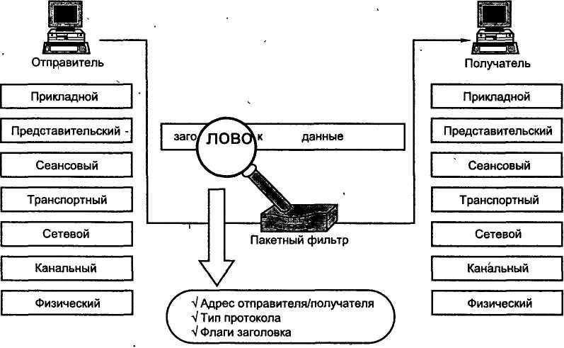

## Основные компоненты пакетного фильтра

1. Сетевые пакеты и их заголовки

В сетевых технологиях пакет — это небольшой сегмент более крупного сообщения. Данные, отправляемые по компьютерным сетям, таким как Интернет, делятся на пакеты. Затем эти пакеты рекомбинируются компьютером или устройством, которое их получает.

Каждый сетевой пакет содержит заголовок, который несет важную информацию о передаваемых данных. Пакетный фильтр использует эти заголовки для принятия решений о маршрутизации и фильтрации. В зависимости от уровня модели OSI заголовки могут отличаться, но основные форматы заголовков встречаются на канальном (L2), сетевом (L3) и транспортном (L4) уровнях.

1) **Заголовок Ethernet (Канальный уровень, L2)** [@habr1] 

Используется для передачи кадров в локальной сети (Ethernet, Wi-Fi).

Основные поля:

- MAC-адрес отправителя и MAC-адрес получателя (идентификация устройств)
- Тип протокола (указывает, передается ли IP, ARP и т. д.)

2) **Заголовок IP (Сетевой уровень, L3)** [@habr2]

Определяет, как пакеты маршрутизируются между узлами сети.

Основные поля:

- IP-адрес источника и IP-адрес назначения
- Время жизни (TTL) – предотвращает бесконечную циркуляцию пакетов
- Протокол – указывает, используется ли TCP, UDP, ICMP и др

3) **Заголовки TCP и UDP (Транспортный уровень, L4)** [@habr2]

Обеспечивают передачу данных между приложениями.

- TCP (Transmission Control Protocol) – надежный, устанавливает соединение (3-way handshake), использует порты источника и назначения, контрольные суммы
- UDP (User Datagram Protocol) – менее надежный, без установления соединения, но быстрее

2. Сетевые интерфейсы

**Сетевые интерфейсы** — это точки подключения к сети, через которые происходит обмен данными. Пакетные фильтры работают непосредственно с сетевыми интерфейсами, перехватывая входящие и исходящие пакеты, которые проходят через них. В Linux это может быть интерфейс Ethernet, Wi-Fi и другие.

3. Правила фильтрации

Правила фильтрации представляют собой набор условий, которые определяют, как обрабатываются пакеты. Типы правил:

- Разрешающие (ALLOW) — пакеты разрешаются к передаче
- Блокирующие (DENY) — пакеты отклоняются
- Журналирующие (LOG) — информация о пакетах записывается в журнал

4. Таблицы

Правила, используемые пакетным фильтром, группируются в таблицы, каждая из которых предназначена для определённой задачи. Основные таблицы:

- filter: касается правил фильтрации (прием, отказ или игнорирование пакета)
- nat: касается перевода источника или назначения адресов и портов пакетов
- mangle: касается других изменений IP пакетов (включая ToS — Type of Service — поля и параметры)
- raw: позволяет производить над пакетами другие изменения вручную прежде чем они достигнут системы отслеживания соединений

5. Цепочки (chains)

**Цепочки** — это последовательности правил внутри таблицы фильтрации. [@github.io]

Каждая таблица содержит списки правил под названием chains (цепочки). Брандмауэр использует стандартные цепочки для обработки пакетов, основанные на стандартных условиях. Администратор может создавать другие цепочки, которые будут использоваться только когда на них ссылается одна из стандартных сетей (прямо или косвенно). 

Таблица фильтров имеет три стандартных цепи:**

- INPUT: касается пакетов, пунктом назначения которых является брандмауэр;
- OUTPUT: касается пакетов, отправляемых брандмауэром;
- FORWARD: касается транзитных пакетов, проходящих через брандмауэр (который не является ни их источником, ни их пунктом назначения).

Таблица nat также имеет три стандартных цепи:

- PREROUTING: для изменения пребывающих пакетов;
- POSTROUTING: для изменения отправляемых пакетов, перед отправкой;
- OUTPUT: для изменения пакетов, сгенерированных брандмауэром.

6. Программное обеспечение для фильтрации

В Linux для реализации пакетной фильтрации используется специализированное программное обеспечение. Примеры:

- iptables — классический инструмент для настройки фильтрации на уровне IP
- nftables — новая, более современная система фильтрации, пришедшая на смену iptables с улучшенной функциональностью и производительностью
- eBPF - это современный механизм фильтрации, который позволяет загружать в ядро пользовательские программы для высокоэффективной обработки трафика

Эти инструменты обеспечивают интерфейс для создания и управления правилами фильтрации.

7. Журналирование и мониторинг

Процесс записи событий и действий пакетного фильтра в журнал. Журналирование позволяет администраторам отслеживать подозрительную активность и анализировать успешные и неуспешные попытки доступа. Это важно для дальнейшего реагирования на инциденты и улучшения мер безопасности.

## Принцип работы пакетного фильтра

1. Перехват пакетов:

Пакетный фильтр работает на уровне сети и может перехватывать пакеты, проходящие через сетевые интерфейсы системы. Когда сетевой пакет поступает в систему, он проходит через набор цепочек Netfilter, которые позволяют определить его дальнейшую судьбу.  

2. Анализ заголовков пакетов: 

Каждый пакет сети содержит заголовок, в котором находятся такие данные, как IP-адреса источника и назначения, номер порта, протокол (например, TCP, UDP, ICMP) и другие параметры. Пакетный фильтр анализирует эти заголовки для принятия решений, сравнивает их с заданными правилами.

3. Применение правил фильтрации:

Пакетный фильтр использует набор заранее заданных правил для принятия решений о том, как обрабатывать каждый пакет. Эти правила могут включать:

- Разрешение или блокировку трафика на основе IP-адреса
- Управление доступом по номерам портов
- Фильтрацию по протоколам (например, только разрешить трафик TCP).

4. Принятие решения и передача пакета:

Если пакет соответствует правилам фильтрации, он либо передаётся дальше в систему (или в сеть), либо блокируется.

# Пакетная фильтрация в Linux

Пакетная фильтрация в Linux осуществляется с помощью встроенных механизмов ядра, которые позволяют контролировать и управлять сетевым трафиком. Это важно для обеспечения безопасности, защиты от несанкционированного доступа и организации маршрутизации пакетов в сети.

## Встроенные механизмы фильтрации в Linux

Linux использует мощную подсистему Netfilter, встроенную в ядро, которая отвечает за обработку сетевых пакетов. Она предоставляет интерфейс для межсетевого экрана (firewall), а также поддерживает NAT (Network Address Translation) и отслеживание соединений (conntrack).

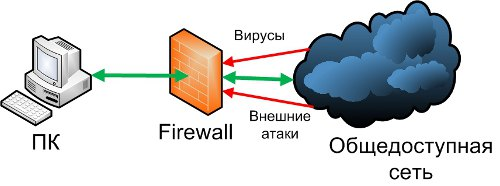

Для взаимодействия с Netfilter в Linux используются несколько инструментов:

- iptables – традиционный инструмент управления фильтрацией пакетов.
- nftables – современная альтернатива, более мощная и гибкая.
- eBPF – новый механизм, обеспечивающий высокоэффективную обработку пакетов на уровне ядра.

## Обзор iptables, nftables и eBPF

**iptables:**

- Это один из самых популярных инструментов для создания правил фильтрации на основе пакетов. Он существует с 1998 года и является основным средством для настройки брандмауэров в Linux.
- Поддерживает четыре основных таблицы: filter (стандартный), nat (преобразование адресов), mangle (модификация пакетов) и raw.
- Каждая таблица состоит из цепочек (chains), таких как INPUT, OUTPUT и FORWARD.

**nftables:**

- Это современная замена iptables, представленная в ядре Linux 3.13, которая упрощает управление правилами и улучшает производительность
- Объединяет некоторые функции и таблицы в одну унифицированную систему (в том числе управление NAT и фильтрацию)
- Использует механизм "nft", который позволяет писать более сложные и гибкие правила

**eBPF (extended Berkeley Packet Filter):**

- Это мощный механизм, позволяющий запуска кода непосредственно в ядре Linux для фильтрации пакетов и мониторинга
- eBPF позволяет создавать сложные фильтры и анализаторы для сетевого трафика с минимальным воздействием на производительность
- Подходит для продвинутой аналитики, безопасности и оптимизации работы приложений

# Работа iptables

Операционные системы Linux, на которых чаще всего и функционируют серверы (виртуальные машины), имеют встроенный инструмент защиты – программный фильтр **iptables**. Все сетевые пакеты идут через ядро приложения и проходят проверку на безопасность для компьютера. Сценария всего два – или данные передаются дальше на обработку, или полностью блокируются. [@timeweb]

iptables работает путем проверки пакетов данных на соответствие определенным критериям и выполнения заданных действий, если пакеты соответствуют этим критериям. Эти критерии и действия определяются в таблицах, которые состоят из набора правил.

## Основные таблицы и цепочки iptables

В iptables есть четыре основные таблицы:

1. Filter - это основная таблица, используемая для фильтрации пакетов
2. NAT - эта таблица используется для настройки NAT (Network Address Translation)
3. Mangle - эта таблица используется для специальной обработки пакетов
4. Raw - эта таблица используется для обхода системы отслеживания состояний

Каждая таблица состоит из набора цепочек. В iptables есть три встроенные цепочки:

1. INPUT - эта цепочка применяется к пакетам, которые предназначены для самой системы
2. FORWARD - эта цепочка применяется к пакетам, которые проходят через систему
3. OUTPUT - эта цепочка применяется к пакетам, которые исходят из системы

## Правила фильтрации и их синтаксис в iptables

Общий синтаксис запуска программы выглядит следующим образом: *iptables -t таблица действие цепочка дополнительные_параметры*

Перечень основных действий, для выполнения которых используется Iptables:

1. -A – добавить правило в цепочку
2. -C – проверить применяемые правила
3. -D – удалить текущее правило
4. -I – вставить правило с указанным номером
5. -L – вывести правила текущей цепочки
6. -S – вывести все активные правила
7. -F – очистить все правила
8. -N – создать цепочку
9. -X – удалить цепочку
10. -P – установить действие «по умолчанию»

В качестве дополнительных параметров используются опции: 

1. -p – вручную установить протокол (TCP, UDP, UDPLITE, ICMP, ICMPv6, ESP, AH, SCTP, MH)
2. -s – указать статичный IP-адрес оборудования, откуда отправляется пакет данных
3. -d – установить IP получателя
4. -i – настроить входной сетевой интерфейс
5. -o – то же самое в отношении исходящего интерфейса
6. -j – выбрать действие при подтверждении правила

# Работа nftables

**nftables** — это современный механизм фильтрации пакетов в Linux, который заменяет устаревший iptables. Он обеспечивает более простую и удобную работу с правилами, а также улучшенную производительность. [@archlinux]

## Основные таблицы и цепочки nftables

В отличие от iptables, nftables предоставляет более унифицированный и гибкий подход к управлению пакетным фильтром. Вместо разделения на отдельные таблицы (filter, nat, mangle, raw), nftables предлагает более общую структуру, где вы сами определяете таблицы и цепочки, адаптированные к вашим конкретным потребностям.

Таблицы определяются с указанием семейства адресов. Таблицы могут относиться к одному из пяти семейств:

- ip: (т.е. IPv4) — семейство по умолчанию; используется, если семейство не было указано
- ip6: IPv6
- inet: IPv4 и IPv6 (используется чаще всего, делает правила более универсальными)
- arp: ARP
- bridge: Мосты

В отличие от iptables, в nftables отсутствуют также и встроенные цепочки. Соответственно, если опрелённые типы или хуки (это точки в сетевом стеке, где пакет может быть перехвачен и обработан) фреймворка netfilter не задействованы ни в одной цепочке, то проходящие через эти цепочки пакеты обрабатываться не будут (в отличие от iptables). Есть два типа цепочек:

- **Base chains (базовые цепочки)** – напрямую обрабатывают пакеты из сетевого стека (input, output, forward и т. д.)
- **Regular chains (обычные цепочки)** – служат вспомогательными и вызываются из других цепочек

## Правила фильтрации и их синтаксис в nftables

Синтаксис nftables разработан для большей ясности и удобства по сравнению с iptables: *nft <команда> <объект> <путь к объекту> <параметры>*

- Команда — add, insert, delete, replace, rename, list, flush…
- Объект — table, chain, rule, set, ruleset…
- Путь к объекту зависит от типа. Например, у таблицы это <семейство> <название>. У правила — гораздо длиннее: <семейство таблицы> <название таблицы> <название цепочки>
- Параметры зависят от типа объекта. Для правила это условие отбора пакетов и действие, применяемое к отобранным пакетам

# Работа eBPF

**eBPF (англ. extended Berkley Packet Filter — расширенный фильтр пакетов Беркли)** — это мощный механизм в ядре Linux, который позволяет безопасно выполнять пользовательский код на уровне ядра без необходимости его модификации. Благодаря eBPF можно анализировать и фильтровать сетевой трафик с высокой производительностью и низкими затратами на системные ресурсы. В отличие от классических инструментов (iptables, nftables), eBPF обладает высокой производительностью и гибкостью, что делает его особенно полезным для современных задач сетевой безопасности. [@habr3]

eBPF работает следующим образом:

1. Пользователь загружает eBPF-программу в ядро
2. Ядро проверяет программу на безопасность (верификация)
3. Программа подключается к одной из точек (hook points) ядра, например, XDP, socket, tc
4. При прохождении сетевого пакета eBPF-программа анализирует его заголовки и принимает решение (пропустить, изменить, отбросить и т. д.)
5. Результат обработки применяется к пакету в реальном времени

## Основные точки внедрения eBPF для фильтрации

**1. XDP (eXpress Data Path)**

XDP обрабатывает пакеты на уровне сетевого драйвера, еще до попадания в стек ядра.

- Блокировка нежелательных пакетов
- Фильтрация DDoS-трафика на высоких скоростях
- Оптимизация маршрутизации трафика

**2. TC (Traffic Control) BPF**

TC eBPF работает на уровне сетевого стека ядра и позволяет фильтровать и изменять пакеты после их принятия системой.

- Ограничение пропускной способности определенных потоков
- Перенаправление или модификация пакетов
- Мониторинг сетевого трафика

**3. Socket Filtering (SOCK_FILTER)**

Фильтрует трафик на уровне сокетов, прежде чем он попадет в пользовательские приложения.

- Фильтрация UDP и TCP-трафика на уровне приложений
- Блокировка нежелательных соединений
- Логирование и мониторинг сетевых соединений

# Практическое применение

## Пример работы с iptables

Перед активацией приложение требуется установить из стандартного репозитория Linux. Так, для инсталляции в Ubuntu подойдет команда: *sudo apt install iptables*

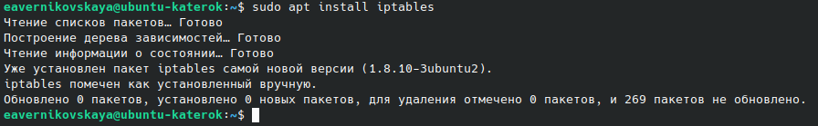

Посмотрим конкретные цепочки правил. Команда чтобы вывести на экран конкретную цепочку правил выглядит следующим образом: *sudo iptables -L [имя цепочки]*

Зададим правила «по умолчанию» вручную: *sudo iptables -p INPUT ACCEPT*, *sudo iptables -p OUTPUT ACCEPT* и *sudo iptables -p FORWARD DROP*. Здесь мы разрешаем все цепочки INPUT и OUTPUT, запрещаем FORWARD

Проверим командой *iptables -L -n -v* правильность заданных правил 

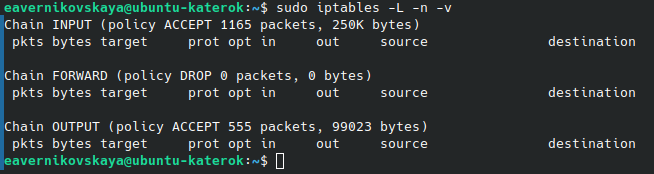

По умолчанию iptables работает с таблицей filter. Для просмотра правил в этой таблице используем: *sudo iptables -t filter -L -n -v*. Аналогично посмотрим правила в таблицах nat, mangle и raw: *sudo iptables -t nat -L -n -v*, *sudo iptables -t mangle -L -n -v* и *sudo iptables -t raw -L -n -v* 

Создадим пользовательскую цепочку в таблице фильтрации: *sudo iptables -N MYCHAIN*

Добавим правила в стандартную цепочку (например, разрешение ssh): *sudo iptables -A INPUT -p tcp --dport 22 -j ACCEPT* 

Добавим правила в созданную цепочку (например, заблокируем IP адрес 192.168.1.0/24): *sudo iptables -A MYCHAIN -s 192.168.1.0/24 -j DROP*

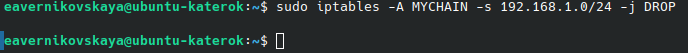

И проверим правильность выполнения 

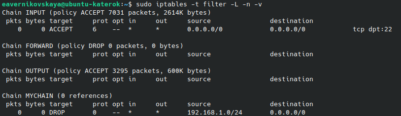

Теперь можно использовать созданную цепочку. Например, разрешить доступ по цепочке MYCHAIN: *sudo iptables -A INPUT -j MYCHAIN*

Далее для сохранения текущих правил iptables используем: *sudo iptables-save | sudo tee /etc/iptables/rules.v4*

Чтобы настройки применялись после перезагрузки используем команду *sudo iptables-restore < /etc/iptables/rules.v4*  

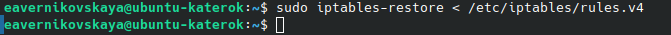

Далее перезапустим систему и проверим остались ли наши ранее заданные правила 

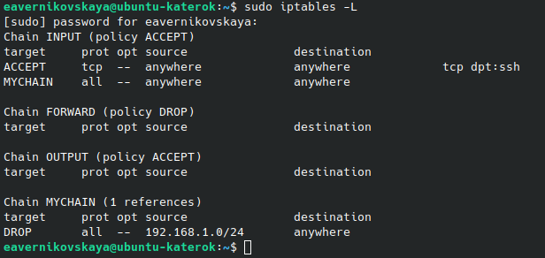

Если требуется полное удаление правил, применяется команда: *sudo iptables –F*

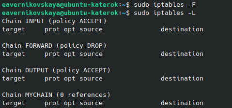

Далее удалим созданную нами ранее цепочку с помощью утилиты *sudo iptables –X*

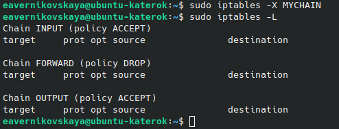

Снова сохраним текущие правила и применим iptables-restore

Выполним команду *ping*, которая отправляет ICMP Echo запросы (пакеты) на адрес google.com. Ответы от сервера показывают, что он доступен. Далее изменим политику по умолчанию для цепочки OUTPUT, устанавливая ее в DROP. Это означает, что все исходящие пакеты будут сбрасываться. После выполнения этой команды, запросы, инициируемые из нашего компьютера, не смогут покидать систему. При попытке отправить ping на google.com возникает ошибка Temporary failure in name resolution. Это связано с тем, что все исходящие пакеты, включая DNS-запросы, блокируются установленными правилами iptables.

## Пример работы с nftables

В некоторых дистрибутивах nftables уже установлен. Установить его можно командой *sudo apt-get install nftables* 

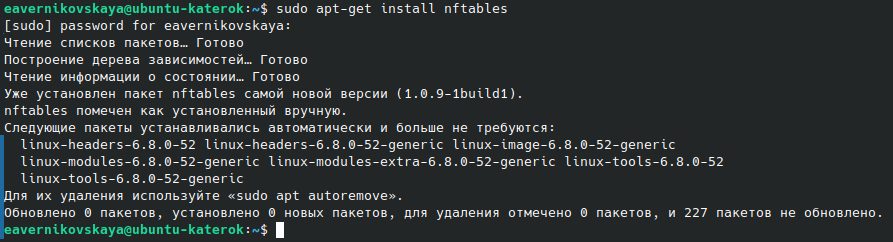

Текущий набор правил можно узнать командой: *sudo nft list ruleset*

При создании таблицы (table) должно быть определено семейство (family) адресов. 

Например, создадим таблицу с именем, test_table, которая отрабатывает одновременно пакеты IPv4 и IPv6: *sudo nft add table inet test_table*

Для добавления цепочки использется команда с таким синтаксисом: *sudo nft add chain inet [таблица] [цепочка] {set}* 

Например создадим такую цепочку: *sudo nft add chain inet test_table test_chain {type filter hook input priority 0 \; policy accept \; }*. Эта цепочка фильтрует входящие пакеты. Приоритет (priority) задает порядок, в котором nftables обрабатывает цепочки с одинаковым значением hook. Параметр policy устанавливает действие по умолчанию для правил в этой цепочке. В данном случае мы установили действие accept (принимать пакет) 

Правила добавляются командой с таким синтаксисом: *sudo nft add rule [family] [table] [chain] [expression] [action]* 

Теперь добавим правило: *sudo nft add rule inet test_table test_chain ip saddr 8.8.8.8 drop*. Данное правило добавляется в таблицу с именем test_table в цепочку test_chain и отбрасывает пакеты с ip-адресом источника отправления 8.8.8.8.

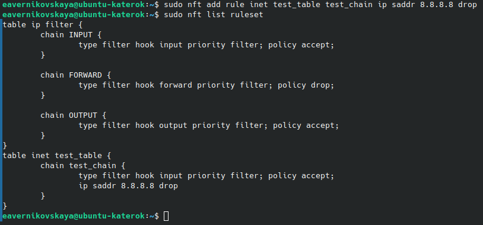

Для удаления правила nftables используется команда со следующим синтаксисом: *sudo nft delete rule [family] [table] [chain] handle [number]*

Например *sudo nft delete rule inet test_table test_chain handle 2* удалит правило созданное нами на предыдущем шаге 

Далее для сохранения текущих правил iptables используем: *sudo nft list ruleset | sudo tee /etc/nftables.conf*

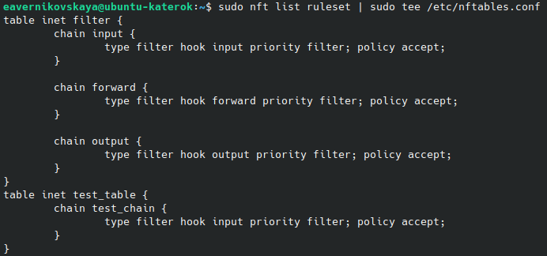

Далее после перезарузки системы загрузим наши сохранённые правила: *sudo nft -f /etc/nftables.conf*

Цепочка удаляется с помощью следующей команды: *sudo nft delete chain [family] [table] [chain]*

Удалим созданную нами ранее цепочку test_chain: *sudo nft delete chain inet test_table test_chain* 

Таблицу можно удалить конструкцией со следующим синтаксисом: *sudo nft delete table [family] [table]*

Удалим таблицу test_table: *sudo nft delete table inet test_table* 

## Сравнение iptables, nftables и eBPF

\begin{table}[H]
\centering
\caption{Сравнение iptables, nftables и eBPF}
\label{table:table}
\begin{tabular}{|p{4cm}|p{4cm}|p{4cm}|p{4cm}|}
\hline
\textbf{Метод} & \textbf{Где работает?} & \textbf{Плюсы} & \textbf{Минусы} \\ \hline
iptables & Пользовательское пространство & Прост в использовании & Низкая производительность, неэффективен при большом количестве правил \\ \hline
nftables & Пользовательское пространство & Гибкость, выше скорость, чем у iptables & Требует новых знаний \\ \hline
eBPF XDP & Драйвер сетевой карты & Максимальная скорость, подходит для DDoS-защиты & Ограниченные возможности обработки пакетов \\ \hline
eBPF TC & Сетевой стек ядра & Гибкость, возможность модификации пакетов & Чуть сложнее, чем XDP \\ \hline
eBPF SOCK FILTER & Уровень приложений & Позволяет фильтровать на уровне сокетов &Не применимо для всей сети \\ \hline
\end{tabular}
\end{table}

# Выводы

Таким образом, пакетная фильтрация в Linux играет ключевую роль в обеспечении сетевой безопасности и управления трафиком. 

Пакетный фильтр на базе Linux является мощным и гибким инструментом, который позволяет эффективно управлять сетевым трафиком и обеспечивать защиту от киберугроз. Современные технологии, такие как nftables и eBPF, делают фильтрацию более эффективной, а мониторинг трафика с помощью инструментов логирования позволяет оперативно реагировать на потенциальные угрозы.

nftables заменяет iptables, предоставляя более удобный и эффективный механизм управления фильтрацией трафика, но поддержка iptables все еще актуальна в ряде случаев.

Использование современных средств фильтрации в Linux позволяет создать надежную систему защиты и поддерживать высокий уровень безопасности в сетевых инфраструктурах!

# Список литературы{.unnumbered}

::: {#refs}
::: 
